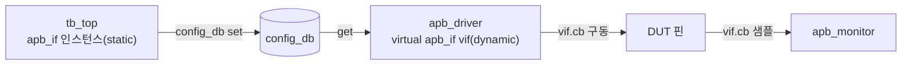

# Virtual Interface

:::tldr
- class(동적)는 module/interface(정적 hierarchy)에 직접 접근할 수 없다 → **virtual interface**가 그 다리.
- virtual interface = interface **인스턴스를 가리키는 handle**(null 가능, 재대입 가능).
- top이 실제 interface를 `config_db`에 set → driver/monitor가 build_phase에서 get. 이게 class-based TB와 RTL을 잇는 핵심 브릿지.
- set/get은 **타입이 정확히 일치**해야 한다(interface 이름·파라미터까지).
:::

:::note 용어 빠른 정리 (한국어 ↔ English)
| 한국어 | English | 뜻 |
|---|---|---|
| 정적 계층 | static hierarchy | elaboration에 고정되는 module/interface 세계 |
| 동적 객체 | dynamic object | 런타임 `new()`로 생기는 class 세계 |
| 가상 인터페이스 | virtual interface | interface 인스턴스를 가리키는 handle |
| 핸들 | handle | 참조(≈pointer), null 가능 |
| 엘라보레이션 | elaboration | 컴파일 후 계층/연결을 확정하는 단계 |
:::

## 1. 문제 — class는 static world에 못 들어간다

`interface`와 `module`은 elaboration 시점에 **고정**되는 static 계층이다. `class` 객체는 시뮬레이션 중 `new()`로 생기는 **dynamic** 존재라, 특정 interface 인스턴스 이름을 코드에 정적으로 박을 수 없다.

```sv
class apb_driver;
  // apb.cb.paddr <= ...;   // ❌ 어느 인스턴스(apb0? apb1?)인지 정적으로 못 박힘
endclass
```

→ class는 "어떤 interface 인스턴스"를 **런타임에 가리킬** 무언가가 필요하다. 그게 virtual interface.

## 2. 해법 — virtual interface (handle)

```sv
class apb_driver;
  virtual apb_if vif;          // interface를 가리키는 handle (처음엔 null)

  task drive(bus_txn t);
    @(vif.cb);                 // 그 인스턴스의 clocking block에 동기
    vif.cb.paddr  <= t.addr;
    vif.cb.pwrite <= t.is_write;
    vif.cb.psel   <= 1;
  endtask
endclass
```

신호 접근 3가지 경로:

```sv
vif.psel       // interface 신호 직접 (비동기/조합 신호용)
vif.cb.psel    // clocking block 통해 (동기 신호 — race-free, 권장)
vif.tb.psel    // modport 통해 (방향 강제)
```

## 3. 연결 — top → config_db → driver

```sv
// top module
module tb_top;
  bit clk, rstn;
  apb_if apb (clk, rstn);                 // 실제 interface 인스턴스
  dut u_dut(.apb(apb.dut));

  initial begin
    // interface handle을 config_db에 등록 (set)
    uvm_config_db#(virtual apb_if)::set(null, "*", "apb_vif", apb);
    run_test();
  end
endmodule
```

```sv
// driver build_phase에서 받기 (get)
function void build_phase(uvm_phase phase);
  super.build_phase(phase);
  if (!uvm_config_db#(virtual apb_if)::get(this, "", "apb_vif", vif))
    `uvm_fatal("NOVIF", "virtual interface not set for driver")
endfunction
```



- **set 인자**: `set(context, inst_path, "key", value)`. `set(null, "*", ...)` = 전역.
- **get 인자**: `get(this, "", "key", var)`. 내 자신을 대상으로 한 set을 조회.
- set은 보통 top/test에서, get은 하위 component build_phase에서. build는 top-down이라 상위 set이 먼저 준비된다.

## 4. 자주 나는 버그 — 체크리스트

| 증상 | 원인 | 해결 |
|---|---|---|
| `get`이 false | key 문자열/경로 불일치 | set/get의 `"key"`·path 정렬, `+UVM_CONFIG_DB_TRACE` |
| `get`이 false | **타입 불일치** | `#(virtual apb_if)` 가 set/get 동일해야(파라미터까지) |
| run_phase에서 null deref | get 실패를 무시 | `if(!...get) `uvm_fatal` |
| 신호 race | cb 안 거치고 직접 구동 | 동기 신호는 `vif.cb.sig <= ...` |
| set이 get보다 늦음 | 타이밍 | set은 build 이전(top initial)·상위에서 |

```sv
// 파라미터화 interface면 파라미터까지 타입에 포함
uvm_config_db#(virtual axi_if#(.DW(64)))::set(null,"*","axi_vif", axi);
uvm_config_db#(virtual axi_if#(.DW(64)))::get(this,"","axi_vif", vif);  // 동일해야!
```

:::gotcha
`get`이 실패했는데 무시하고 진행하면 `vif`가 null → run_phase에서 **null handle dereference**로 죽고, 에러가 한참 뒤에 터져 원인 추적이 어렵다. 반드시 build 단계에서 `if(!...get(...)) `uvm_fatal(...)` 으로 **즉시** 잡아라.
:::

## 5. 여러 interface / 인스턴스 구분

agent가 여러 개면 경로나 key로 구분해 set한다.

```sv
// 서로 다른 인스턴스에 다른 vif
uvm_config_db#(virtual apb_if)::set(this, "env.agt0.*", "apb_vif", apb0);
uvm_config_db#(virtual apb_if)::set(this, "env.agt1.*", "apb_vif", apb1);
```

## 6. config_db 없이? (비권장)

직접 계층 참조(`driver.vif = tb_top.apb;`)도 문법상 가능하지만, 절대 경로가 박혀 **재사용·vertical reuse가 깨진다**. config_db 경유가 표준인 이유. (Part 2 config_db, Part 8 vertical reuse 참고)

| | virtual interface | actual interface |
|---|---|---|
| 세계 | dynamic(class) | static(module) |
| null 가능 | O | X |
| 재대입 | O | X |
| 용도 | class가 핀에 접근하는 handle | 실제 신호 다발 |

:::analogy
interface 인스턴스 = 벽에 고정된 콘센트. virtual interface = 그 콘센트 주소가 적힌 **쪽지(handle)**. driver는 쪽지를 들고 다니다 필요할 때 그 콘센트에 꽂는다. config_db는 쪽지를 나눠주는 우편함. 쪽지가 없으면(null) 꽂을 데를 몰라 죽는다.
:::

```check
Q: class가 interface 신호에 직접 접근하지 못하는 근본 이유와, 이를 잇는 메커니즘은?
A: interface/module은 elaboration에 고정되는 **static 계층**이고, class 객체는 런타임 `new()`로 생기는 **dynamic** 존재라 정적 경로로 묶일 수 없다. 해법은 **virtual interface**(interface 인스턴스를 가리키는 handle)이며, top에서 config_db로 set → driver/monitor가 build_phase에서 get해 사용한다.
H: static 세계 vs dynamic 세계의 다리
```

```check
Q: driver의 build_phase에서 `uvm_config_db#(virtual apb_if)::get`이 false를 반환했다. 올바른 처리와, 가장 흔한 원인 두 가지는?
A: 처리는 `uvm_fatal`로 즉시 중단(null인 채 run_phase로 가면 null deref). 흔한 원인은 ① set/get의 **key 문자열·경로 불일치**, ② **타입 불일치**(파라미터화 interface의 파라미터까지 정확히 같아야 함). `+UVM_CONFIG_DB_TRACE`로 진단.
H: 멈추고, key·타입을 의심
```

```check
Q: `vif.psel <= 1` 과 `vif.cb.psel <= 1` 중 동기 프로토콜 신호엔 무엇을 쓰며 왜인가?
A: `vif.cb.psel <= 1`(clocking block 경유). cb를 통하면 정의된 input/output skew가 적용되어 driver 구동과 monitor 샘플 사이 race가 제거된다. `vif.psel` 직접 구동은 edge race를 유발한다(비동기 신호는 예외적으로 직접 접근).
H: race-free 경로
```

```check
Q: config_db 대신 `driver.vif = tb_top.apb;` 처럼 직접 계층 참조로 연결하면 무엇이 나빠지나?
A: 절대 계층 경로가 코드에 박혀 **재사용성과 vertical reuse가 깨진다**. 상위 레벨에서 경로가 달라지면 동작하지 않는다. config_db 경유는 상대 경로/타입 기반이라 env를 더 큰 env에 중첩해도 그대로 동작한다.
H: 절대 경로 하드코딩의 대가
```
