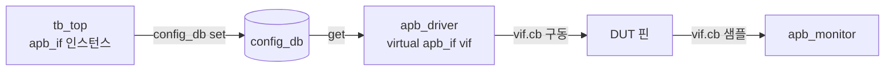

# Virtual Interface

:::tldr
- class(동적)는 module/interface(정적 hierarchy)에 직접 접근할 수 없다 → **virtual interface**가 그 다리.
- virtual interface = interface 인스턴스를 가리키는 **handle**.
- top module이 실제 interface를 `config_db`에 set → driver/monitor가 get으로 받아 DUT 핀을 구동/샘플. 이게 class-based TB와 RTL을 잇는 핵심 브릿지.
:::

## 문제: class는 static world에 못 들어간다

`interface`와 `module`은 elaboration 시점에 고정되는 **static** 계층입니다. `class` 객체는 시뮬레이션 중 `new()`로 생기는 **dynamic** 존재라, interface 인스턴스 이름을 직접 쓸 수 없습니다.

```sv
class apb_driver;
  // apb_if.cb.paddr <= ...;   // ❌ 어느 인스턴스인지 정적으로 못 박힘
endclass
```

## 해법: virtual interface (handle)

```sv
class apb_driver;
  virtual apb_if vif;          // interface를 가리키는 handle

  task drive(bus_txn t);
    @(vif.cb);
    vif.cb.paddr  <= t.addr;
    vif.cb.pwrite <= t.is_write;
    vif.cb.psel   <= 1;
  endtask
endclass
```

## 연결: top → config_db → driver

```sv
// top module
module tb_top;
  bit clk, rstn;
  apb_if apb(clk, rstn);          // 실제 interface 인스턴스
  dut u_dut(.apb(apb.dut));

  initial begin
    // interface handle을 config_db에 등록
    uvm_config_db#(virtual apb_if)::set(null, "*", "vif", apb);
    run_test();
  end
endmodule
```

```sv
// driver build_phase
function void build_phase(uvm_phase phase);
  super.build_phase(phase);
  if (!uvm_config_db#(virtual apb_if)::get(this, "", "vif", vif))
    `uvm_fatal("NOVIF", "virtual interface not set for driver")
endfunction
```



:::gotcha
`get`이 실패했는데 무시하고 진행하면 `vif`가 null → run_phase에서 **null handle dereference**로 죽습니다. 반드시 `if(!...get(...)) `uvm_fatal(...)` 패턴으로 build 단계에서 즉시 잡으세요.
:::

:::analogy
interface 인스턴스 = 실제 콘센트(벽에 고정). virtual interface = 그 콘센트를 가리키는 "주소가 적힌 쪽지". driver는 쪽지(handle)를 들고 다니다 필요할 때 그 콘센트에 꽂는다. config_db는 쪽지를 나눠주는 우편함.
:::

```check
Q: class가 interface 신호에 직접 접근하지 못하는 근본 이유와, 이를 잇는 메커니즘은?
A: interface/module은 elaboration 시 고정되는 **static 계층**이고 class 객체는 런타임에 생기는 **dynamic** 존재라 정적 경로로 묶일 수 없다. 해법은 **virtual interface**(interface 인스턴스를 가리키는 handle)이며, top에서 config_db로 set → driver/monitor가 get으로 받아 사용한다.
H: static vs dynamic 세계
```

```check
Q: driver의 build_phase에서 `uvm_config_db#(virtual apb_if)::get`이 false를 반환했다. 올바른 처리는?
A: `uvm_fatal`로 즉시 중단한다. vif가 null인 채 run_phase로 가면 null dereference로 죽고 원인 추적이 어렵다. build 단계에서 명확한 메시지와 함께 fatal 처리하는 것이 정석.
```
