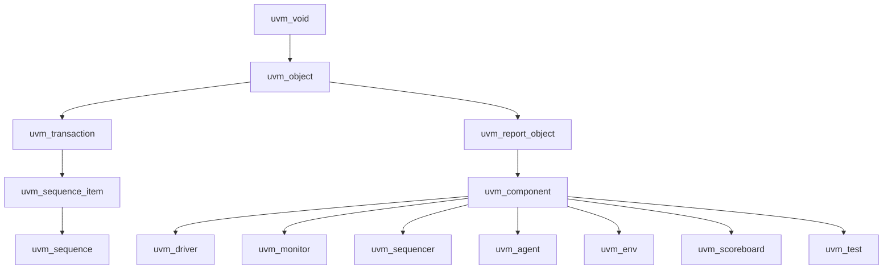

# Class Hierarchy

:::tldr
- UVM의 모든 것은 `uvm_void`에서 출발해 **두 갈래**로 갈린다: **uvm_object**(데이터) vs **uvm_component**(구조).
- object = transaction/sequence처럼 생겼다 사라지는 데이터. component = driver/monitor처럼 hierarchy에 영구 등록되어 phase에 참여하는 구조물.
- 이 구분이 "왜 sequence_item은 component가 아닌가"를 설명하고, **내 클래스가 무엇을 extends 해야 하는지**를 결정한다.
:::

:::note 용어 빠른 정리 (한국어 ↔ English)
| 한국어 | English | 뜻 |
|---|---|---|
| 계층 (클래스) | class hierarchy | base→derived 상속 트리 |
| 계층 (컴포넌트) | component hierarchy / topology | parent→child 인스턴스 트리 (런타임) |
| 트랜잭션 | transaction | 핀 토글을 추상화한 데이터 단위 (addr/data/kind…) |
| 최상위 | uvm_root / uvm_top | 암묵적 root component (싱글톤) |
| 복제 | clone | create + copy 한 번에 |
:::

## 0. 먼저 — 왜 이 트리를 알아야 하나

UVM에서 내가 만드는 모든 클래스는 **이 트리의 어딘가를 extends** 한다. 그래서 첫 결정이 항상 "object 계열인가 component 계열인가"다. 잘못 고르면 시그니처·phase·factory가 전부 어긋난다. 두 계열의 구분 기준은 단 하나:

> **시뮬레이션 내내 그 자리에 있는 구조물인가(component), 흐르다 사라지는 데이터인가(object).**

주의: "class hierarchy"(상속 트리, 컴파일 타임)와 "component hierarchy"(env.agt.drv 같은 인스턴스 트리, 런타임)는 **다른 말**이다. 이 챕터는 전자, topology는 후자.

## 1. 큰 그림



읽는 법 두 가지:
- **uvm_component도 결국 uvm_object의 자식**이다 — 그래서 component도 print/copy 같은 object 기능을 가진다. 둘은 형제가 아니라 "object ⊃ component".
- 중간의 `uvm_report_object`는 메시징(`uvm_info` 등) 기능을 얹는 층 — 모든 component가 보고(report)를 할 수 있는 이유가 상속 위치 때문이다.

## 2. object vs component

| | uvm_object | uvm_component |
|---|---|---|
| 성격 | 데이터 | 구조 |
| 생존 | 임시(생성/소멸 반복) | 시뮬 내내 영구 |
| hierarchy | 등록 안 됨 | parent로 등록됨 |
| phase | 참여 안 함 | 참여함 |
| 예시 | transaction, sequence_item, sequence, config object | driver, monitor, agent, env, test, scoreboard |
| 핵심 메서드 | copy/clone/compare/print/pack | build/connect/run phases |
| 등록 매크로 | `uvm_object_utils` | `uvm_component_utils` |
| new 시그니처 | `new(string name)` | `new(string name, uvm_component parent)` |

```sv
class bus_txn extends uvm_sequence_item;   // 데이터
  `uvm_object_utils(bus_txn)
  rand bit [31:0] addr, data;
  function new(string name="bus_txn"); super.new(name); endfunction
endclass

class bus_driver extends uvm_driver #(bus_txn);  // 구조
  `uvm_component_utils(bus_driver)
  function new(string name, uvm_component parent); super.new(name,parent); endfunction
endclass
```

### uvm_object가 주는 공통 메서드

```sv
bus_txn a, b;
a = bus_txn::type_id::create("a");
b = bus_txn::type_id::create("b");
b.copy(a);                       // 필드 복사 (do_copy 구현 필요/매크로)
$cast(b, a.clone());             // clone = create + copy. 반환이 uvm_object라 $cast
if (!b.compare(a)) `uvm_error("SCB","mismatch")
a.print();                       // 테이블 출력
`uvm_info("MON", a.sprint(), UVM_HIGH)   // 문자열로
```

- **clone의 반환 타입은 `uvm_object`** — 받을 때 `$cast`가 필요하다 (part0/oop의 downcast 그대로).
- copy/compare/print의 실제 동작은 `do_copy/do_compare/do_print`(또는 field 매크로)가 채운다 → part2/field-automation.

### component family가 base에서 받는 것

| base | 얹어주는 것 |
|---|---|
| `uvm_driver #(REQ)` | `seq_item_port`(sequencer와 대화 통로), `req` 핸들 |
| `uvm_sequencer #(REQ)` | sequence 중재(arbitration) 엔진 |
| `uvm_monitor` / `uvm_scoreboard` / `uvm_env` / `uvm_test` | 사실상 **빈 클래스** — 기능보다 *의미적 라벨* + 방법론상 위치 |
| `uvm_agent` | `is_active` 필드 (ACTIVE/PASSIVE 규약) |

> monitor가 빈 클래스라는 건 중요한 통찰이다: UVM의 구조는 강제가 아니라 **합의된 자리 배치**다. 그래도 라벨대로 extends 해야 남이 내 코드를 읽을 수 있다(+ 일부 툴이 타입으로 topology를 해석한다).

## 3. uvm_root — 보이지 않는 최상위

`run_test("my_test")`를 부르면 UVM이 싱글톤 **uvm_root**(`uvm_top`)를 만들고, test를 factory로 생성해 그 아래에 붙인다. 그래서 topology는 항상:

```
uvm_top
└── uvm_test_top (my_test)      ← run_test가 생성, 이름은 항상 "uvm_test_top"
    └── env
        └── agt
            ├── sqr ── drv
            └── mon
```

- 각 component의 위치 문자열 = `get_full_name()` → `"uvm_test_top.env.agt.drv"`. config_db 경로 매칭(part2)이 이 문자열 위에서 돈다.
- `uvm_top.print_topology()`로 전체 트리를 덤프할 수 있다 — env 구조 디버그 1순위.

:::gotcha
component의 `new`는 **반드시 `(string name, uvm_component parent)`** 시그니처. parent를 받아 hierarchy에 자신을 등록합니다. object의 `new`는 `(string name)`만. 시그니처를 헷갈리면 factory create가 깨집니다.
:::

:::gotcha
**component는 build 시점에만 만들고, run_phase 중 동적 생성하지 않는다.** 컴포넌트 트리는 elaboration 후 고정이라는 게 UVM의 전제(phase 참여·port 연결이 build/connect에 묶여 있다). 시뮬 중 생겼다 사라져야 하는 것이라면 그건 데이터, 즉 object로 설계해야 한다.
:::

:::analogy
RTL에 비유: uvm_object = wire/packet(흐르는 데이터), uvm_component = module instance(고정된 구조물). 패킷은 매 clock 새로 생기고, 모듈은 시뮬 내내 그 자리에 있다. "module을 시뮬 중간에 instantiate할 수 없다"는 감각 그대로 — component도 build 이후엔 고정이다.
:::

```check
Q: uvm_sequence_item이 uvm_component가 아니라 uvm_object 계열인 이유는?
A: sequence_item은 **데이터(transaction)**라서 매번 생성·복제·비교되고 소멸한다. hierarchy에 영구 등록되거나 phase에 참여할 필요가 없다. 영구적 구조물(driver/monitor)만 component이고, 흐르는 데이터는 object다.
H: 생겼다 사라지나, 시뮬 내내 사나?
```

```check
Q: component의 생성자 시그니처가 object와 다른 점과, 그 이유는?
A: component는 `function new(string name, uvm_component parent)` — parent를 받아 UVM hierarchy에 자신을 등록한다. object는 `function new(string name)`만 받는다. 이 등록 덕분에 component가 phase 메커니즘과 계층 경로(get_full_name)에 참여한다.
```

```check
Q: `clone()`으로 transaction을 복제해 받을 때 `$cast`가 필요한 이유는?
A: clone의 반환 타입이 base인 `uvm_object`이기 때문. 실제 객체는 derived(bus_txn)지만 핸들 타입이 base이므로, derived 핸들로 받으려면 런타임 체크가 있는 downcast(`$cast`)를 거쳐야 한다 — part0 OOP의 upcast/downcast 규칙 그대로.
H: 반환 선언 타입 vs 실제 객체 타입
```

```check
Q: uvm_monitor·uvm_scoreboard가 사실상 빈 클래스인데도 굳이 그걸 extends 하는 이유는?
A: 기능 때문이 아니라 **방법론적 라벨** 때문 — 역할을 타입으로 선언해 코드의 의도를 표준화하고, 팀/툴이 topology를 읽을 수 있게 한다. UVM 구조의 상당 부분은 강제가 아닌 합의된 자리 배치다.
```
