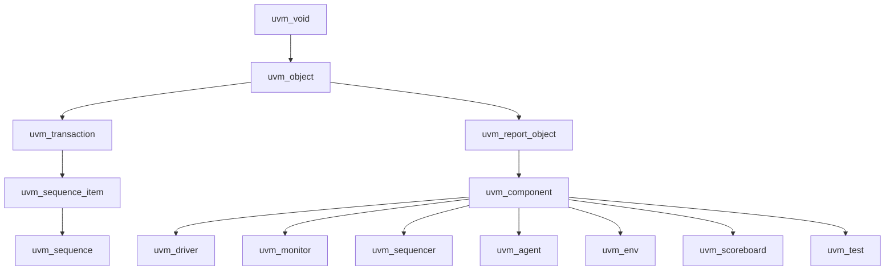

# Class Hierarchy

:::tldr
- UVM의 모든 것은 `uvm_void`에서 출발해 **두 갈래**로 갈린다: **uvm_object**(데이터) vs **uvm_component**(구조).
- object = transaction/sequence처럼 생겼다 사라지는 데이터. component = driver/monitor처럼 hierarchy에 영구 등록되어 phase에 참여하는 구조물.
- 이 구분이 "왜 sequence_item은 component가 아닌가"를 설명한다.
:::

## 큰 그림



## object vs component

| | uvm_object | uvm_component |
|---|---|---|
| 성격 | 데이터 | 구조 |
| 생존 | 임시(생성/소멸 반복) | 시뮬 내내 영구 |
| hierarchy | 등록 안 됨 | parent로 등록됨 |
| phase | 참여 안 함 | 참여함 |
| 예시 | transaction, sequence_item, config | driver, monitor, agent, env, test |
| 핵심 메서드 | copy/clone/compare/print/pack | build/connect/run phases |
| 등록 매크로 | `uvm_object_utils` | `uvm_component_utils` |

```sv
class bus_txn extends uvm_sequence_item;   // 데이터
  `uvm_object_utils(bus_txn)
  rand bit [31:0] addr, data;
  function new(string name="bus_txn"); super.new(name); endfunction
endclass

class bus_driver extends uvm_driver #(bus_txn);  // 구조
  `uvm_component_utils(bus_driver)
  function new(string name, uvm_component parent); super.new(name,parent); endfunction
endclass
```

:::gotcha
component의 `new`는 **반드시 `(string name, uvm_component parent)`** 시그니처. parent를 받아 hierarchy에 자신을 등록합니다. object의 `new`는 `(string name)`만. 시그니처를 헷갈리면 factory create가 깨집니다.
:::

:::analogy
RTL에 비유: uvm_object = wire/packet(흐르는 데이터), uvm_component = module instance(고정된 구조물). 패킷은 매 clock 새로 생기고, 모듈은 시뮬 내내 그 자리에 있다.
:::

```check
Q: uvm_sequence_item이 uvm_component가 아니라 uvm_object 계열인 이유는?
A: sequence_item은 **데이터(transaction)**라서 매번 생성·복제·비교되고 소멸한다. hierarchy에 영구 등록되거나 phase에 참여할 필요가 없다. 영구적 구조물(driver/monitor)만 component이고, 흐르는 데이터는 object다.
H: 생겼다 사라지나, 시뮬 내내 사나?
```

```check
Q: component의 생성자 시그니처가 object와 다른 점과, 그 이유는?
A: component는 `function new(string name, uvm_component parent)` — parent를 받아 UVM hierarchy에 자신을 등록한다. object는 `function new(string name)`만 받는다. 이 등록 덕분에 component가 phase 메커니즘과 계층 경로(get_full_name)에 참여한다.
```
