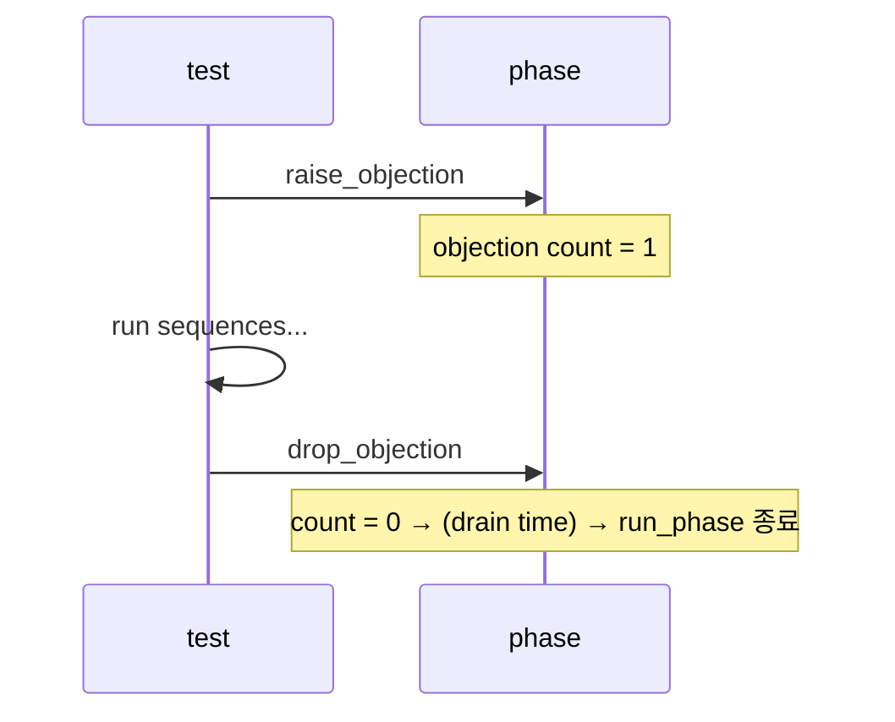

# Objections & End of Test

:::tldr
- objection = "아직 run_phase 끝내지 마세요" 신호. 모든 objection이 drop되면 phase가 종료된다.
- 보통 **sequence/test가 raise → 작업 → drop**. component가 병렬로 도는데 누가 아직 일하는지 중앙에서 추적하는 메커니즘.
- objection을 안 들면 run_phase가 0 time에 끝나버리고, 안 내리면 영원히 안 끝난다(hang).
- 마지막 transaction이 DUT를 빠져나올 시간은 **drain time**으로 확보.
:::

:::note 용어 빠른 정리 (한국어 ↔ English)
| 한국어 | English | 뜻 |
|---|---|---|
| 이의 제기 | objection | "끝내지 마라"는 반대표 |
| 들기/내리기 | raise / drop | 반대표 +1 / −1 |
| 테스트 종료 | end of test (EOT) | run_phase가 끝나는 조건의 합의 |
| 배수 시간 | drain time | count=0 후 추가로 기다리는 시간 |
| 매달림 | hang | 시뮬이 영원히 안 끝나는 상태 |
:::

## 0. 먼저 — "끝났다"는 왜 어려운 문제인가

Verilog TB에선 `#10000; $finish;` 또는 마지막 자극 뒤 `$finish` — **한 곳이 끝을 알았다.** UVM에선 수십 개 component의 run_phase가 **병렬로** 돌고, 서로의 존재도 모른다(재사용을 위해 일부러 decoupling 했으니까). driver는 sequence가 더 올지 모르고, scoreboard는 transaction이 더 올지 모른다.

그래서 "끝"은 **합의 문제**가 된다. UVM의 답이 objection — 일종의 분산 투표다:

> 일이 남은 주체는 raise로 반대표를 들고, 끝나면 drop으로 내린다. **반대표 합계가 0이 되는 순간** phase가 끝난다.

내부적으로 raise/drop은 component 계층을 따라 uvm_top까지 전파·집계된다. 그래서 어디서 들든 전역 카운트로 합산된다.

## 1. 기본 패턴

```sv
task run_phase(uvm_phase phase);
  phase.raise_objection(this, "starting traffic");
  // ... 시간 소비 작업 ...
  repeat (100) begin
    seq.start(sqr);
  end
  phase.drop_objection(this, "traffic done");
endtask
```

두 번째 인자(설명 문자열)는 선택이지만 **꼭 쓰는 습관**을 — objection 디버그 시 "누가 왜 들었는지"가 로그에 남는다.

## 2. 누가 raise/drop 하나?

가장 흔한 정석: **test 또는 virtual sequence가 raise/drop**. driver/monitor는 objection을 들지 않습니다(그들은 항상 도는 백그라운드 서비스).

```sv
class my_test extends uvm_test;
  task run_phase(uvm_phase phase);
    my_seq seq = my_seq::type_id::create("seq");
    phase.raise_objection(this);
    seq.start(env.agt.sqr);
    phase.drop_objection(this);
  endtask
endclass
```

또는 sequence 안에서 `starting_phase`(`get_starting_phase()`)로 raise/drop:

```sv
task body();
  uvm_phase ph = get_starting_phase();
  if (ph) ph.raise_objection(this);
  // ...
  if (ph) ph.drop_objection(this);
endtask
```

원칙은 하나다: **자극의 시작과 끝을 아는 주체가 책임진다.** 그게 보통 test/virtual sequence다. (모든 component가 제각각 들면 누가 안 내렸는지 추적이 지옥이 된다 — 드는 주체는 최소로.)

## 3. drain time — 마지막 transaction의 퇴장 시간

drop이 끝나 count=0이 되는 순간은 보통 "마지막 자극을 **넣은**" 순간이지, DUT가 그것을 **다 뱉은** 순간이 아니다. 파이프라인에 남은 데이터가 빠져나올 시간을 벌어주는 게 drain time:

```sv
phase.phase_done.set_drain_time(this, 100ns);
```



고정 drain time이 안 맞는 DUT(가변 latency)는, scoreboard가 "in-flight transaction이 남아 있는 동안 raise를 유지"하는 패턴이나 quiesce 체크(outstanding=0 확인)로 발전시킨다 — Part 4 scoreboard에서 다시.

:::analogy
codec 파이프라인의 **flush**와 같다. 마지막 프레임의 비트스트림을 다 넣었다고 디코딩이 끝난 게 아니다 — 파이프라인에 남은 프레임이 출력될 때까지 기다렸다가(EOS 처리/flush) 비교를 끝내야 한다. drain time = flush 대기, "입력 끝 ≠ 출력 끝"이라는 같은 진실.
:::

## 4. sub-phase와 objection

`main_phase` 같은 sub-phase를 쓸 경우, objection은 **그 phase 객체에** 걸어야 한다(`main_phase`의 인자 phase). run_phase의 objection과 별개 카운트라, "main에서 raise했는데 run이 안 끝나요" 같은 혼선이 생기면 둘을 섞어 쓰고 있는지부터 의심.

:::gotcha
**raise를 했는데 drop을 안 하면** 시뮬레이션이 영원히 안 끝납니다(흔히 timeout으로만 죽음). 반대로 **아무도 raise를 안 하면** run_phase가 0 time에 즉시 끝나 아무 일도 안 일어납니다. raise/drop은 반드시 짝 — 사이에 에러로 빠져나갈 수 있는 코드(return, uvm_fatal 외 예외 경로)가 있으면 drop이 누락될 수 있으니 경로를 점검.
:::

:::gotcha
**transaction마다 raise/drop 하지 말 것.** objection은 계층 전파를 동반해 비용이 있다 — 수백만 transaction이면 성능에 보인다. 자극 묶음(시퀀스 시작~끝) 단위로 드는 게 정석이다.
:::

:::tip
`+UVM_OBJECTION_TRACE` 플래그로 누가 언제 raise/drop 했는지 추적할 수 있습니다. "왜 안 끝나지?" 디버깅의 1순위. 두 번째가 `+UVM_TIMEOUT`으로 일단 죽여서 그 시점 상태를 보는 것.
:::

```check
Q: run_phase가 시작하자마자 0 time에 끝나버렸다. 가장 가능성 높은 원인은?
A: 아무도 `raise_objection`을 하지 않았다. objection이 0이면 UVM은 할 일이 없다고 보고 run_phase를 즉시 종료한다. test/sequence에서 raise를 추가해야 한다.
H: objection count가 처음부터 0이면?
```

```check
Q: objection을 raise/drop할 책임은 보통 어느 컴포넌트가 지며, driver/monitor는 왜 안 드는가?
A: 보통 **test 또는 (virtual) sequence**가 자극을 시작할 때 raise, 끝낼 때 drop한다. driver/monitor는 run_phase 내내 백그라운드로 도는 서비스라 "끝내지 마라"를 주장할 주체가 아니다 — 자극의 시작/끝을 아는 쪽이 책임진다.
```

```check
Q: drain time은 무엇을 해결하나? 한 문장으로.
A: objection count가 0이 된 시점(=마지막 자극 투입 완료)과 DUT가 마지막 응답을 뱉는 시점 사이의 간격을 메워, 파이프라인에 남은(in-flight) transaction이 관찰·채점될 시간을 확보한다.
H: 입력 끝 ≠ 출력 끝
```

```check
Q: 시뮬이 영원히 안 끝난다(timeout으로만 죽는다). 디버그 절차는?
A: objection 누수다 — 누군가 raise 후 drop을 안 했다. `+UVM_OBJECTION_TRACE`로 raise/drop 로그를 확인해 drop 없는 주체를 찾는다. 흔한 원인: 에러 경로로 task를 빠져나가 drop 누락, sequence가 영원히 안 끝남, sub-phase와 run_phase의 objection 혼용.
```
