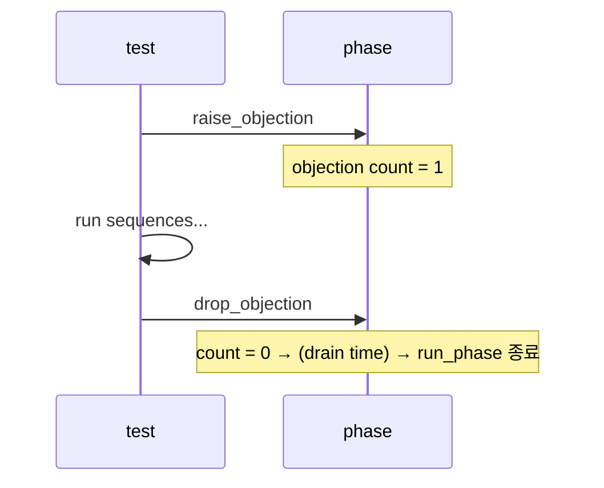

# Objections & End of Test

:::tldr
- objection = "아직 run_phase 끝내지 마세요" 신호. 모든 objection이 drop되면 phase가 종료된다.
- 보통 **sequence/test가 raise → 작업 → drop**. component가 병렬로 도는데 누가 아직 일하는지 중앙에서 추적하는 메커니즘.
- objection을 안 들면 run_phase가 0 time에 끝나버리고, 안 내리면 영원히 안 끝난다(hang).
:::

## 기본 패턴

```sv
task run_phase(uvm_phase phase);
  phase.raise_objection(this, "starting traffic");
  // ... 시간 소비 작업 ...
  repeat (100) begin
    seq.start(sqr);
  end
  phase.drop_objection(this, "traffic done");
endtask
```

## 누가 raise/drop 하나?

가장 흔한 정석: **test 또는 virtual sequence가 raise/drop**. driver/monitor는 objection을 들지 않습니다(그들은 항상 도는 백그라운드).

```sv
class my_test extends uvm_test;
  task run_phase(uvm_phase phase);
    my_seq seq = my_seq::type_id::create("seq");
    phase.raise_objection(this);
    seq.start(env.agt.sqr);
    phase.drop_objection(this);
  endtask
endclass
```

또는 sequence 안에서 `starting_phase`(`get_starting_phase()`)로 raise/drop:

```sv
task body();
  uvm_phase ph = get_starting_phase();
  if (ph) ph.raise_objection(this);
  // ...
  if (ph) ph.drop_objection(this);
endtask
```

## drain time

마지막 transaction이 DUT를 빠져나갈 시간을 벌어줍니다.

```sv
phase.phase_done.set_drain_time(this, 100ns);
```



:::gotcha
**raise를 했는데 drop을 안 하면** 시뮬레이션이 영원히 안 끝납니다(흔히 timeout으로만 죽음). 반대로 **아무도 raise를 안 하면** run_phase가 0 time에 즉시 끝나 아무 일도 안 일어납니다. raise/drop은 반드시 짝.
:::

:::tip
`+UVM_OBJECTION_TRACE` 플래그로 누가 언제 raise/drop 했는지 추적할 수 있습니다. "왜 안 끝나지?" 디버깅의 1순위.
:::

```check
Q: run_phase가 시작하자마자 0 time에 끝나버렸다. 가장 가능성 높은 원인은?
A: 아무도 `raise_objection`을 하지 않았다. objection이 0이면 UVM은 할 일이 없다고 보고 run_phase를 즉시 종료한다. test/sequence에서 raise를 추가해야 한다.
H: objection count가 처음부터 0이면?
```

```check
Q: objection을 raise/drop할 책임은 보통 어느 컴포넌트가 지며, driver/monitor는 왜 안 드는가?
A: 보통 **test 또는 (virtual) sequence**가 자극을 시작할 때 raise, 끝낼 때 drop한다. driver/monitor는 run_phase 내내 백그라운드로 도는 서비스라 "끝내지 마라"를 주장할 주체가 아니다 — 자극의 시작/끝을 아는 쪽이 책임진다.
```
