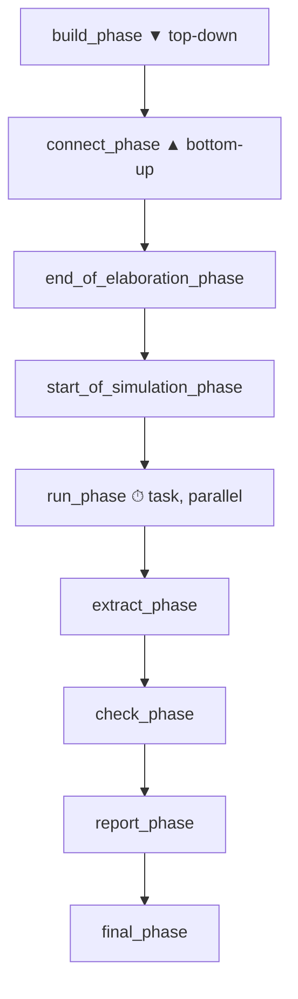

# UVM Phases

:::tldr
- phase = 모든 component가 **같은 박자**로 build→connect→run→cleanup을 진행하게 하는 동기화 메커니즘.
- **build_phase는 top-down**(부모가 자식을 만들어야 함), **connect_phase는 bottom-up**(자식 port가 먼저 준비돼야 함).
- run_phase만 시간을 소비(task)하고 나머지는 function(0 time). run은 12개 sub-phase(reset/configure/main/shutdown…)로 세분된다.
:::

## phase 순서



| phase | function/task | 방향 | 하는 일 |
|---|---|---|---|
| build | function | top-down | component 생성, config get |
| connect | function | bottom-up | TLM port 연결 |
| end_of_elaboration | function | bottom-up | 연결 점검, topology 확인 |
| start_of_simulation | function | bottom-up | 시작 직전 출력/초기화 |
| **run** | **task** | parallel | 실제 stimulus 구동 |
| extract | function | bottom-up | 결과 수집 |
| check | function | bottom-up | pass/fail 판정 |
| report | function | bottom-up | 결과 출력 |
| final | function | top-down | 마무리 |

## build는 왜 top-down?

부모가 `create`로 자식을 만들어야 자식이 존재합니다. test→env→agent→driver 순서로 위에서 아래로 생성.

```sv
class my_env extends uvm_env;
  my_agent agt;
  function void build_phase(uvm_phase phase);
    super.build_phase(phase);
    agt = my_agent::type_id::create("agt", this);  // 자식 생성
  endfunction
endclass
```

## connect는 왜 bottom-up?

자식의 port가 먼저 존재해야 부모가 그것을 연결할 수 있습니다.

```sv
function void connect_phase(uvm_phase phase);
  agt.mon.ap.connect(scb.analysis_export);  // 자식 port끼리 연결
endfunction
```

## run_phase와 sub-phase

run_phase는 시간을 소비하는 유일한 phase이며, 12개 reusable sub-phase로 나뉩니다:

```
pre_reset → reset → post_reset → pre_configure → configure → post_configure
→ pre_main → main → post_main → pre_shutdown → shutdown → post_shutdown
```

보통은 `run_phase` 하나만 써도 되지만, reset 시퀀스와 main 시퀀스를 명확히 분리하고 싶으면 `reset_phase`, `main_phase`를 오버라이드합니다.

:::gotcha
모든 phase 메서드에서 **`super.<phase>_phase(phase)`를 먼저 호출**하세요. 특히 build_phase에서 빠뜨리면 field automation/config 자동 적용이 안 됩니다. 가장 흔한 초보 버그.
:::

```check
Q: build_phase는 top-down, connect_phase는 bottom-up인 이유를 각각 한 줄로?
A: build은 부모가 `create`로 자식을 만들어야 자식이 존재하므로 위→아래(top-down). connect는 자식 컴포넌트의 port가 먼저 존재해야 부모가 그 port들을 연결할 수 있으므로 아래→위(bottom-up).
H: 건물: 구조물은 위→아래, 배관 연결은 아래→위
```

```check
Q: 9개 주요 phase 중 시간을 소비(task)하는 것은? 나머지는?
A: **run_phase**만 task(time-consuming). 나머지(build/connect/end_of_elaboration/start_of_simulation/extract/check/report/final)는 모두 function이라 0 시뮬레이션 시간에 실행된다.
```
