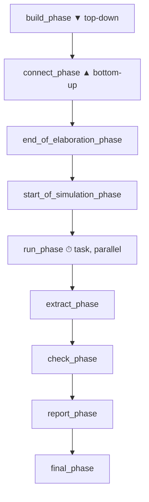

# UVM Phases

:::tldr
- phase = 모든 component가 **같은 박자**로 build→connect→run→cleanup을 진행하게 하는 동기화 메커니즘.
- **build_phase는 top-down**(부모가 자식을 만들어야 함), **connect_phase는 bottom-up**(자식 port가 먼저 준비돼야 함).
- run_phase만 시간을 소비(task)하고 나머지는 function(0 time). run은 12개 sub-phase(reset/configure/main/shutdown…)로 세분된다.
- phase 메서드는 **내가 부르는 게 아니라 UVM이 불러준다** (inversion of control).
:::

:::note 용어 빠른 정리 (한국어 ↔ English)
| 한국어 | English | 뜻 |
|---|---|---|
| 단계 | phase | 합의된 실행 구간 (build/connect/run…) |
| 정교화 | elaboration | 구조(생성+연결)가 확정되는 과정 |
| 위→아래 | top-down | 부모 먼저 실행 |
| 아래→위 | bottom-up | 자식(말단) 먼저 실행 |
| 제어 역전 | inversion of control (IoC) | 프레임워크가 내 코드를 호출하는 구조 |
| 시간 소비 | time-consuming | 시뮬레이션 시간이 흐르는 (task) |
:::

## 0. 먼저 — phase가 풀려는 문제

Verilog TB에서 여러 `initial` 블록은 **실행 순서 보장이 없다.** TB가 커지면 "interface가 연결되기 전에 자극이 출발", "설정이 끝나기 전에 reset 해제" 같은 race가 환경 버그의 단골이 된다. 사람마다 ad-hoc 이벤트/딜레이로 순서를 맞추던 것을, UVM은 **모든 component가 합의한 표준 구간(phase)** 으로 강제했다:

> "생성은 build에서, 연결은 connect에서, 자극은 run에서, 채점은 check에서." — 누가 짠 component든 같은 박자로 움직이므로 조립이 가능해진다.

또 하나의 멘탈 모델 전환: **phase 메서드는 callback이다.** 내 코드 어디에도 `drv.build_phase()` 라고 부르는 곳이 없다 — `run_test()`가 시작한 phase 머신이 트리를 순회하며 **불러준다**(inversion of control). RTL로 치면 내가 호출하는 함수가 아니라 "센시티비티에 걸려 있는 always 블록"에 가깝다.

## 1. phase 순서



| phase | function/task | 방향 | 하는 일 |
|---|---|---|---|
| build | function | top-down | component 생성, config get |
| connect | function | bottom-up | TLM port 연결 |
| end_of_elaboration | function | bottom-up | 연결 점검, topology 확인 |
| start_of_simulation | function | bottom-up | 시작 직전 출력/초기화 |
| **run** | **task** | parallel | 실제 stimulus 구동 |
| extract | function | bottom-up | 결과 수집 |
| check | function | bottom-up | pass/fail 판정 |
| report | function | bottom-up | 결과 출력 |
| final | function | top-down | 마무리 |

전체를 셋으로 묶으면 기억하기 쉽다: **구축(build~start_of_simulation, 0 time) → 실행(run, 시간 흐름) → 정리(extract~final, 0 time)**.

## 2. run_test()에서 phase까지 — 전체 흐름

```sv
// tb_top.sv
initial begin
  uvm_config_db#(virtual bus_if)::set(null, "*", "vif", bif);
  run_test();           // +UVM_TESTNAME=my_test 로 test 선택
end
```

`run_test()`가 하는 일: ① test 이름을 (인자 또는 `+UVM_TESTNAME`에서) 결정 → ② factory로 test 생성(`uvm_test_top`) → ③ phase 머신 시작 → ④ 트리 전체에 phase를 순서대로 적용. 즉 **test 선택도, 모든 phase 호출도 UVM 인프라가 한다.** 내 코드는 끼어들 자리(phase 메서드)에 로직을 놓을 뿐이다.

## 3. build는 왜 top-down?

부모가 `create`로 자식을 만들어야 자식이 존재합니다. test→env→agent→driver 순서로 위에서 아래로 생성. (자식의 build_phase는 부모의 build_phase가 **끝난 뒤** 호출된다 — 부모가 만들지 않은 자식은 build가 아예 안 불린다.)

```sv
class my_env extends uvm_env;
  my_agent agt;
  function void build_phase(uvm_phase phase);
    super.build_phase(phase);
    agt = my_agent::type_id::create("agt", this);  // 자식 생성
  endfunction
endclass
```

## 4. connect는 왜 bottom-up?

자식의 port가 먼저 존재해야 부모가 그것을 연결할 수 있습니다.

```sv
function void connect_phase(uvm_phase phase);
  agt.mon.ap.connect(scb.analysis_export);  // 자식 port끼리 연결
endfunction
```

connect가 끝나면 구조는 **동결**이다 — end_of_elaboration은 "동결된 topology를 검사하는" 자리(예: `uvm_top.print_topology()`).

## 5. run_phase와 sub-phase

run_phase는 시간을 소비하는 유일한 phase이며, **모든 component의 run_phase task가 fork되어 병렬로** 돈다. 종료는 objection(다음 챕터)으로 합의한다.

run과 병행하는 12개 reusable sub-phase도 있다:

```
pre_reset → reset → post_reset → pre_configure → configure → post_configure
→ pre_main → main → post_main → pre_shutdown → shutdown → post_shutdown
```

보통은 `run_phase` 하나만 써도 되지만, reset 시퀀스와 main 시퀀스를 명확히 분리하고 싶으면 `reset_phase`, `main_phase`를 오버라이드합니다. (sub-phase의 objection은 run_phase와 **별도** — 섞어 쓸 때 흔한 함정.)

:::analogy
칩 bring-up 절차와 같다: power → clock → reset 해제 → 레지스터 설정 → 트래픽. 순서를 어기면 무엇이 잘못됐는지조차 알 수 없다. phase는 그 bring-up 절차를 TB 세계에 강제한 것 — 그래서 남의 VIP를 받아도 "어느 단계에서 무엇을 하는지"를 묻지 않아도 된다.
:::

:::gotcha
모든 phase 메서드에서 **`super.<phase>_phase(phase)`를 먼저 호출**하세요. 특히 build_phase에서 빠뜨리면 field automation/config 자동 적용이 안 됩니다. 가장 흔한 초보 버그.
:::

:::gotcha
run_phase들은 병렬 fork라 **component 간 실행 순서를 가정하면 안 된다.** "driver가 monitor보다 먼저 시작하겠지" 같은 가정은 race다. 순서가 필요하면 phase(reset_phase→main_phase), event, 또는 sequence로 명시적으로 동기화할 것.
:::

:::tip
시뮬이 안 끝날 때 — UVM에는 전역 타임아웃이 있다(기본 9200s, `+UVM_TIMEOUT=<ns>,<NO|YES>`로 조절). timeout으로 죽었다면 대부분 objection 누수(다음 챕터)다.
:::

```check
Q: build_phase는 top-down, connect_phase는 bottom-up인 이유를 각각 한 줄로?
A: build은 부모가 `create`로 자식을 만들어야 자식이 존재하므로 위→아래(top-down). connect는 자식 컴포넌트의 port가 먼저 존재해야 부모가 그 port들을 연결할 수 있으므로 아래→위(bottom-up).
H: 건물: 구조물은 위→아래, 배관 연결은 아래→위
```

```check
Q: 9개 주요 phase 중 시간을 소비(task)하는 것은? 나머지는?
A: **run_phase**만 task(time-consuming). 나머지(build/connect/end_of_elaboration/start_of_simulation/extract/check/report/final)는 모두 function이라 0 시뮬레이션 시간에 실행된다.
```

```check
Q: "phase 메서드는 inversion of control"이라는 말의 뜻은?
A: 내 코드가 phase 메서드를 호출하는 게 아니라, `run_test()`가 시작한 UVM phase 머신이 component 트리를 순회하며 **내 메서드를 불러준다**. 나는 정해진 자리(build/connect/run…)에 로직을 놓을 뿐이다. 그래서 모든 component가 작성자와 무관하게 같은 박자로 움직인다.
H: 누가 누구를 호출하나?
```

```check
Q: build_phase에서 `super.build_phase(phase)`를 빠뜨리면 생기는 대표적 증상은?
A: uvm_component의 기본 build 동작(자동 config 적용/field automation 처리 등)이 실행되지 않아, config_db로 내려보낸 설정이 적용되지 않는 등 조용한 오동작이 생긴다. 모든 phase 오버라이드에서 super 호출을 습관화해야 한다.
```
