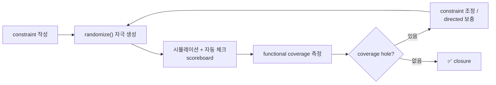
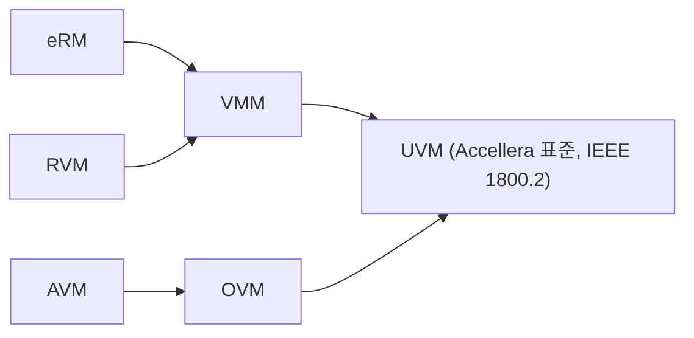

# Why UVM

:::tldr
- UVM은 3가지를 해결한다: **재사용성(reusability)**, **확장성(scalability)**, **coverage-driven 검증**.
- directed test는 corner case를 사람이 다 못 적고, TB가 프로젝트마다 통째로 버려진다.
- UVM = 표준화된 클래스 라이브러리(IEEE 1800.2) + factory/config/phase/TLM 인프라로 "재사용 가능한 검증 환경"을 찍어내는 **방법론(methodology)**.
:::

:::note 용어 빠른 정리 (한국어 ↔ English)
| 한국어 | English | 뜻 |
|---|---|---|
| 방법론 | methodology | 라이브러리 + "이렇게 써라"는 규약의 묶음 |
| 지시적 테스트 | directed test | 사람이 시나리오를 직접 나열하는 테스트 |
| 제약 랜덤 | constrained random (CRV) | 규칙(constraint)만 주고 자극을 자동 생성 |
| 기능 커버리지 | functional coverage | "계획한 시나리오가 실제로 발생했나" 측정 |
| 커버리지 주도 검증 | coverage-driven verification (CDV) | coverage 구멍을 보며 검증을 진행하는 방식 |
| 검증 IP | VIP (Verification IP) | 재사용 가능한 프로토콜 검증 부품(agent 등) |
| 테스트벤치 | testbench (TB) | DUT를 둘러싼 검증 환경 전체 |
:::

## 0. 먼저 — 검증이 왜 위기인가

RTL 복잡도는 게이트 수로 늘지만, **검증해야 할 상태 공간은 조합적으로 폭발**한다. 업계 통계로 칩 개발 노력의 60~70%가 검증이고, 그 비중은 계속 커져 왔다. 핵심 질문은 둘:

1. **자극(stimulus)을 어떻게 다 만들 것인가?** — 사람의 상상력은 스케일이 안 된다.
2. **"언제 끝났다"고 말할 것인가?** — 측정 지표가 없으면 일정도 품질도 못 박는다.

UVM은 이 두 질문에 대한 업계 표준 답이다: 자극은 **constrained random**으로, 완료는 **coverage**로.

## 1. directed test의 한계

```sv
initial begin
  write(32'h1000, 32'hDEAD);
  read (32'h1000);
  write(32'h1004, 32'hBEEF);
  // ... 사람이 시나리오를 일일이 나열
end
```

- corner case를 **사람이 다 상상**해야 한다 → 누락 불가피.
- 신호가 바뀌면 TB 전체 수정.
- "얼마나 검증했나" 정량 지표가 없다.
- 다른 프로젝트로 **재사용 불가** — 칩 하나 끝나면 TB는 버려진다.

:::analogy
codec 검증의 conformance stream이 정확히 directed test다 — 표준이 정의한 스트림은 다 통과해도, 실제 필드에서 깨지는 건 **아무도 안 만들어 본 비트스트림 조합**이었다. "스트림을 사람이 고르는 것"의 한계가 곧 directed test의 한계. constrained random은 "문법은 지키되 조합은 기계가 발굴"하게 만든 것이다.
:::

## 2. UVM이 주는 것

| 문제 | UVM의 답 |
|---|---|
| corner case 누락 | constrained random + functional coverage |
| 진행률 측정 불가 | coverage-driven → 정량 closure |
| TB 재사용 불가 | 표준 컴포넌트(agent/env) + factory override |
| 환경 구성 산발적 | phase + config_db로 일관된 build/connect |
| 컴포넌트 결합도 | TLM port로 느슨한 연결 |

### coverage-driven 검증 루프 (CDV loop)



이 루프가 돌려면 세 부품이 필요하다 — **자극 생성기**(sequence), **자동 채점기**(scoreboard — 랜덤 자극은 사람이 눈으로 못 본다), **진행률 계기판**(coverage). UVM 컴포넌트 구조는 이 세 역할의 표준 자리 배치다.

## 3. UVM의 실체 — 정확히 무엇인가

UVM은 마법이 아니라 두 층이다:

1. **클래스 라이브러리** — `uvm_component`, `uvm_sequence`, factory, config_db, TLM port 등 SystemVerilog로 짠 base class들. IEEE 1800.2로 표준화. 소스도 공개돼 있다(Accellera uvm-core).
2. **사용 규약(methodology)** — "driver는 이렇게, agent는 이 구성으로, 생성은 factory로" 라는 합의. 이 합의 덕에 **남이 만든 VIP를 사서 내 env에 끼울 수 있다.**

> 즉 Part 0에서 배운 OOP(상속·다형성·parameterization)가 재료이고, UVM은 그 재료로 지은 **표준 프레임워크**다. "왜 이렇게 복잡하냐"의 답은 대부분 "재사용 가능하려면 이 간접화가 필요해서"다.

## 4. 방법론 계보



UVM은 OVM을 기반으로 Accellera가 표준화했고, 이제 IEEE 1800.2 표준입니다. 벤더 독립적이라 어느 시뮬레이터에서도 동작합니다. (역사는 면접 단골은 아니지만, "왜 표준인가 = 벤더 종속 탈피 + VIP 생태계"는 답할 수 있어야 한다.)

:::note
UVM의 가치는 "클래스 몇 개"가 아니라 **재사용 가능한 검증 IP(VIP)**를 만들고 조립하는 *문화*에 있습니다. 그래서 단순 문법 암기보다 "왜 이렇게 나눠놨나"를 이해하는 게 핵심.
:::

:::gotcha
UVM을 쓴다고 random 검증이 공짜로 되는 게 아니다. **coverage 모델 없이 random만 돌리면 "많이 돌렸다"만 남고 "다 봤다"는 못 말한다.** 반대로 모든 걸 random으로 풀 필요도 없다 — 부팅 시퀀스 같은 건 directed가 여전히 정답. 실무는 CRV 골격 + directed 보충의 혼합이다.
:::

:::gotcha
작은 블록 하나, 일회성 확인에 full UVM은 과투자일 수 있다. UVM의 비용(학습·보일러플레이트)은 **재사용·규모**에서 회수된다. "왜 UVM?"에 "표준이니까"라고만 답하면 반쪽 — 비용/효익 구조까지 말해야 한다.
:::

```check
Q: UVM이 해결하려는 핵심 문제 3가지를 한 단어씩으로?
A: **Reusability**(IP/프로젝트 간 TB 재사용), **Scalability**(복잡도 증가에도 구조적 대응), **Coverage-driven**(검증 완료를 정량적으로 측정). 모두 directed test의 한계에서 출발한다.
H: 재사용 / 확장 / 측정
```

```check
Q: "directed test로도 다 되는데 왜 random인가?"에 한 문장으로 답하면?
A: 사람이 모든 corner case를 상상해 직접 적는 것은 스케일이 안 되고 누락이 불가피하기 때문. constrained random은 규칙만 주면 예상 못한 조합을 자동 생성하고, functional coverage로 그 진행률을 측정할 수 있다.
```

```check
Q: constrained random 자극을 쓰는 순간 scoreboard(자동 채점)와 coverage가 **필수**가 되는 이유는?
A: 자극이 랜덤이면 ① 결과를 사람이 눈으로 일일이 확인할 수 없으므로 기대값과 자동 비교하는 scoreboard가 필요하고, ② 어떤 시나리오가 실제로 발생했는지 알 수 없으므로 coverage로 측정해야 한다. 셋은 한 세트다(CDV 루프).
H: 랜덤이면 "무엇이 나왔는지"와 "맞았는지"를 누가 아나?
```

```check
Q: UVM의 실체를 두 층으로 분리해 설명하면?
A: ① SystemVerilog로 작성된 표준 **base class 라이브러리**(component/sequence/factory/config_db/TLM, IEEE 1800.2) + ② 그것을 어떻게 조립하라는 **사용 규약(methodology)**. 규약의 합의 덕분에 서로 다른 회사의 VIP가 한 env에서 조립된다.
```
