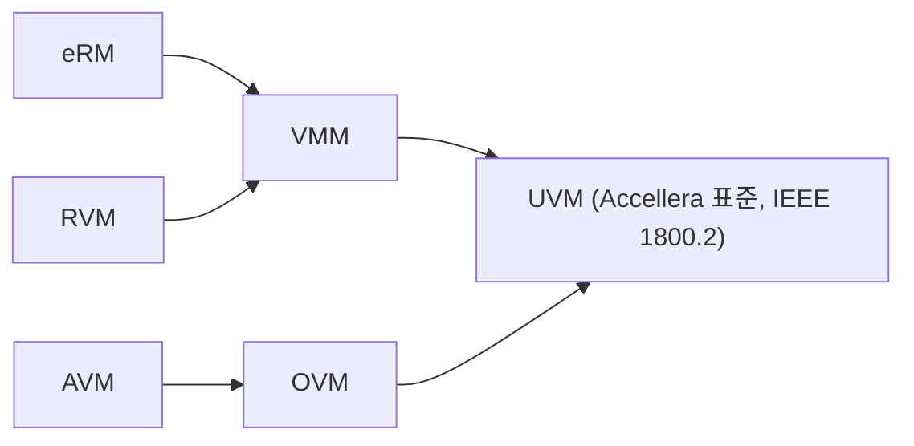

# Why UVM

:::tldr
- UVM은 3가지를 해결한다: **재사용성(reusability)**, **확장성(scalability)**, **coverage-driven 검증**.
- directed test는 corner case를 사람이 다 못 적고, TB가 프로젝트마다 통째로 버려진다.
- UVM = 표준화된 클래스 라이브러리 + factory/config/phase/TLM 인프라로 "재사용 가능한 검증 환경"을 찍어내는 방법론.
:::

## directed test의 한계

```sv
initial begin
  write(32'h1000, 32'hDEAD);
  read (32'h1000);
  write(32'h1004, 32'hBEEF);
  // ... 사람이 시나리오를 일일이 나열
end
```

- corner case를 **사람이 다 상상**해야 한다 → 누락 불가피.
- 신호가 바뀌면 TB 전체 수정.
- "얼마나 검증했나" 정량 지표가 없다.
- 다른 프로젝트로 **재사용 불가**.

## UVM이 주는 것

| 문제 | UVM의 답 |
|---|---|
| corner case 누락 | constrained random + functional coverage |
| 진행률 측정 불가 | coverage-driven → 정량 closure |
| TB 재사용 불가 | 표준 컴포넌트(agent/env) + factory override |
| 환경 구성 산발적 | phase + config_db로 일관된 build/connect |
| 컴포넌트 결합도 | TLM port로 느슨한 연결 |

## 방법론 계보



UVM은 OVM을 기반으로 Accellera가 표준화했고, 이제 IEEE 1800.2 표준입니다. 벤더 독립적이라 어느 시뮬레이터에서도 동작합니다.

:::note
UVM의 가치는 "클래스 몇 개"가 아니라 **재사용 가능한 검증 IP(VIP)**를 만들고 조립하는 *문화*에 있습니다. 그래서 단순 문법 암기보다 "왜 이렇게 나눠놨나"를 이해하는 게 핵심.
:::

```check
Q: UVM이 해결하려는 핵심 문제 3가지를 한 단어씩으로?
A: **Reusability**(IP/프로젝트 간 TB 재사용), **Scalability**(복잡도 증가에도 구조적 대응), **Coverage-driven**(검증 완료를 정량적으로 측정). 모두 directed test의 한계에서 출발한다.
H: 재사용 / 확장 / 측정
```

```check
Q: "directed test로도 다 되는데 왜 random인가?"에 한 문장으로 답하면?
A: 사람이 모든 corner case를 상상해 직접 적는 것은 스케일이 안 되고 누락이 불가피하기 때문. constrained random은 규칙만 주면 예상 못한 조합을 자동 생성하고, functional coverage로 그 진행률을 측정할 수 있다.
```
