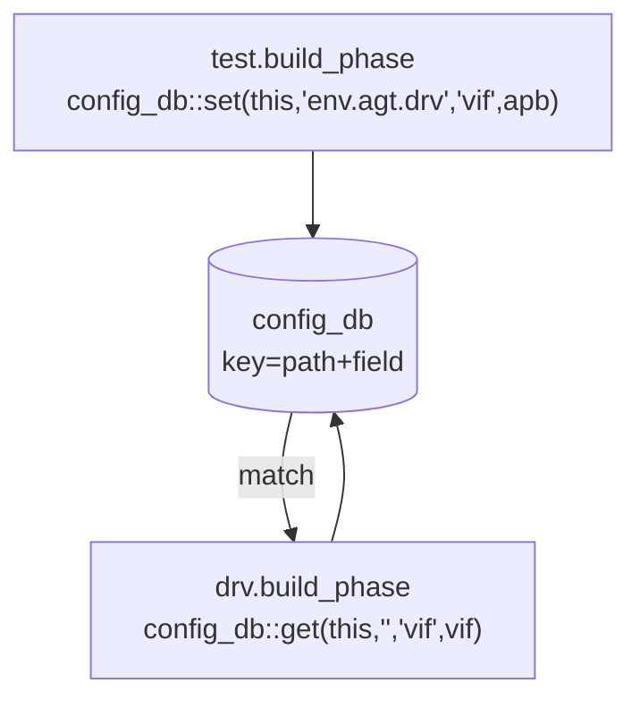

# Config DB

:::tldr
- `uvm_config_db#(T)::set/get` = 계층을 통해 설정/handle을 전달하는 중앙 저장소.
- 보통 **상위(test/env)에서 set → 하위(driver/monitor)에서 get**. virtual interface 전달의 표준 통로.
- 경로에 와일드카드 `*` 가능. 같은 키에 여러 set이 있으면 **계층 상위에서 한 set이 우선**하고, 같은 레벨이면 마지막 set이 우선.
:::

## set / get

```sv
// 상위에서 set: (context, instance_path, field_name, value)
uvm_config_db#(virtual apb_if)::set(null, "*",        "vif",     apb);
uvm_config_db#(int)         ::set(this, "env.agt*",  "is_active", UVM_ACTIVE);
uvm_config_db#(apb_cfg)     ::set(this, "env",       "cfg",     cfg);

// 하위에서 get: (context, "", field_name, var)
function void build_phase(uvm_phase phase);
  if (!uvm_config_db#(virtual apb_if)::get(this, "", "vif", vif))
    `uvm_fatal("NOVIF","no vif")
  void'(uvm_config_db#(apb_cfg)::get(this, "", "cfg", cfg));
endfunction
```

- `context` + `instance_path` 가 합쳐져 **누구에게** 적용될지 결정.
- `set(null, "*", ...)`: 전역(top 기준 모든 경로).
- `get(this, "", "vif", vif)`: 내 자신을 대상으로 한 set을 조회.

## 동작 그림



set은 키(경로+필드)와 값을 저장하고, get은 자신의 full path로 매칭되는 가장 우선하는 값을 꺼냅니다.

## resource_db와의 관계

`uvm_config_db`는 `uvm_resource_db` 위에 만든 편의 계층입니다. config_db는 "계층 경로 기반" 조회에 최적화돼 있어 TB 설정에 표준으로 씁니다.

:::gotcha
타입(`#(T)`)이 set과 get에서 **정확히 일치**해야 합니다. `set#(int)` 한 것을 `get#(bit[31:0])`로 받으면 매칭 실패. virtual interface도 interface 타입까지 동일해야 합니다.
:::

:::gotcha
set은 보통 build 단계에서, 부모가 자식보다 **먼저** 실행되므로(top-down) 값이 준비됩니다. 만약 자식 build에서 get이 실패한다면 set 경로/타입/타이밍을 의심하세요.
:::

```check
Q: virtual interface를 driver에 넘길 때 config_db를 쓰는 일반적 흐름은?
A: top module(또는 test)에서 `uvm_config_db#(virtual xxx_if)::set(null,"*","vif",intf)`로 등록하고, driver/monitor의 build_phase에서 `get(this,"","vif",vif)`로 받는다. get 실패 시 uvm_fatal. 이것이 static interface와 dynamic class를 잇는 표준 패턴.
H: 상위 set → 하위 get
```

```check
Q: `set#(int)`으로 넣은 값을 `get#(bit[31:0])`로 받으면 어떻게 되나?
A: 매칭 실패(get이 false 반환). config_db는 타입 파라미터 `#(T)`까지 키의 일부로 취급하므로 set/get의 타입이 정확히 일치해야 한다.
```
