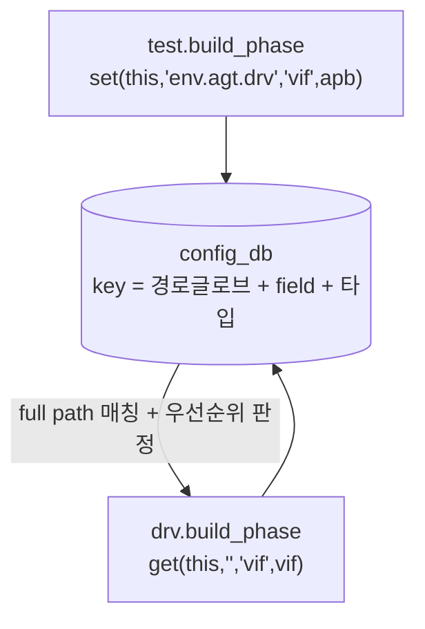

# Config DB

:::tldr
- `uvm_config_db#(T)::set/get` = 계층을 통해 설정/handle을 전달하는 중앙 저장소.
- 보통 **상위(test/env)에서 set → 하위(driver/monitor)에서 get**. virtual interface 전달의 표준 통로.
- 경로에 와일드카드 `*` 가능. 같은 키에 여러 set이 있으면 **계층 상위의 set이 우선**, 같은 레벨이면 나중 set이 우선.
- 최대의 적은 **조용한 실패** — 키 오타·타입 불일치는 컴파일 에러도 시뮬 에러도 아니다. get 반환값 체크 + `+UVM_CONFIG_DB_TRACE`가 생명줄.
:::

:::note 용어 빠른 정리 (한국어 ↔ English)
| 한국어 | English | 뜻 |
|---|---|---|
| 설정 데이터베이스 | configuration database | 계층 인지 key-value 저장소 |
| 문맥 | context (cntxt) | set/get의 기준 컴포넌트 (경로의 출발점) |
| 인스턴스 경로 | instance path | 대상 지정 문자열 (글로브 와일드카드 허용) |
| 와일드카드 | wildcard / glob | `*`(임의 문자열), `?`(한 글자) |
| 우선순위 | precedence | 여러 set이 겹칠 때 승자 규칙 |
| 설정 객체 | config object | 설정들을 묶은 uvm_object (권장 패턴) |
:::

## 0. 먼저 — 풀려는 문제: "깊은 곳까지 어떻게 내려보내나"

test가 결정한 설정(active/passive, 에러 허용치, 그리고 무엇보다 **virtual interface**)을 5단계 아래 driver가 써야 한다. 후보들을 보면:

- **생성자 인자로 전달?** — 중간의 env·agent 전부가 "자기는 안 쓰는 인자"를 받아 내려보내야 한다(tramp data). 설정 하나 추가될 때마다 전 계층 시그니처 수정 — 재사용 파괴.
- **전역 변수?** — 두 agent에 서로 다른 vif를 줄 수 없다. 누가 언제 바꿨는지 추적 불가.
- **UVM의 답** — **계층 경로를 키로 쓰는 중앙 저장소.** 주는 쪽은 "누구에게(`경로`) 무엇을(`키`) 얼마로(`값`)"를 등록하고, 받는 쪽은 "내 앞으로 온 것"을 조회한다. 중간 계층은 아무것도 몰라도 된다.

:::analogy
RTL에서 탑레벨 설정을 깊은 모듈까지 내려보내려고 모든 중간 모듈에 포트를 뚫던 그 배선 작업(feedthrough wiring)을 기억하면 된다 — config_db는 그 배선을 없앤 "주소 기반 우편함"이다. 받는 쪽 주소(계층 경로)만 맞으면 중간 모듈은 손대지 않는다.
:::

## 1. set / get

```sv
// 상위에서 set: (context, instance_path, field_name, value)
uvm_config_db#(virtual apb_if)::set(null, "*",        "vif",       apb);
uvm_config_db#(int)          ::set(this, "env.agt*",  "is_active", UVM_ACTIVE);
uvm_config_db#(apb_cfg)      ::set(this, "env",       "cfg",       cfg);

// 하위에서 get: (context, "", field_name, var)
function void build_phase(uvm_phase phase);
  if (!uvm_config_db#(virtual apb_if)::get(this, "", "vif", vif))
    `uvm_fatal("NOVIF","no vif")
  void'(uvm_config_db#(apb_cfg)::get(this, "", "cfg", cfg));  // 선택적 설정은 void' 캐스팅으로 의도 표시
endfunction
```

인자 4개의 역할:

| 인자 | set에서 | get에서 |
|---|---|---|
| `cntxt` | 경로의 출발점 (null=절대경로) | 보통 `this` (나) |
| `inst_name` | **대상** 경로 (cntxt 기준 상대, glob 가능) | 보통 `""` (나 자신 조회) |
| `field_name` | 키 문자열 | set과 **정확히 같은 문자열** |
| `value` | 넣을 값 | 받을 변수 (ref) |

- 실효 키 = `cntxt.get_full_name() + "." + inst_name` 글로브 + field_name + **타입 `#(T)`**. 셋 중 하나만 어긋나도 미스.
- `set(null, "*", ...)`: 전역(top 기준 모든 경로). top module(class 밖)에서는 cntxt 자리에 null을 쓴다.

## 2. 동작 그림과 우선순위



get은 자신의 full path(`uvm_test_top.env.agt.drv`)에 매칭되는 모든 set 중 **가장 우선하는 것**을 받는다:

1. **계층이 높은 곳에서 한 set이 이긴다** (test의 set이 env의 set을 덮음) — "상위가 하위 기본값을 재정의한다"는 정책 의도.
2. 같은 컴포넌트가 여러 번 set → **나중 set이 이긴다**.

> 1번이 직관과 반대로 느껴질 수 있다(보통 "가까운 게 이긴다"고 기대하니까). UVM의 선택은 "**test가 최종 결정권자**" — env가 기본값을 set해도 test가 덮어쓸 수 있게 하기 위함이다.

## 3. 표준 사용처 — virtual interface 배달

```sv
// tb_top.sv (module 영역) — static 세계의 물건을 등록
apb_if apb(clk, rstn);
initial begin
  uvm_config_db#(virtual apb_if)::set(null, "uvm_test_top.env.agt*", "vif", apb);
  run_test();
end

// driver (class 세계) — 꺼내 쓴다
class apb_driver extends uvm_driver #(apb_txn);
  virtual apb_if vif;
  function void build_phase(uvm_phase phase);
    super.build_phase(phase);
    if (!uvm_config_db#(virtual apb_if)::get(this, "", "vif", vif))
      `uvm_fatal("NOVIF", {"vif not set for ", get_full_name()})
  endfunction
endclass
```

static(module) 세계와 dynamic(class) 세계를 잇는 표준 다리다 — part0/vif에서 본 그 문제의 공식 해법.

### config object 패턴 (실무 권장)

설정이 늘어나면 int 수십 개를 따로 set/get 하지 말고 **하나의 config object로 묶는다**:

```sv
class apb_cfg extends uvm_object;
  `uvm_object_utils(apb_cfg)
  virtual apb_if vif;
  uvm_active_passive_enum is_active = UVM_ACTIVE;
  int unsigned timeout_cycles = 1000;
  function new(string name="apb_cfg"); super.new(name); endfunction
endclass
// test: cfg 하나만 set → agent: cfg 하나만 get 후 자식에게 분배
```

키가 1개로 줄어 오타 표면적이 줄고, 설정의 단위가 명확해진다. 상용 VIP가 모두 이 패턴이다.

## 4. resource_db와의 관계

`uvm_config_db`는 `uvm_resource_db` 위에 만든 편의 계층입니다. config_db는 "계층 경로 기반" 조회에 최적화돼 있어 TB 설정에 표준으로 씁니다. (resource_db를 직접 쓸 일은 드물다 — "있다"만 알아두면 된다.)

:::gotcha
**config_db의 실패는 조용하다.** 키 오타·경로 미스·타입 불일치 — 어느 것도 컴파일 에러나 시뮬 에러를 내지 않고, 그냥 get이 false를 반환할 뿐이다. 그래서 ① **get 반환값을 반드시 체크**(필수 설정은 `uvm_fatal`) ② 디버그는 **`+UVM_CONFIG_DB_TRACE`** — 모든 set/get과 매칭 결과가 로그에 찍힌다. 이 플래그 하나가 수 시간을 아낀다.
:::

:::gotcha
타입(`#(T)`)이 set과 get에서 **정확히 일치**해야 합니다. `set#(int)` 한 것을 `get#(bit[31:0])`로 받으면 매칭 실패. virtual interface도 interface 타입(+파라미터)까지 동일해야 합니다.
:::

:::gotcha
타이밍 — set은 보통 build에서, 부모가 자식보다 **먼저** 실행되므로(top-down) 자식 get 시점에 값이 준비됩니다. 거꾸로 **자식이 set하고 부모가 get** 하거나, run 중에 set한 것을 build에서 기대하는 식의 시간 역행은 실패. get 실패 디버그 순서: 키 문자열 → 타입 → 경로(글로브가 full path를 정말 덮나) → set/get 시점.
:::

```check
Q: virtual interface를 driver에 넘길 때 config_db를 쓰는 일반적 흐름은?
A: top module(또는 test)에서 `uvm_config_db#(virtual xxx_if)::set(null,"*","vif",intf)`로 등록하고, driver/monitor의 build_phase에서 `get(this,"","vif",vif)`로 받는다. get 실패 시 uvm_fatal. 이것이 static interface와 dynamic class를 잇는 표준 패턴.
H: 상위 set → 하위 get
```

```check
Q: `set#(int)`으로 넣은 값을 `get#(bit[31:0])`로 받으면 어떻게 되나?
A: 매칭 실패(get이 false 반환). config_db는 타입 파라미터 `#(T)`까지 키의 일부로 취급하므로 set/get의 타입이 정확히 일치해야 한다.
```

```check
Q: env와 test가 같은 키를 set 했다. driver의 get은 누구 값을 받나? 그 규칙의 설계 의도는?
A: **test(계층 상위) 값**. 같은 키에 대한 set은 계층이 높은 쪽이 우선하고, 같은 레벨이면 나중 set이 이긴다. 의도는 "test가 최종 결정권자" — 하위가 깔아둔 기본값을 test가 코드 수정 없이 덮어쓸 수 있게 하기 위함이다.
H: 최종 결정권은 누구에게 주고 싶나?
```

```check
Q: config_db get 실패를 디버그하는 가장 효율적인 도구와, 점검 순서는?
A: `+UVM_CONFIG_DB_TRACE` 플래그 — 모든 set/get과 매칭 여부가 로그로 찍힌다. 점검 순서: ① field 키 문자열 오타 ② 타입 `#(T)` 불일치 ③ 경로(set의 cntxt+inst_name 글로브가 get 하는 컴포넌트의 full path를 덮는지) ④ set/get 시점(자식 build 전에 set 됐는지).
```

```check
Q: 설정 항목이 10개로 늘었다. 실무 권장 패턴은?
A: 개별 set/get 10쌍 대신 **config object**(uvm_object 파생)에 묶어 한 번에 전달한다. 키가 하나로 줄어 조용한 실패 표면적이 줄고, agent가 cfg를 받아 자식들에게 분배하는 구조로 설정의 소유권이 명확해진다. 상용 VIP의 표준 작법.
H: 낱개 배달 vs 박스 배달
```
