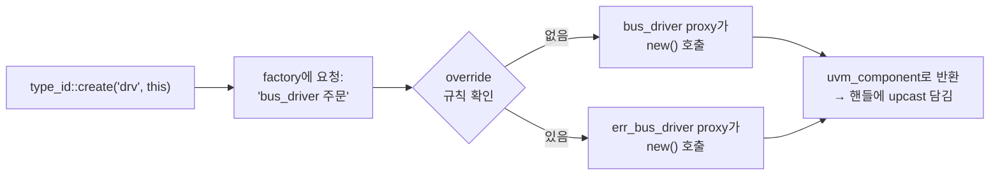

# Factory & create()

:::tldr
- factory = "타입 이름으로 객체를 만들어주는 중앙 공장". `type_id::create()`로 생성하면 **런타임에 다른 타입으로 교체(override)** 가능.
- `new()`는 그 타입으로 고정. `create()`는 factory를 거치므로 유연.
- 등록 매크로(`uvm_component_utils`/`uvm_object_utils`)가 타입을 factory에 등록해 create/override를 가능하게 한다.
- 마법이 아니다 — **registry(등록부) + proxy(대리 생성자)** 로 구현된 고전 factory 디자인 패턴이다.
:::

:::note 용어 빠른 정리 (한국어 ↔ English)
| 한국어 | English | 뜻 |
|---|---|---|
| 공장 패턴 | factory pattern | 생성을 간접화해 타입을 바꿔치기 가능하게 하는 설계 패턴 |
| 등록 | registration | 타입을 factory 등록부에 올리는 것 (utils 매크로) |
| 등록부 | registry | factory가 가진 "이름→타입" 테이블 |
| 대리자 | proxy | 실제 타입 대신 생성을 대행하는 경량 객체 (`type_id`) |
| 재정의 | override | "A 주문이 오면 B를 만들어라"는 지시 |
:::

## 0. 먼저 — 다형성의 마지막 구멍

Part 0 OOP에서: base handle + `virtual`로 **동작**은 런타임에 갈아끼울 수 있다. 그런데 한 군데가 여전히 고정이다 — **생성**:

```sv
bus_driver drv;
drv = new("drv", this);   // 이 줄을 쓰는 순간, 타입은 bus_driver로 영원히 박힌다
```

`new()`는 컴파일 타임에 타입이 결정된다. env 코드에 `new`가 박혀 있으면, driver를 err_driver로 바꾸려면 **env 소스를 고쳐야** 한다 — 재사용 실패. 그래서 생성 자체를 간접화한다: "내가 직접 만들지 않고, **공장에 '이 이름으로 등록된 것'을 주문**한다." 이게 factory 패턴(GoF의 고전 패턴 그대로)이고, UVM은 이를 라이브러리 차원에서 표준화했다.

> 다형성(virtual) = 만들어진 객체의 동작 교체. factory = **만들어지는 타입 자체의 교체.** 둘이 합쳐져야 "코드 수정 없이 TB 동작 변경"이 완성된다.

## 1. new() vs create()

```sv
// ❌ 고정: 항상 정확히 bus_driver
bus_driver drv = new("drv", this);

// ✅ 유연: factory에 등록된 (override 가능한) 타입
bus_driver drv = bus_driver::type_id::create("drv", this);
```

`create`는 내부적으로 factory에게 "bus_driver로 등록된 것을 만들어줘"라고 요청합니다. 누군가 override 해뒀다면 파생 클래스가 대신 생성됩니다.

## 2. 등록 매크로

```sv
class bus_driver extends uvm_driver #(bus_txn);
  `uvm_component_utils(bus_driver)   // factory 등록 + 유틸
  function new(string name, uvm_component parent);
    super.new(name, parent);
  endfunction
endclass

class bus_txn extends uvm_sequence_item;
  `uvm_object_utils(bus_txn)
  function new(string name="bus_txn"); super.new(name); endfunction
endclass
```

매크로가 하는 일:
1. factory에 타입 등록 → `create()` 가능
2. `get_type_name()` 등 타입 정보 제공
3. (필드 매크로와 함께) copy/compare/print 자동화

### object용 vs component용 — create 시그니처가 다르다

| | `uvm_object_utils` | `uvm_component_utils` |
|---|---|---|
| 대상 | transaction/sequence/config | driver/monitor/env/test |
| create | `create("name")` | `create("name", parent)` |
| new 시그니처 | `new(string name="")` | `new(string name, uvm_component parent)` |

component는 hierarchy에 등록돼야 하므로 parent가 필수 — part1/class-hierarchy의 구분이 여기서도 그대로 적용된다.

## 3. 내부 동작 — registry와 proxy

`type_id`의 정체를 알면 마법이 풀린다. utils 매크로가 펼쳐지면 대략 이렇게 된다:

```sv
// `uvm_component_utils(bus_driver) 가 만들어주는 것 (개념적으로)
typedef uvm_component_registry #(bus_driver, "bus_driver") type_id;
```

- **`type_id`** = 이 클래스 전용 **proxy 타입**. "bus_driver를 만들 줄 아는 경량 대리자"로, factory 등록부에 자기를 올린다.
- **factory**(싱글톤) = `"이름/타입" → proxy` 테이블(**registry**) + override 규칙 목록.
- `type_id::create("drv", this)`의 실행 경로:



즉 create는 ① 공장에 주문 → ② 공장이 override 테이블 확인 → ③ 당첨된 타입의 proxy가 진짜 `new()`를 호출 → ④ base 핸들로 반환. **반환을 base 핸들(bus_driver)에 담아도 동작이 derived로 도는 이유 = part0의 다형성** 그대로다. 그래서 override 타입은 반드시 원래 타입의 파생(타입 호환)이어야 한다.

## 4. 왜 공장을 거치나 — 효과

테스트 코드를 **한 줄도 안 고치고**, test에서 override만 선언하면 전혀 다른 driver가 박힙니다 → 에러 주입 테스트, 프로토콜 변형 등. (구체적 override API는 다음 챕터.)

```sv
class err_test extends base_test;
  function void build_phase(uvm_phase phase);
    bus_driver::type_id::set_type_override(err_bus_driver::get_type());
    super.build_phase(phase);   // 이후 env가 create하는 모든 bus_driver → err_bus_driver
  endfunction
endclass
```

:::gotcha
`create()`를 써야 override가 먹습니다. 습관적으로 `new()`를 쓰면 그 컴포넌트는 **영원히 override 불가**. UVM에서 component/object 생성은 거의 항상 `type_id::create`. (예외적으로 TB 외부에 안 보이는 순수 내부 객체 정도만 new 허용.)
:::

:::gotcha
create의 인자 실수 단골 둘 — ① component인데 parent(`this`)를 빠뜨림 → hierarchy 미등록(topology에 안 보이고 config_db 경로 매칭 실패). ② name 문자열을 핸들 이름과 다르게/중복되게 지음 → 로그·경로가 헷갈림. **관례: name 문자열 = 핸들 변수명.**
:::

:::analogy
`new()` = 특정 공장에 직접 전화해 "이 모델만 주세요". `create()` = 본사(factory)에 주문 → 본사가 "이 주문은 신형으로 대체하라"는 지시(override)가 있으면 신형을 보냄. 주문서(코드)는 그대로. codec 검증으로 치면: 같은 TB 골격에서 정상 스트림 generator를 corrupt generator로 갈아끼우던 그 일을, 소스 수정 없이 주문 규칙 하나로 하는 것.
:::

```check
Q: `new()` 대신 `type_id::create()`로 생성해야 하는 핵심 이유는?
A: create는 factory를 거치므로 test 레벨에서 **factory override**로 런타임에 파생 클래스로 교체할 수 있다. new는 그 타입으로 고정되어 override가 불가능하다. UVM의 재사용성(코드 수정 없이 동작 변경)이 여기서 나온다.
H: 코드 수정 없이 타입 바꾸기
```

```check
Q: `uvm_component_utils(my_driver)` 매크로를 빠뜨리면 무슨 일이 생기나?
A: my_driver가 factory에 등록되지 않아 `my_driver::type_id::create()`가 동작하지 않고, factory override 대상도 될 수 없다. 즉 UVM 생성/교체 인프라에서 빠진다.
```

```check
Q: `type_id`의 정체와 create의 내부 경로를 설명하면?
A: `type_id`는 utils 매크로가 만들어주는 그 클래스 전용 **registry/proxy 타입**(`uvm_component_registry#(T,"T")`)이다. `create()`는 싱글톤 factory에 주문 → factory가 override 테이블을 확인 → 당첨된 타입의 proxy가 실제 `new()`를 호출 → base 핸들로 반환한다. 다형성 덕분에 base 핸들로 받아도 derived 동작이 실행된다.
H: 등록부에서 찾고, 대리자가 new를 부른다
```

```check
Q: 다형성(virtual)만으로는 부족해서 factory가 필요한 이유를 한 문장으로?
A: virtual은 **이미 만들어진 객체**의 동작을 실제 타입으로 디스패치할 뿐, 어떤 타입이 **만들어질지**는 `new()`가 박힌 코드가 결정한다. 생성 시점의 타입 결정까지 런타임으로 미루려면 생성을 간접화하는 factory가 필요하다.
H: 동작 교체 vs 생성 교체
```
