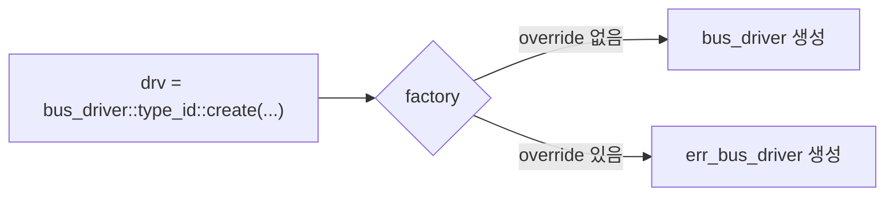

# Factory & create()

:::tldr
- factory = "타입 이름으로 객체를 만들어주는 중앙 공장". `type_id::create()`로 생성하면 **런타임에 다른 타입으로 교체(override)** 가능.
- `new()`는 그 타입으로 고정. `create()`는 factory를 거치므로 유연.
- 등록 매크로(`uvm_component_utils`/`uvm_object_utils`)가 타입을 factory에 등록해 create/override를 가능하게 한다.
:::

## new() vs create()

```sv
// ❌ 고정: 항상 정확히 bus_driver
bus_driver drv = new("drv", this);

// ✅ 유연: factory에 등록된 (override 가능한) 타입
bus_driver drv = bus_driver::type_id::create("drv", this);
```

`create`는 내부적으로 factory에게 "bus_driver로 등록된 것을 만들어줘"라고 요청합니다. 누군가 override 해뒀다면 파생 클래스가 대신 생성됩니다.

## 등록 매크로

```sv
class bus_driver extends uvm_driver #(bus_txn);
  `uvm_component_utils(bus_driver)   // factory 등록 + field automation
  function new(string name, uvm_component parent);
    super.new(name, parent);
  endfunction
endclass

class bus_txn extends uvm_sequence_item;
  `uvm_object_utils(bus_txn)
  function new(string name="bus_txn"); super.new(name); endfunction
endclass
```

매크로가 하는 일:
1. factory에 타입 등록 → `create()` 가능
2. `get_type_name()` 등 타입 정보 제공
3. (필드 매크로와 함께) copy/compare/print 자동화

## 왜 공장을 거치나?



테스트 코드를 **한 줄도 안 고치고**, test에서 override만 선언하면 전혀 다른 driver가 박힙니다 → 에러 주입 테스트, 프로토콜 변형 등.

:::gotcha
`create()`를 써야 override가 먹습니다. 습관적으로 `new()`를 쓰면 그 컴포넌트는 **영원히 override 불가**. UVM에서 component/object 생성은 거의 항상 `type_id::create`.
:::

:::analogy
`new()` = 특정 공장에 직접 전화해 "이 모델만 주세요". `create()` = 본사(factory)에 주문 → 본사가 "이 주문은 신형으로 대체하라"는 지시(override)가 있으면 신형을 보냄. 주문서(코드)는 그대로.
:::

```check
Q: `new()` 대신 `type_id::create()`로 생성해야 하는 핵심 이유는?
A: create는 factory를 거치므로 test 레벨에서 **factory override**로 런타임에 파생 클래스로 교체할 수 있다. new는 그 타입으로 고정되어 override가 불가능하다. UVM의 재사용성(코드 수정 없이 동작 변경)이 여기서 나온다.
H: 코드 수정 없이 타입 바꾸기
```

```check
Q: `uvm_component_utils(my_driver)` 매크로를 빠뜨리면 무슨 일이 생기나?
A: my_driver가 factory에 등록되지 않아 `my_driver::type_id::create()`가 동작하지 않고, factory override 대상도 될 수 없다. 즉 UVM 생성/교체 인프라에서 빠진다.
```
