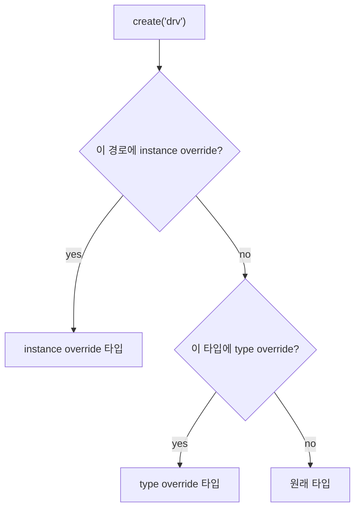

# Type vs Instance Override

:::tldr
- **type override**: 해당 타입의 **모든** 인스턴스를 교체. `set_type_override_by_type`.
- **instance override**: 특정 경로의 인스턴스만 교체. `set_inst_override_by_type`.
- 보통 type override로 시작, 세밀한 제어가 필요하면 instance override. **test의 build_phase, `super.build_phase()` 이전**에 선언.
- 디버그는 `factory.print()` + `print_topology()` — "교체가 됐는지"를 추측하지 말고 찍어서 확인.
:::

:::note 용어 빠른 정리 (한국어 ↔ English)
| 한국어 | English | 뜻 |
|---|---|---|
| 타입 재정의 | type override | 타입 전체 교체 규칙 |
| 인스턴스 재정의 | instance override | 경로 지정 교체 규칙 |
| 타입 기준 | by_type | `T::get_type()` 객체로 지정 (컴파일 체크 O) |
| 이름 기준 | by_name | `"T"` 문자열로 지정 (컴파일 체크 X) |
| 타입 호환 | type compatibility | override 타입이 원래 타입의 파생이어야 함 |
:::

## 0. 먼저 — override가 실무에서 사는 자리

전형적 상황: 잘 도는 env가 있고, **에러 주입 테스트**를 추가하고 싶다. UVM 이전 방식은 env를 복사해 driver만 바꾼 "err_env"를 만드는 것 — env가 진화할 때마다 복사본도 따라 고쳐야 하는 유지보수 지옥. override는 이 문제를 뒤집는다:

> env는 하나만 유지하고, **test마다 "주문 규칙"만 다르게 선언**한다. base_test는 정상 driver, err_test는 err_driver — env 소스는 한 줄도 안 바뀐다. **test = env + override 선언 + 시퀀스 선택**이라는 UVM 테스트 작법의 핵심 축이다.

## 1. type override — "이 타입은 전부 교체"

```sv
class err_test extends base_test;
  function void build_phase(uvm_phase phase);
    // 모든 bus_driver를 err_bus_driver로 교체
    set_type_override_by_type(bus_driver::get_type(),
                              err_bus_driver::get_type());
    super.build_phase(phase);   // 그 다음 env build
  endfunction
endclass
```

축약 형태(같은 일):

```sv
bus_driver::type_id::set_type_override(err_bus_driver::get_type());
```

## 2. instance override — "이 경로만 교체"

```sv
// agent0의 driver만 교체, agent1은 그대로
set_inst_override_by_type("env.agt0.drv",
                          bus_driver::get_type(),
                          err_bus_driver::get_type());
```

경로는 override 당하는 인스턴스의 full path(와일드카드 `*` 가능). 멀티 agent 환경에서 "한 포트만 에러 주입" 같은 비대칭 시나리오의 도구다.

## 3. by_type vs by_name

각 API에 `_by_type` / `_by_name` 두 변종이 있다:

```sv
set_type_override_by_type(bus_driver::get_type(), err_bus_driver::get_type());
set_type_override("bus_driver", "err_bus_driver");   // by_name (문자열)
```

| | by_type | by_name |
|---|---|---|
| 지정 방식 | `T::get_type()` | `"T"` 문자열 |
| 오타 검출 | **컴파일 에러** | 런타임 경고뿐 (조용히 무시될 수 있음) |
| 컴파일 의존성 | 그 타입이 컴파일 범위에 있어야 | 없어도 됨 |
| 쓰는 곳 | 기본값 — 거의 항상 | 명령행/설정 파일에서 타입을 고를 때, 컴파일 분리가 필요한 빅 환경 |

**기본은 by_type.** by_name은 문자열이 utils 매크로에 등록된 이름과 정확히 일치해야 하며, 오타가 나면 에러 없이 "override 안 됨"으로 끝난다.

## 4. 우선순위와 연쇄

instance override가 type override보다 **우선**합니다. 같은 인스턴스에 둘 다 걸리면 instance 쪽이 이깁니다.



추가 규칙 둘:
- **연쇄(chaining):** A→B, B→C 가 둘 다 선언되면 A 주문 시 **C**가 생성된다 (factory가 결과 타입으로 다시 조회를 반복).
- 같은 종류의 override가 겹치면 **먼저 선언된 것이 이긴다** (instance override 경로가 겹치는 경우). 규칙을 외우기보다, 겹치게 선언하지 않는 게 정답.

## 5. 디버그 — 추측하지 말고 찍어라

override가 "먹었는지"는 두 줄로 확인된다:

```sv
// end_of_elaboration_phase 쯤에서
uvm_factory::get().print();      // 등록 타입 + override 규칙 테이블 덤프
uvm_top.print_topology();        // 실제 생성된 타입 확인 ← 최종 진실
```

topology에서 `drv` 자리의 타입이 `err_bus_driver`로 보이면 성공. 이 두 출력은 "왜 override가 안 먹지?" 디버그의 처음이자 거의 끝이다.

:::gotcha
override는 **create가 일어나기 전**에 선언돼야 합니다. 그래서 test의 build_phase에서 `super.build_phase()`(=env가 자식들을 create하는 시점) **이전**에 set_*_override를 호출하는 순서가 중요합니다. 순서가 바뀌면 이미 원래 타입으로 생성된 뒤라 조용히 무시됩니다.
:::

:::gotcha
override가 안 먹는 3대 원인 체크리스트 — ① 대상이 `new()`로 생성되고 있다(create만 factory를 거친다) ② override 타입이 utils 매크로로 **등록 안 됨** ③ by_name 문자열 오타 / instance 경로 오타(경로는 `get_full_name()` 기준, `uvm_test_top.`부터인지 확인). 셋 다 아니면 선언 시점(super.build 이후) 문제.
:::

:::tip
override 대상은 base/derived가 **타입 호환**이어야 합니다(보통 derived가 base를 extends). 그래야 base handle에 안전하게 담깁니다(다형성). 호환 안 되면 런타임 에러.
:::

:::analogy
codec 검증에서 같은 TB로 정상 스트림과 corrupt 스트림 테스트를 모두 돌리던 것을 떠올리면 된다 — TB를 복제하는 게 아니라 **스트림 생성기만 갈아끼웠다**. override는 그 "갈아끼우기"를 문자 그대로 코드 수정 0줄로 만든 장치다. type override = 전 채널 교체, instance override = 특정 채널만.
:::

```check
Q: type override와 instance override의 차이와, 둘이 동시에 걸렸을 때 누가 이기나?
A: type override는 해당 타입의 **모든** 인스턴스를 교체, instance override는 특정 **경로의 인스턴스만** 교체한다. 같은 인스턴스에 둘 다 적용되면 **instance override가 우선**한다.
H: 좁은 범위가 이긴다
```

```check
Q: test의 build_phase에서 override 호출과 `super.build_phase()`의 순서가 왜 중요한가?
A: override는 자식 컴포넌트가 `create`되기 전에 등록돼야 효력이 있다. env의 자식 생성은 `super.build_phase()`에서 일어나므로, override 선언을 그 호출 **이전**에 두어야 한다. 순서가 바뀌면 이미 원래 타입으로 생성된 뒤라 override가 무시된다.
```

```check
Q: by_type과 by_name 중 무엇을 기본으로 쓰고, by_name의 위험은?
A: 기본은 **by_type**(`T::get_type()`) — 오타가 컴파일 에러로 잡힌다. by_name은 문자열 기반이라 오타·등록명 불일치 시 **에러 없이 조용히 무시**될 수 있다. 컴파일 의존성을 끊어야 하는 특수한 경우에만 by_name.
H: 컴파일러가 잡아주는 쪽
```

```check
Q: override를 선언했는데 안 먹는 것 같다. 확인 절차는?
A: `uvm_factory::get().print()`로 override 규칙이 등록됐는지, `uvm_top.print_topology()`로 실제 생성된 타입이 바뀌었는지 찍는다. 안 바뀌었다면 ① new() 사용 ② override 타입 미등록 ③ 경로/이름 오타 ④ super.build_phase 이후 선언 — 순으로 점검한다.
```
