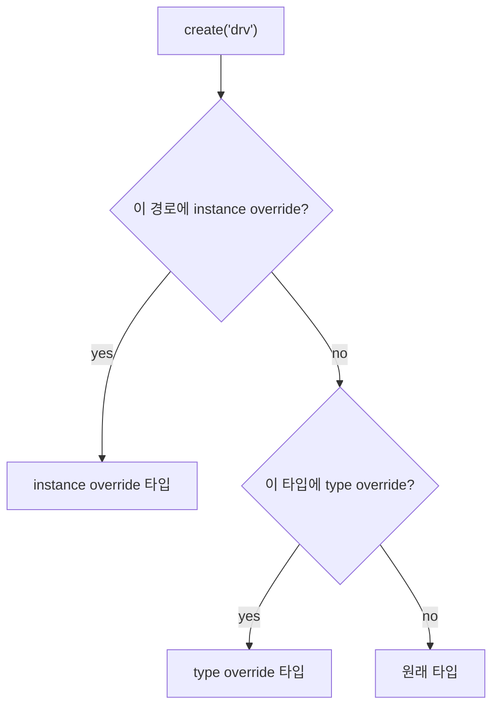

# Type vs Instance Override

:::tldr
- **type override**: 해당 타입의 **모든** 인스턴스를 교체. `set_type_override_by_type`.
- **instance override**: 특정 경로의 인스턴스만 교체. `set_inst_override_by_type`.
- 보통 type override로 시작, 세밀한 제어가 필요하면 instance override. test의 build_phase에서 선언.
:::

## type override

```sv
class err_test extends base_test;
  function void build_phase(uvm_phase phase);
    // 모든 bus_driver를 err_bus_driver로 교체
    set_type_override_by_type(bus_driver::get_type(),
                              err_bus_driver::get_type());
    super.build_phase(phase);   // 그 다음 env build
  endfunction
endclass
```

축약 매크로/형태:

```sv
bus_driver::type_id::set_type_override(err_bus_driver::get_type());
```

## instance override

```sv
// agent0의 driver만 교체, agent1은 그대로
set_inst_override_by_type("env.agt0.drv",
                          bus_driver::get_type(),
                          err_bus_driver::get_type());
```

경로는 override 당하는 인스턴스의 full path(와일드카드 `*` 가능).

## 우선순위

instance override가 type override보다 **우선**합니다. 같은 인스턴스에 둘 다 걸리면 instance 쪽이 이깁니다.



:::gotcha
override는 **create가 일어나기 전**에 선언돼야 합니다. 그래서 test의 build_phase에서 `super.build_phase()`(=env가 자식들을 create하는 시점) **이전**에 set_*_override를 호출하는 순서가 중요합니다.
:::

:::tip
override 대상은 base/derived가 **타입 호환**이어야 합니다(보통 derived가 base를 extends). 그래야 base handle에 안전하게 담깁니다(다형성). 호환 안 되면 런타임 에러.
:::

```check
Q: type override와 instance override의 차이와, 둘이 동시에 걸렸을 때 누가 이기나?
A: type override는 해당 타입의 **모든** 인스턴스를 교체, instance override는 특정 **경로의 인스턴스만** 교체한다. 같은 인스턴스에 둘 다 적용되면 **instance override가 우선**한다.
H: 좁은 범위가 이긴다
```

```check
Q: test의 build_phase에서 override 호출과 `super.build_phase()`의 순서가 왜 중요한가?
A: override는 자식 컴포넌트가 `create`되기 전에 등록돼야 효력이 있다. env의 자식 생성은 `super.build_phase()`에서 일어나므로, override 선언을 그 호출 **이전**에 두어야 한다. 순서가 바뀌면 이미 원래 타입으로 생성된 뒤라 override가 무시된다.
```
