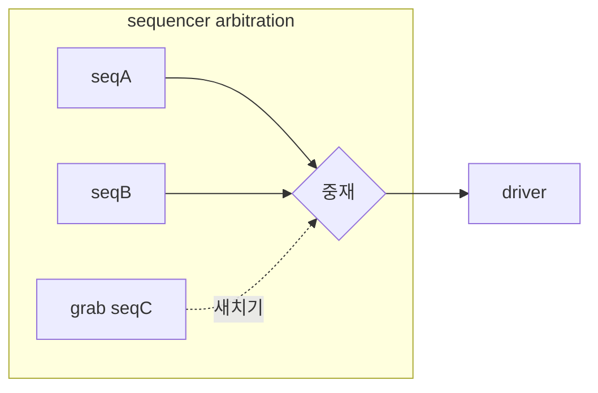

# Arbitration · lock · grab

:::tldr
- 한 sequencer에 여러 sequence가 동시에 item을 보내려 하면 sequencer가 **중재(arbitration)**한다.
- 중재 모드: FIFO/RANDOM/priority/weighted 등. `set_arbitration()`.
- **lock**: 내 차례를 양보 안 함(큐에 줄 서서 독점). **grab**: 새치기(맨 앞 독점). 둘 다 unlock/ungrab 필수.
:::

## arbitration 모드

```sv
sqr.set_arbitration(UVM_SEQ_ARB_WEIGHTED);
```

| 모드 | 동작 |
|---|---|
| UVM_SEQ_ARB_FIFO (기본) | 먼저 온 순서 |
| UVM_SEQ_ARB_WEIGHTED | priority 가중 랜덤 |
| UVM_SEQ_ARB_RANDOM | 균등 랜덤 |
| UVM_SEQ_ARB_STRICT_FIFO | priority 높은 것 중 FIFO |
| UVM_SEQ_ARB_STRICT_RANDOM | priority 높은 것 중 랜덤 |
| UVM_SEQ_ARB_USER | 사용자 정의 `user_priority_arbitration()` |

priority 지정:

```sv
seq.start(sqr, .this_priority(300));  // 높을수록 우선(STRICT 모드에서)
```

## lock — 줄 서서 독점

```sv
task body();
  lock(m_sequencer);     // 내 차례가 되면 그때부터 독점
  // ... 원자적으로 보낼 item들 (중간에 끼어들기 없음) ...
  unlock(m_sequencer);
endtask
```

lock은 **arbitration 큐를 정상적으로 통과**한 뒤 독점합니다(공정).

## grab — 새치기 독점

```sv
grab(m_sequencer);       // 큐 맨 앞으로 즉시 새치기
// ... 긴급 시퀀스 (예: 에러 복구) ...
ungrab(m_sequencer);
```

grab은 현재 진행 중인 item 경계 후 **즉시** 독점합니다(우선순위 무시).



:::gotcha
lock/grab 후 **반드시 unlock/ungrab**. 빠뜨리면 다른 sequence가 영원히 item을 못 보내 hang. 보통 try-finally가 없으니 예외 경로에서도 풀리도록 구조에 주의.
:::

:::tip
대부분의 환경은 기본 FIFO로 충분합니다. lock/grab은 "레지스터 설정 도중 끼어들면 안 되는 원자적 시퀀스"나 "에러 복구 긴급 시퀀스" 같은 특수 상황에만.
:::

```check
Q: lock과 grab의 차이는?
A: 둘 다 sequencer를 독점하지만, **lock**은 arbitration 큐를 정상적으로 통과한 뒤(공정하게 차례가 오면) 독점하고, **grab**은 큐를 무시하고 현재 item 경계 직후 즉시 새치기로 독점한다. grab이 더 강하고 긴급용.
H: 줄 서기 vs 새치기
```

```check
Q: 여러 sequence가 한 sequencer에 동시에 item을 보낼 때 순서는 누가 정하나? 기본 모드는?
A: sequencer의 **arbitration**이 정한다. 기본은 `UVM_SEQ_ARB_FIFO`(먼저 온 순서). priority 기반이 필요하면 STRICT/WEIGHTED 모드로 바꾸고 start의 this_priority로 우선순위를 준다.
```
