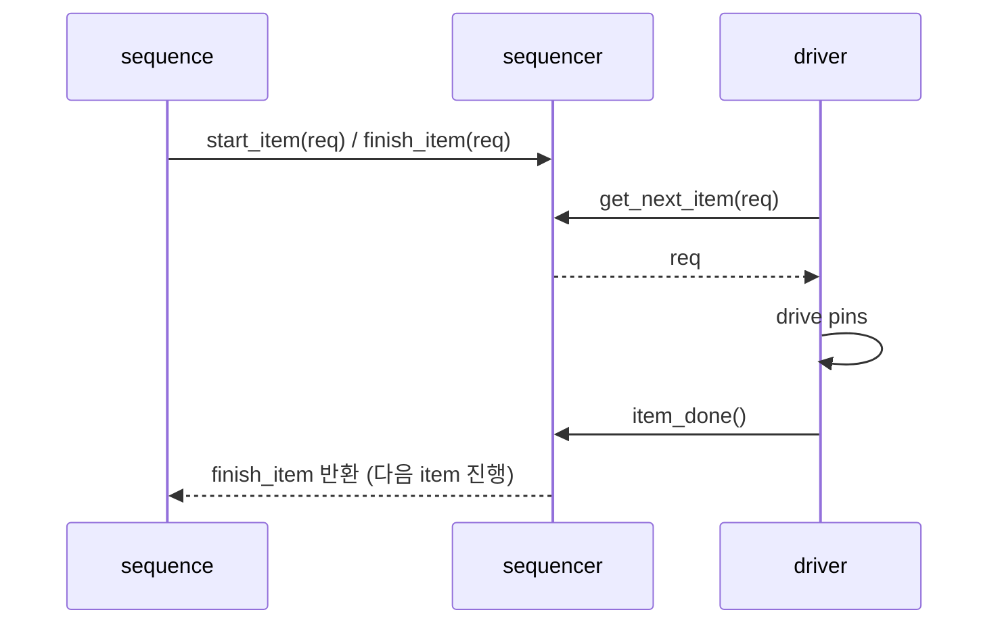

# Driver–Sequencer Handshake

:::tldr
- sequencer는 sequence가 만든 item을 driver에게 **중재해서 전달**한다.
- 핵심 핸드셰이크: driver가 `seq_item_port.get_next_item(req)` → 핀 구동 → `item_done()`.
- `get_next_item`/`item_done` (blocking) vs `get`/`put`. response가 필요하면 `item_done(rsp)` 또는 `put(rsp)`.
:::

## 연결

```sv
// agent.connect_phase
drv.seq_item_port.connect(sqr.seq_item_export);
```

driver의 `seq_item_port`와 sequencer의 `seq_item_export`를 연결하면 통로가 생깁니다.

## driver run_phase (정석)

```sv
task run_phase(uvm_phase phase);
  forever begin
    seq_item_port.get_next_item(req);   // sequence가 줄 때까지 block
    drive(req);                          // 핀 토글
    seq_item_port.item_done();           // 완료 알림 → sequence 진행
  end
endtask

task drive(apb_txn t);
  @(vif.cb);
  vif.cb.paddr  <= t.addr;
  vif.cb.pwrite <= t.is_write;
  vif.cb.psel   <= 1;
  @(vif.cb); vif.cb.penable <= 1;
  wait (vif.cb.pready);
  if (!t.is_write) t.data = vif.cb.prdata;   // read 결과 채우기
  vif.cb.psel <= 0; vif.cb.penable <= 0;
endtask
```

## handshake 순서



## response 돌려주기

read 데이터처럼 결과를 sequence로 보내려면:

```sv
// driver
seq_item_port.get_next_item(req);
drive(req);
rsp = apb_txn::type_id::create("rsp");
rsp.set_id_info(req);        // req와 묶기 (필수)
rsp.data = read_data;
seq_item_port.item_done(rsp);  // 또는 put(rsp)
```

## get_next_item vs get

| | get_next_item / item_done | get / put |
|---|---|---|
| pairing | get_next_item 후 반드시 item_done | get 하나로 완결 |
| 다음 item 미리보기 | 가능(peek 효과) | 불가 |
| 권장 | 대부분의 driver | 단순 파이프 |

:::gotcha
`get_next_item` 했으면 **반드시 `item_done`**을 불러야 sequence의 `finish_item`이 반환되고 다음 item이 나옵니다. 빠뜨리면 sequence가 첫 item에서 영원히 멈춥니다(흔한 hang 버그).
:::

:::gotcha
response를 줄 때 `rsp.set_id_info(req)`를 빠뜨리면 sequence가 어떤 요청에 대한 응답인지 매칭하지 못합니다.
:::

```check
Q: driver run_phase의 표준 3단계는?
A: `forever`: ① `seq_item_port.get_next_item(req)`로 item을 받고(없으면 block), ② `drive(req)`로 핀을 구동, ③ `seq_item_port.item_done()`으로 완료를 알린다. item_done을 빠뜨리면 sequence가 멈춘다.
H: get → drive → done
```

```check
Q: read transaction의 결과(prdata)를 sequence로 돌려주려면 driver가 무엇을 해야 하나?
A: 응답 item(rsp)을 만들어 `rsp.set_id_info(req)`로 요청과 묶고, 결과 데이터를 채운 뒤 `item_done(rsp)`(또는 `put(rsp)`)로 전달한다. set_id_info를 빠뜨리면 응답 매칭이 안 된다.
```
