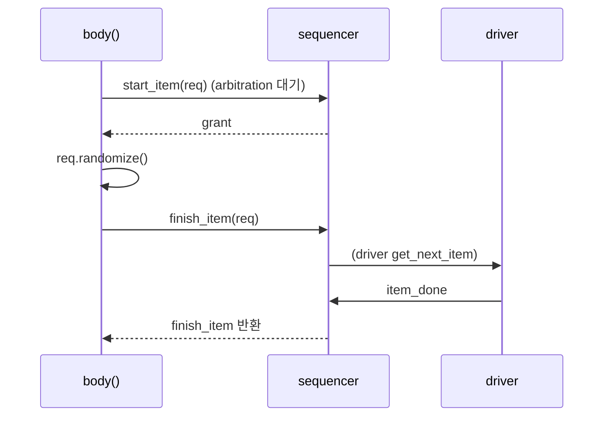

# Sequences

:::tldr
- sequence = "어떤 item들을 어떤 순서/제약으로 보낼지" 정의하는 시나리오. `uvm_sequence #(REQ)`를 extends.
- 핵심은 `body()` task. 안에서 `start_item/finish_item` 또는 `uvm_do` 매크로로 item을 생성·전송.
- sequence는 sequencer에 `start()`로 올린다. sequence끼리 중첩(계층)해 복잡한 시나리오를 조립.
:::

## 기본 sequence

```sv
class write_seq extends uvm_sequence #(apb_txn);
  `uvm_object_utils(write_seq)
  rand int unsigned n = 10;
  function new(string name="write_seq"); super.new(name); endfunction

  task body();
    repeat (n) begin
      apb_txn req = apb_txn::type_id::create("req");
      start_item(req);
      if (!req.randomize() with { is_write == 1; })
        `uvm_error("SEQ","rand failed")
      finish_item(req);   // sequencer→driver 전달, item_done까지 대기
    end
  endtask
endclass
```

## uvm_do 매크로 (축약)

```sv
task body();
  apb_txn req;
  `uvm_do_with(req, { is_write == 1; addr inside {[0:'hFF]}; })
  `uvm_do(req)
endtask
```

`uvm_do` = create + start_item + randomize + finish_item 한 번에. 편하지만 명시적 코드가 디버깅엔 유리.

## 실행

```sv
write_seq seq = write_seq::type_id::create("seq");
seq.randomize() with { n == 20; };
seq.start(env.agt.sqr);     // 이 sequencer에 올림
```

## 계층(중첩) sequence

```sv
class traffic_seq extends uvm_sequence #(apb_txn);
  `uvm_object_utils(traffic_seq)
  task body();
    write_seq ws; read_seq rs;
    `uvm_do(ws)        // sub-sequence 실행
    `uvm_do(rs)
  endtask
endclass
```

## start_item / finish_item 내부



:::gotcha
`randomize()`는 **start_item과 finish_item 사이**에서 호출하세요. start_item 전에 randomize하면 late-randomization(직전 상태 반영)의 이점을 잃고, sequencer가 줄 차례(arbitration)와 어긋날 수 있습니다.
:::

:::tip
재사용을 위해 sequence에 직접 sequencer 핸들을 박지 말고 `p_sequencer`/parameter로 받으세요(virtual sequence 챕터). 그래야 어느 환경에서나 올릴 수 있습니다.
:::

```check
Q: `body()` 안에서 transaction을 보내는 명시적 3단계는?
A: `start_item(req)` → `req.randomize()` → `finish_item(req)`. start_item에서 sequencer 차례(arbitration)를 얻고, 그 사이에 randomize하며, finish_item으로 driver에 전달하고 item_done까지 기다린다. (`uvm_do`는 이 전체를 한 매크로로 축약.)
H: start → randomize → finish
```

```check
Q: sequence를 실제로 구동하려면 무엇을 호출하나?
A: `seq.start(sequencer_handle)`. 이 호출이 sequence의 body()를 지정한 sequencer 위에서 실행시킨다. test/virtual sequence에서 대상 sequencer를 지정해 start한다.
```
