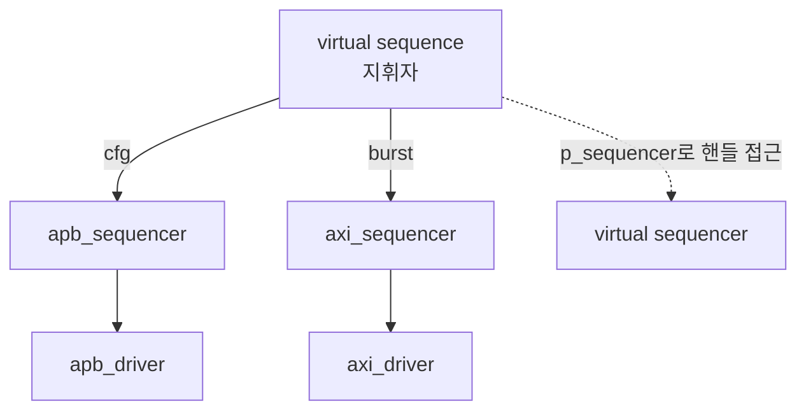

# Virtual Sequences & Sequencer

:::tldr
- 여러 agent(APB+AXI+IRQ…)를 **동시에 조율**해야 할 때 virtual sequence가 지휘자 역할.
- virtual sequencer = 여러 하위 sequencer **핸들을 모아둔** 컴포넌트(자기 item은 없음).
- virtual sequence의 body에서 `p_sequencer.apb_sqr`, `p_sequencer.axi_sqr`에 sub-sequence를 동시에 올린다.
:::

## 왜 필요한가

단일 sequencer는 한 프로토콜만 다룹니다. 하지만 실제 테스트는 "APB로 레지스터 설정 → AXI로 데이터 전송 → IRQ 대기"처럼 **여러 인터페이스를 한 시나리오로 엮습니다.**

## virtual sequencer

```sv
class virt_sequencer extends uvm_sequencer;   // item 타입 없음
  `uvm_component_utils(virt_sequencer)
  apb_sequencer apb_sqr;     // 하위 sequencer 핸들
  axi_sequencer axi_sqr;
  function new(string n, uvm_component p); super.new(n,p); endfunction
endclass
```

env에서 연결:

```sv
// env.connect_phase
v_sqr.apb_sqr = apb_agt.sqr;
v_sqr.axi_sqr = axi_agt.sqr;
```

## virtual sequence

```sv
class config_then_xfer_vseq extends uvm_sequence;
  `uvm_object_utils(config_then_xfer_vseq)
  `uvm_declare_p_sequencer(virt_sequencer)   // p_sequencer 타입 지정

  task body();
    apb_cfg_seq cfg = apb_cfg_seq::type_id::create("cfg");
    axi_burst_seq bst = axi_burst_seq::type_id::create("bst");

    cfg.start(p_sequencer.apb_sqr);          // APB로 설정 (순차)
    fork
      bst.start(p_sequencer.axi_sqr);        // AXI 데이터 (병렬)
      wait_irq_seq::type_id::create("irq").start(p_sequencer.apb_sqr);
    join
  endtask
endclass
```



## p_sequencer

`uvm_declare_p_sequencer(T)` 매크로가 `p_sequencer`를 타입 `T`로 캐스팅해 둡니다. 이걸로 하위 sequencer 핸들에 타입 안전하게 접근.

:::gotcha
virtual sequencer는 **자기 transaction을 구동하지 않습니다**(연결된 driver 없음). 단지 하위 sequencer 핸들의 컨테이너. 여기에 `seq_item_port`를 연결하려 하면 안 됩니다.
:::

:::tip
virtual sequence는 test에서 한 번만 start하면 전체 시나리오가 굴러갑니다. test는 "어떤 virtual sequence를 돌릴지"만 고르는 얇은 층이 되는 것이 이상적(Part 5).
:::

```check
Q: virtual sequencer가 일반 sequencer와 결정적으로 다른 점은?
A: virtual sequencer는 자기 transaction 타입이나 연결된 driver가 **없다**. 단지 여러 하위(실제) sequencer들의 **핸들을 모아두는 컨테이너**일 뿐이고, virtual sequence가 그 핸들들로 sub-sequence를 각 인터페이스에 분배·조율한다.
H: 지휘자는 악기를 직접 연주하지 않는다
```

```check
Q: APB 설정 후 AXI 전송과 IRQ 대기를 동시에 하는 시나리오는 어디서 어떻게 구현하나?
A: **virtual sequence**의 body()에서 구현한다. APB cfg sub-sequence를 `p_sequencer.apb_sqr`에 순차로 start한 뒤, `fork...join`으로 AXI burst를 axi_sqr에, IRQ 대기를 해당 sqr에 병렬로 start한다. p_sequencer로 하위 sequencer 핸들에 접근한다.
```
