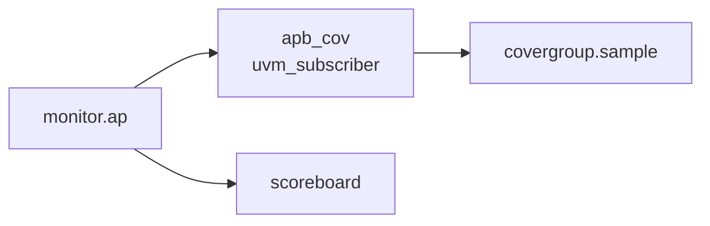

# Coverage Collector / Subscriber

:::tldr
- coverage collector = monitor가 publish한 transaction을 받아 **covergroup을 sample**하는 컴포넌트.
- `uvm_subscriber #(T)`를 extends하면 `write(T t)`만 구현하면 된다(analysis_imp 내장).
- monitor 쪽 데이터를 sample → "실제로 일어난" 시나리오를 측정(driver 의도가 아님).
:::

## uvm_subscriber

```sv
class apb_cov extends uvm_subscriber #(apb_txn);
  `uvm_component_utils(apb_cov)
  apb_txn tr;

  covergroup cg;
    cp_dir : coverpoint tr.is_write { bins rd={0}; bins wr={1}; }
    cp_addr: coverpoint tr.addr {
      bins low  = {[0:'hFFF]};
      bins high = {['h1000:$]};
    }
    cp_err : coverpoint tr.slverr { bins ok={0}; bins err={1}; }
    x_dir_addr: cross cp_dir, cp_addr;
  endgroup

  function new(string n, uvm_component p);
    super.new(n,p); cg = new();
  endfunction

  function void write(apb_txn t);   // subscriber가 요구하는 메서드
    tr = t;
    cg.sample();
  endfunction
endclass
```

## 연결

```sv
// env.connect_phase
agt.mon.ap.connect(cov.analysis_export);   // subscriber의 내장 export
```

`uvm_subscriber`는 `analysis_export`를 이미 갖고 있어 monitor의 analysis_port에 바로 연결됩니다.



## report

```sv
function void report_phase(uvm_phase phase);
  `uvm_info("COV", $sformatf("coverage = %.1f%%", cg.get_coverage()), UVM_LOW)
endfunction
```

:::gotcha
covergroup은 클래스 멤버로 두고 **`new()`에서 인스턴스화**해야 sample이 동작합니다(`cg = new();`). 깜빡하면 null 참조. 또한 sample 직전에 `tr`을 갱신해야 coverpoint가 올바른 값을 본다.
:::

:::tip
coverage를 monitor 안에 욱여넣지 말고 **별도 subscriber**로 분리하세요. agent를 coverage 유무에 따라 가볍게/무겁게 구성할 수 있고(`cfg.has_coverage`), 재사용성이 올라갑니다.
:::

```check
Q: `uvm_subscriber #(apb_txn)`를 상속하면 coverage collector 구현이 간단해지는 이유는?
A: uvm_subscriber는 내부에 `analysis_imp`와 `analysis_export`를 이미 갖고 있어, 사용자는 `write(apb_txn t)` 메서드만 구현하면 된다. monitor의 analysis_port에 export를 바로 connect하고, write 안에서 covergroup을 sample하면 끝.
H: write()만 채우면 된다
```

```check
Q: covergroup을 선언했는데 coverage가 0%로만 나온다. 가장 흔한 두 실수는?
A: ① 생성자에서 `cg = new();`를 빠뜨려 covergroup 인스턴스가 없음(또는 sample 미호출), ② sample 직전에 coverpoint가 참조하는 멤버(tr 등)를 갱신하지 않아 항상 같은/엉뚱한 값을 sample. 둘 다 실제 값이 bin에 들어가지 못하게 만든다.
```
