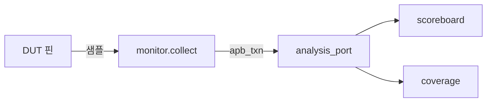

# Monitor 설계

:::tldr
- monitor = DUT 핀을 **수동 관측**해서 transaction으로 복원하고 analysis_port로 publish.
- driver와 독립이어야 한다 — driver가 "보낸 것"이 아니라 **실제 버스에 일어난 것**을 본다.
- passive(구동 안 함)라서 passive agent에도 들어가고, scoreboard/coverage의 데이터 원천.
:::

## 기본 구조

```sv
class apb_monitor extends uvm_monitor;
  `uvm_component_utils(apb_monitor)
  virtual apb_if vif;
  uvm_analysis_port #(apb_txn) ap;

  function new(string n, uvm_component p); super.new(n,p); endfunction

  function void build_phase(uvm_phase phase);
    ap = new("ap", this);
    if (!uvm_config_db#(virtual apb_if)::get(this,"","vif",vif))
      `uvm_fatal("NOVIF","monitor vif")
  endfunction

  task run_phase(uvm_phase phase);
    forever begin
      apb_txn t = collect();   // 한 transaction 관측
      ap.write(t);             // publish
    end
  endtask

  task collect();              // 프로토콜 디코딩
    apb_txn t = apb_txn::type_id::create("t");
    @(vif.cb iff vif.cb.psel && !vif.cb.penable);   // SETUP
    t.addr = vif.cb.paddr; t.is_write = vif.cb.pwrite;
    @(vif.cb iff vif.cb.penable && vif.cb.pready);   // ACCESS 완료
    t.data   = t.is_write ? vif.cb.pwdata : vif.cb.prdata;
    t.slverr = vif.cb.pslverr;
    return t;
  endtask
endclass
```

## 설계 원칙

- **수동성**: monitor는 신호를 **구동하지 않는다**(`<=` 없음). 오직 샘플.
- **driver 독립**: driver 내부 상태를 참조하지 말고 버스에서 재구성. 그래야 driver 버그도 잡는다.
- **프로토콜 완결성**: 한 transaction의 시작~끝을 정확히 디코딩(handshake edge 기준).
- **coverage hook**: 필요하면 monitor 내부 또는 별도 subscriber에서 sample.



:::gotcha
monitor가 driver의 transaction 핸들을 받아 쓰면(예: driver가 mailbox로 넘김) "실제로 핀에 나간 것"이 아니라 "driver가 의도한 것"을 보게 됩니다. driver 버그(타이밍/인코딩)를 못 잡습니다. 반드시 **핀에서 독립적으로 재구성**하세요.
:::

:::tip
같은 monitor를 active agent와 passive agent 양쪽에서 재사용합니다. 그래서 monitor는 절대 driver/sequencer에 의존하면 안 됩니다.
:::

```check
Q: monitor가 driver가 보낸 transaction 객체를 그대로 받아 쓰지 않고, 핀에서 독립적으로 재구성해야 하는 이유는?
A: driver가 "의도한" transaction과 실제 핀에 나간 신호가 다를 수 있다(driver의 타이밍/인코딩 버그). monitor가 버스 신호에서 독립적으로 복원해야 driver 버그까지 검출하고, passive agent에서도 재사용 가능하다.
H: 의도 vs 실제, 그리고 누가 버그를 잡나
```

```check
Q: monitor가 관측한 transaction을 scoreboard/coverage로 내보내는 표준 메커니즘은?
A: `uvm_analysis_port`(monitor에 선언) → `ap.write(t)`로 publish → 연결된 scoreboard/coverage의 `uvm_analysis_imp.write()`가 받는다. 1:多 broadcast라 여러 구독자에 동시에 전달된다.
```
