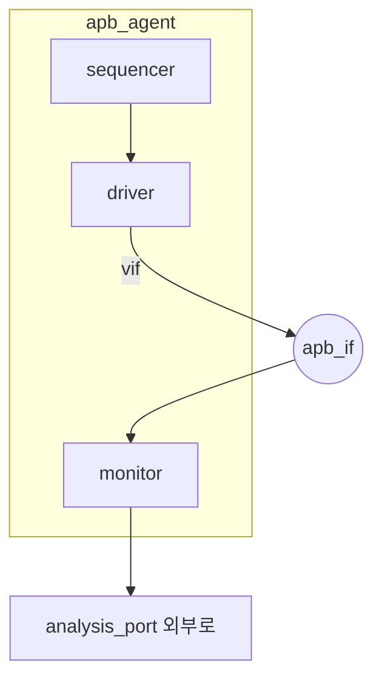

# Agent (active/passive)

:::tldr
- agent = **하나의 프로토콜 인터페이스**를 캡슐화한 재사용 단위 = sequencer + driver + monitor.
- **active**(is_active=UVM_ACTIVE): 구동+관측(driver/sequencer 생성). **passive**: 관측만(monitor만).
- agent가 UVM 재사용(VIP)의 기본 빌딩블록. 같은 agent를 active/passive로 재사용.
:::

## 표준 agent

```sv
class apb_agent extends uvm_agent;
  `uvm_component_utils(apb_agent)
  apb_sequencer sqr;
  apb_driver    drv;
  apb_monitor   mon;
  apb_cfg       cfg;

  function new(string n, uvm_component p); super.new(n,p); endfunction

  function void build_phase(uvm_phase phase);
    super.build_phase(phase);
    void'(uvm_config_db#(apb_cfg)::get(this,"","cfg",cfg));
    mon = apb_monitor::type_id::create("mon", this);   // 항상 생성
    if (get_is_active() == UVM_ACTIVE) begin           // active만
      sqr = apb_sequencer::type_id::create("sqr", this);
      drv = apb_driver   ::type_id::create("drv", this);
    end
  endfunction

  function void connect_phase(uvm_phase phase);
    if (get_is_active() == UVM_ACTIVE)
      drv.seq_item_port.connect(sqr.seq_item_export);
  endfunction
endclass
```

## is_active 설정

`uvm_agent`는 `is_active` 필드를 내장하고 `get_is_active()`를 제공합니다. config로 주입:

```sv
uvm_config_db#(uvm_active_passive_enum)::set(this, "env.apb_agt", "is_active", UVM_PASSIVE);
```



active = SQR+DRV+MON, passive = MON만.

:::gotcha
monitor는 **active/passive 무관하게 항상 생성**합니다(관측은 늘 필요). active일 때만 driver/sequencer를 생성하도록 `get_is_active()` 분기를 정확히 두세요. monitor를 active 분기 안에 두는 실수가 흔합니다.
:::

:::tip
passive agent의 용도: ① DUT **출력측** 모니터링(자극은 다른 곳에서), ② 칩 레벨에서 블록 agent를 관측 전용으로 재사용, ③ 실제 트래픽이 도는 인터페이스를 그냥 체크.
:::

```check
Q: active agent와 passive agent는 각각 어떤 sub-component를 생성하나?
A: active(UVM_ACTIVE) = sequencer + driver + monitor (구동+관측). passive(UVM_PASSIVE) = monitor만(관측 전용). monitor는 두 경우 모두 생성한다.
H: 관측은 늘, 구동은 active만
```

```check
Q: 같은 apb_agent를 한 환경에선 자극 생성용, 다른 환경에선 관측 전용으로 쓰려면 코드를 어떻게 짜야 하나?
A: build_phase에서 `get_is_active()`로 분기해 active일 때만 driver/sequencer를 create하고 monitor는 항상 create한다. is_active는 config_db로 외부 주입한다. 그러면 agent 코드 변경 없이 active/passive 재사용이 된다.
```
