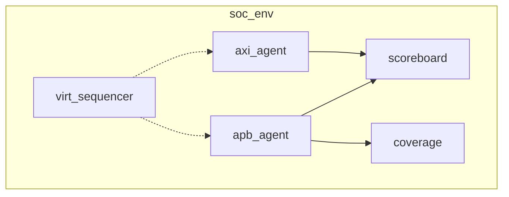

# Environment

:::tldr
- env = 여러 agent + scoreboard + coverage + virtual sequencer를 **통합**하는 컨테이너.
- env는 재사용 단위다 — 블록 env를 그대로 칩 env 안에 인스턴스화(vertical reuse).
- connect_phase에서 monitor→scoreboard/coverage, virtual sequencer→하위 sequencer를 엮는다.
:::

## 구성

```sv
class soc_env extends uvm_env;
  `uvm_component_utils(soc_env)
  apb_agent      apb_agt;
  axi_agent      axi_agt;
  apb_scoreboard scb;
  apb_cov        cov;
  virt_sequencer v_sqr;
  env_cfg        cfg;

  function new(string n, uvm_component p); super.new(n,p); endfunction

  function void build_phase(uvm_phase phase);
    super.build_phase(phase);
    void'(uvm_config_db#(env_cfg)::get(this,"","cfg",cfg));
    apb_agt = apb_agent     ::type_id::create("apb_agt", this);
    axi_agt = axi_agent     ::type_id::create("axi_agt", this);
    scb     = apb_scoreboard::type_id::create("scb", this);
    cov     = apb_cov       ::type_id::create("cov", this);
    v_sqr   = virt_sequencer::type_id::create("v_sqr", this);
  endfunction

  function void connect_phase(uvm_phase phase);
    apb_agt.mon.ap.connect(scb.inp_export);
    axi_agt.mon.ap.connect(scb.out_export);
    apb_agt.mon.ap.connect(cov.analysis_export);
    v_sqr.apb_sqr = apb_agt.sqr;       // virtual sequencer 배선
    v_sqr.axi_sqr = axi_agt.sqr;
  endfunction
endclass
```



## config 객체로 구성 제어

env는 보통 `env_cfg`(어떤 agent를 active로, coverage 켤지 등)를 받아 빌드를 분기합니다.

```sv
class env_cfg extends uvm_object;
  uvm_active_passive_enum apb_is_active = UVM_ACTIVE;
  bit has_cov = 1;
  virtual apb_if apb_vif;
endclass
```

:::gotcha
env는 **wiring(연결)만** 하고 stimulus를 직접 만들지 않습니다. "무슨 트래픽을 돌릴지"는 test/virtual sequence의 책임. env에 sequence.start를 박으면 재사용성이 망가집니다.
:::

:::tip
블록 env를 칩 env 안에 그대로 인스턴스화하면 블록 검증 자산이 칩 레벨에서 재사용됩니다(Part 8 vertical reuse). 그래서 env는 자기 완결적이고 config 주도적으로 설계.
:::

```check
Q: env의 connect_phase에서 전형적으로 무엇을 배선하나?
A: 각 agent monitor의 analysis_port를 scoreboard/coverage의 export에 연결하고, virtual sequencer의 하위 sequencer 핸들(v_sqr.apb_sqr 등)을 실제 agent의 sequencer로 채운다. 즉 데이터 흐름과 제어 흐름의 wiring.
H: monitor→scoreboard, vseqr→sqr
```

```check
Q: env에 직접 sequence를 start하면 안 되는 이유는?
A: env는 재사용 가능한 구조 컨테이너이고 "무엇을 구동할지"(시나리오)는 test마다 달라진다. env에 stimulus를 박으면 다른 시나리오/상위 레벨에서 재사용할 수 없게 된다. stimulus는 test/virtual sequence가 담당해야 한다.
```
