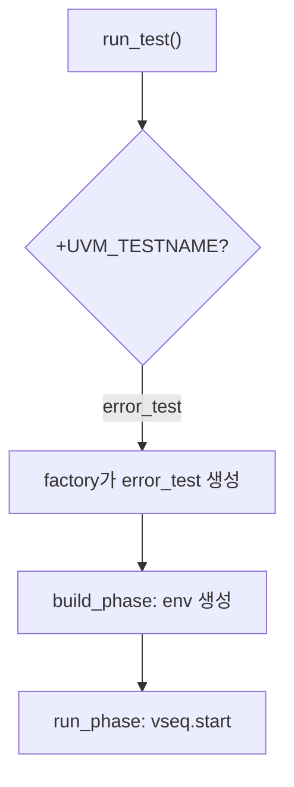

# Test & run_test

:::tldr
- test = 최상위 component. env를 build하고 config를 주입하고 **어떤 sequence를 돌릴지** 고른다.
- `run_test("my_test")` 또는 `+UVM_TESTNAME=my_test`로 **컴파일 없이** 테스트 교체.
- base_test에 공통 build를 두고, 파생 test가 sequence/override만 바꾸는 **test library** 패턴이 정석.
:::

## base test

```sv
class base_test extends uvm_test;
  `uvm_component_utils(base_test)
  soc_env  env;
  env_cfg  cfg;

  function new(string n, uvm_component p); super.new(n,p); endfunction

  function void build_phase(uvm_phase phase);
    super.build_phase(phase);
    cfg = env_cfg::type_id::create("cfg");
    if (!uvm_config_db#(virtual apb_if)::get(this,"","apb_vif",cfg.apb_vif))
      `uvm_fatal("CFG","no apb vif")
    uvm_config_db#(env_cfg)::set(this,"env","cfg",cfg);
    env = soc_env::type_id::create("env", this);
  endfunction
endclass
```

## 파생 test (시나리오만 교체)

```sv
class smoke_test extends base_test;
  `uvm_component_utils(smoke_test)
  function new(string n, uvm_component p); super.new(n,p); endfunction

  task run_phase(uvm_phase phase);
    config_then_xfer_vseq vseq = config_then_xfer_vseq::type_id::create("vseq");
    phase.raise_objection(this);
    vseq.start(env.v_sqr);
    phase.drop_objection(this);
  endtask
endclass

class error_test extends base_test;       // override만으로 에러 주입
  `uvm_component_utils(error_test)
  function void build_phase(uvm_phase phase);
    set_type_override_by_type(apb_driver::get_type(), err_apb_driver::get_type());
    super.build_phase(phase);
  endfunction
  // run_phase는 base/smoke 재사용 가능
endclass
```

## run_test

```sv
// top module
initial begin
  uvm_config_db#(virtual apb_if)::set(null,"*","apb_vif",apb);
  run_test();    // 인자 없으면 +UVM_TESTNAME 사용
end
```

실행:

```
simv +UVM_TESTNAME=error_test +UVM_VERBOSITY=UVM_HIGH
```



:::gotcha
`run_test()`에 이름을 하드코딩하면 그 테스트만 돌게 됩니다. **인자 없이** 호출하고 `+UVM_TESTNAME`으로 외부에서 고르는 게 표준 — 재컴파일 없이 regression에서 수백 개 테스트를 돌리는 기반.
:::

:::tip
test는 **얇아야** 합니다. 공통 build는 base_test, 시나리오는 virtual sequence로 빼면, 새 test는 "어떤 vseq를 start"만 다른 몇 줄짜리가 됩니다.
:::

```check
Q: 재컴파일 없이 다른 테스트를 돌리는 메커니즘은?
A: top에서 `run_test()`를 **인자 없이** 호출하고, 런타임에 `+UVM_TESTNAME=<test_name>`을 주면 factory가 그 이름의 test를 생성한다. regression에서 한 번 컴파일하고 수백 테스트를 플래그만 바꿔 돌릴 수 있다.
H: 플래그로 고른다
```

```check
Q: error injection 테스트를 만들 때 base_test를 거의 그대로 두고 무엇만 바꾸면 되나?
A: build_phase에서 `set_type_override_by_type`로 정상 driver를 에러 주입 driver로 교체하고 `super.build_phase()`를 호출한다. run_phase(시나리오)는 base를 재사용할 수 있다. 즉 factory override 한 줄로 동작을 바꾼다.
```
