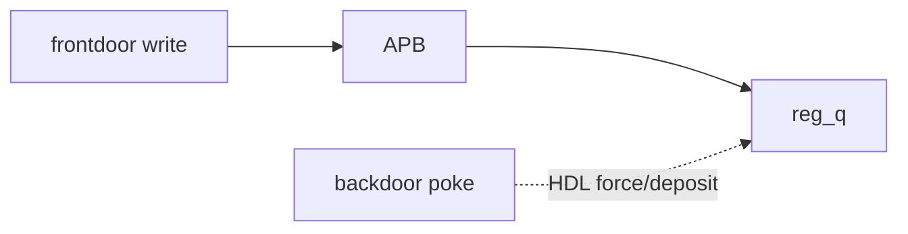

# Frontdoor vs Backdoor

:::tldr
- **frontdoor**: 실제 버스(APB 등)로 read/write → 시간 소비, 프로토콜 검증까지 됨.
- **backdoor**: HDL 경로로 레지스터에 **직접** 접근 → 0 time, 버스 우회. 초기화/예측에 유용.
- `.read(status, val, UVM_BACKDOOR)` 또는 `peek/poke`. backdoor는 hdl_path 설정이 전제.
:::

## 사용

```sv
// frontdoor (기본): 버스 트랜잭션 발생, 시간 소비
ctrl.write(status, 32'h1);
ctrl.read (status, val);

// backdoor: HDL 직접, 0 time
ctrl.write(status, 32'h1, UVM_BACKDOOR);
ctrl.peek (status, val);     // backdoor read
ctrl.poke (status, 32'hF);   // backdoor write
```

## hdl_path 설정

backdoor가 동작하려면 모델이 RTL 신호 경로를 알아야 합니다.

```sv
// reg_block.build() 등에서
add_hdl_path_slice("u_ctrl.enable_q", 0, 1);
// 또는 block 레벨
reg_model.add_hdl_path("tb_top.dut");
ctrl.add_hdl_path_slice("regfile.ctrl_q", 0, 32);
```

## 언제 무엇을

| 상황 | 권장 |
|---|---|
| 레지스터 프로토콜/접근정책 검증 | frontdoor |
| 빠른 초기화(수백 레지스터 셋업) | backdoor |
| 예상값 주입/확인(시간 무관) | backdoor poke/peek |
| W1C/RC 등 부작용 동작 검증 | frontdoor |



:::gotcha
backdoor는 **버스를 우회**하므로 프로토콜 동작(접근 정책, 부작용, 타이밍)을 검증하지 못합니다. "기능 검증"엔 frontdoor, "환경 셋업/관찰"엔 backdoor. 둘을 혼동하면 버그를 놓칩니다.
:::

:::tip
대규모 칩에서 reset 직후 수백 개 레지스터를 frontdoor로 쓰면 수만 cycle이 듭니다. backdoor poke로 초기 상태를 0 time에 세팅하고, 검증 대상 레지스터만 frontdoor로 확인하는 하이브리드가 실전 패턴.
:::

```check
Q: frontdoor와 backdoor 접근의 핵심 차이 두 가지는?
A: ① 경로 — frontdoor는 실제 버스(APB 등) 프로토콜로, backdoor는 HDL 신호에 직접 접근. ② 시간 — frontdoor는 시간 소비(여러 cycle), backdoor는 0 time. 그래서 frontdoor는 프로토콜까지 검증, backdoor는 빠른 셋업/관찰용.
H: 버스를 타나 안 타나, 시간을 쓰나 안 쓰나
```

```check
Q: 레지스터의 W1C(write-1-to-clear) 동작을 검증하려면 frontdoor와 backdoor 중 무엇을 써야 하나? 왜?
A: **frontdoor**. W1C 같은 부작용은 실제 버스 write가 RTL 로직을 거쳐야 발생한다. backdoor는 버스를 우회해 신호에 직접 값을 넣으므로 그 부작용 로직을 타지 않아 동작을 검증할 수 없다.
```
