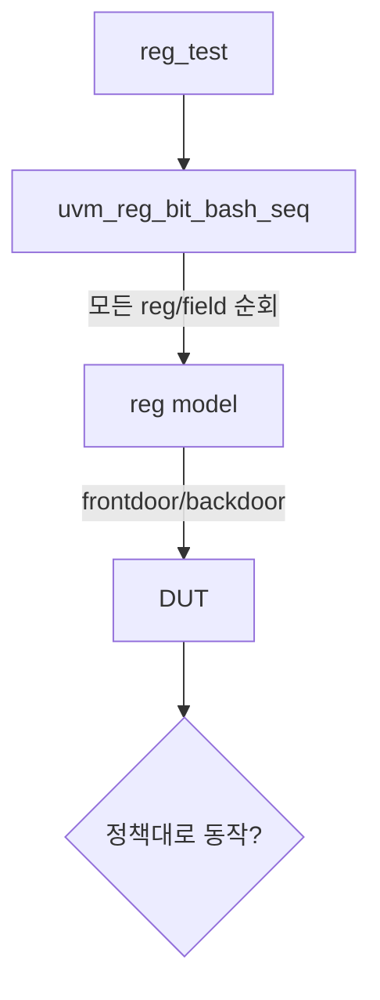

# Built-in Reg Sequences

:::tldr
- UVM은 레지스터 검증용 **기성 시퀀스**를 제공한다 — 직접 안 짜도 reset/bit-bash/access를 자동 수행.
- 대표: `uvm_reg_hw_reset_seq`, `uvm_reg_bit_bash_seq`, `uvm_reg_access_seq`, `uvm_mem_walk_seq`.
- attribute(`NO_REG_TESTS` 등)로 특정 레지스터를 예외 처리.
:::

## 주요 시퀀스

| 시퀀스 | 검증 내용 |
|---|---|
| `uvm_reg_hw_reset_seq` | reset 후 모든 reg가 reset value인가 |
| `uvm_reg_bit_bash_seq` | 각 bit가 접근정책(RW/RO/W1C)대로 동작하나 |
| `uvm_reg_access_seq` | frontdoor write → backdoor read 일치 |
| `uvm_reg_shared_access_seq` | 여러 map에서의 접근 일관성 |
| `uvm_mem_walk_seq` | 메모리 walking-1/0 |

## 실행

```sv
class reg_test extends base_test;
  `uvm_component_utils(reg_test)
  task run_phase(uvm_phase phase);
    uvm_reg_hw_reset_seq seq = uvm_reg_hw_reset_seq::type_id::create("seq");
    seq.model = env.reg_model;        // 모델 지정 (필수)
    phase.raise_objection(this);
    seq.start(null);                  // reg seq는 sequencer 없이 model 사용
    phase.drop_objection(this);
  endtask
endclass
```

## 예외 처리 (attributes)

검증에서 빼야 할 레지스터(예: 부작용이 큰 것)는 attribute로 표시:

```sv
// 모델 build에서
uvm_resource_db#(bit)::set({"REG::", ctrl.get_full_name()}, "NO_REG_HW_RESET_TEST", 1);
// 또는 reg.add_attribute / get_attribute 패턴 (버전별)
```



:::gotcha
built-in reg sequence는 `seq.model`을 **반드시 지정**해야 합니다. 또 hdl_path가 설정돼야 access_seq(backdoor 비교)가 동작합니다. 모델/경로 설정이 빠지면 시퀀스가 조용히 아무것도 안 하거나 fatal.
:::

:::tip
새 칩 bring-up에서 `hw_reset_seq` + `bit_bash_seq`만 돌려도 레지스터맵 연결 오류(주소 오타, 정책 실수)의 상당수가 즉시 잡힙니다. RAL 도입의 즉효약.
:::

```check
Q: 모든 레지스터가 reset 후 reset value를 갖는지, 그리고 각 bit가 접근정책대로 동작하는지를 자동 검증하는 built-in 시퀀스는?
A: reset value 확인은 `uvm_reg_hw_reset_seq`, bit별 접근정책(RW/RO/W1C 등) 검증은 `uvm_reg_bit_bash_seq`. 둘 다 모델을 순회하며 자동 수행하므로 직접 짤 필요가 없다.
H: hw_reset / bit_bash
```

```check
Q: built-in reg sequence를 start할 때 일반 sequence와 다른 필수 설정은?
A: `seq.model = reg_model`로 대상 레지스터 모델을 지정해야 한다(보통 `seq.start(null)`로 sequencer 없이 실행). access/backdoor 계열은 추가로 hdl_path 설정이 돼 있어야 동작한다.
```
