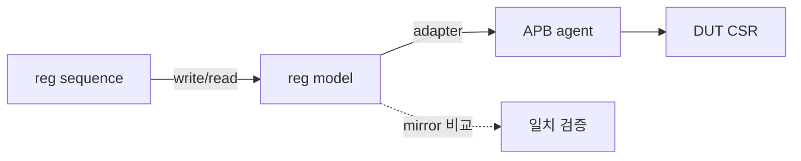

# Register Model (RAL)

:::tldr
- RAL = Register Abstraction Layer. DUT 레지스터를 **객체 모델**로 추상화 → `reg.write(status,value)` 한 줄로 접근.
- 계층: `uvm_reg_field` ⊂ `uvm_reg` ⊂ `uvm_reg_block`. 각 reg는 주소/필드/접근정책(RW/RO/W1C…)을 가진다.
- 모델은 **mirror(예상값)**와 **desired/actual**을 추적해, 별도 scoreboard 없이도 레지스터 일치를 검증.
:::

## 모델 구조

```sv
class ctrl_reg extends uvm_reg;
  `uvm_object_utils(ctrl_reg)
  rand uvm_reg_field enable;
  rand uvm_reg_field mode;
  function new(string n="ctrl_reg"); super.new(n, 32, UVM_NO_COVERAGE); endfunction
  virtual function void build();
    enable = uvm_reg_field::type_id::create("enable");
    enable.configure(this, 1, 0, "RW", 0, 1'h0, 1, 1, 0);  // size,lsb,access,...
    mode   = uvm_reg_field::type_id::create("mode");
    mode.configure(this, 2, 1, "RW", 0, 2'h0, 1, 1, 0);
  endfunction
endclass

class my_reg_block extends uvm_reg_block;
  `uvm_object_utils(my_reg_block)
  rand ctrl_reg   ctrl;
  rand status_reg status;
  uvm_reg_map     map;
  function new(string n="my_reg_block"); super.new(n, UVM_NO_COVERAGE); endfunction
  virtual function void build();
    ctrl = ctrl_reg::type_id::create("ctrl"); ctrl.configure(this); ctrl.build();
    status = status_reg::type_id::create("status"); status.configure(this); status.build();
    map = create_map("map", 0, 4, UVM_LITTLE_ENDIAN);
    map.add_reg(ctrl,   'h00, "RW");
    map.add_reg(status, 'h04, "RO");
    lock_model();
  endfunction
endclass
```

## 접근 정책 (field access)

| 정책 | 의미 |
|---|---|
| RW | read/write |
| RO | read만 |
| WO | write만 |
| W1C | write-1-to-clear |
| RC | read시 clear |
| W1S | write-1-to-set |

## mirror / desired / actual

- **desired**: 내가 쓰려는 값.
- **mirror**: 모델이 추정하는 현재 HW 값.
- **actual**: 실제 HW 값.

```sv
ctrl.write(status, 32'h1);          // HW에 쓰고 mirror 갱신
ctrl.read(status, rdata);           // HW에서 읽음
ctrl.mirror(status, UVM_CHECK);     // mirror vs actual 자동 비교
```



:::gotcha
모델을 다 만든 뒤 **`lock_model()`**과 map 구성을 빠뜨리면 주소 매핑이 안 되어 frontdoor 접근이 실패합니다. block.build() 끝에서 map.add_reg + lock_model을 잊지 마세요.
:::

:::tip
RAL의 진짜 가치: 레지스터 주소가 바뀌어도 **모델만 수정**하면 모든 sequence가 그대로 동작. 그리고 mirror 덕에 별도 register scoreboard가 거의 필요 없습니다.
:::

```check
Q: RAL의 mirror 값이 하는 역할은?
A: mirror는 모델이 추정하는 레지스터의 **현재 HW 값**이다. write/read 시 갱신되고, `mirror(.., UVM_CHECK)`로 실제 HW 값과 자동 비교해 레지스터 정합성을 검증한다. 덕분에 별도 레지스터 scoreboard 없이도 일치 검사가 된다.
H: 모델이 기억하는 예상 현재값
```

```check
Q: `uvm_reg_field`, `uvm_reg`, `uvm_reg_block`의 포함 관계는?
A: field ⊂ reg ⊂ reg_block. 여러 `uvm_reg_field`가 한 `uvm_reg`를 구성하고, 여러 `uvm_reg`가 주소 map과 함께 `uvm_reg_block`을 구성한다. block이 전체 레지스터 공간을 표현한다.
```
