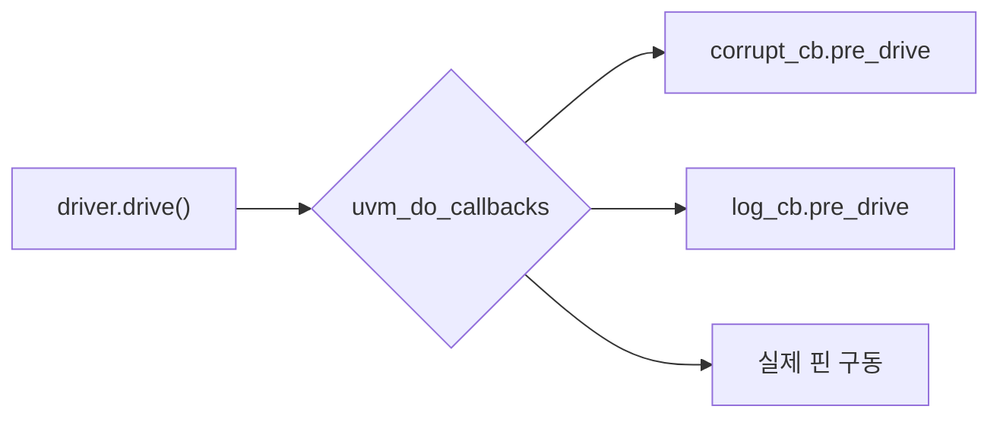

# Callbacks

:::tldr
- callback = 컴포넌트 코드를 **수정하지 않고** 특정 지점에 사용자 훅을 끼우는 메커니즘.
- factory override는 "타입 통째 교체", callback은 "기존 객체의 특정 hook만 변경" — 더 가볍다.
- driver/monitor에 `uvm_callback` hook을 심어두면, test에서 에러 주입/스코어보드 변형을 외부에서 주입.
:::

## 정의

```sv
// 1) callback 클래스
class drv_cb extends uvm_callback;
  `uvm_object_utils(drv_cb)
  function new(string n="drv_cb"); super.new(n); endfunction
  virtual function void pre_drive(apb_driver drv, apb_txn t); endfunction
endclass

// 2) driver에 hook 등록
class apb_driver extends uvm_driver #(apb_txn);
  `uvm_component_utils(apb_driver)
  `uvm_register_cb(apb_driver, drv_cb)    // 이 driver가 drv_cb를 받음

  task drive(apb_txn t);
    `uvm_do_callbacks(apb_driver, drv_cb, pre_drive(this, t))   // hook 지점
    // ... 실제 구동 ...
  endtask
endclass
```

## 사용 (test에서 주입)

```sv
class corrupt_cb extends drv_cb;
  `uvm_object_utils(corrupt_cb)
  function void pre_drive(apb_driver drv, apb_txn t);
    if ($urandom_range(0,9) == 0) t.data ^= 32'hFF;   // 10% 비트 손상
  endfunction
endclass

// test build_phase
corrupt_cb cb = corrupt_cb::type_id::create("cb");
uvm_callbacks#(apb_driver, drv_cb)::add(env.apb_agt.drv, cb);
```



## callback vs factory override

| | callback | factory override |
|---|---|---|
| 범위 | 특정 hook만 | 타입/인스턴스 전체 |
| 여러 개 적층 | 가능(여러 cb 등록) | 하나로 교체 |
| 적합 | 에러 주입, 로깅, 변형 | 동작 자체가 다른 컴포넌트 |

:::gotcha
callback hook 지점(`uvm_do_callbacks`)을 컴포넌트 개발자가 **미리 심어둬야** 합니다. hook이 없는 곳엔 callback을 못 건다 → VIP 설계 시 pre/post hook을 전략적으로 배치하는 게 중요.
:::

:::tip
"정상 driver는 그대로 두고, 가끔 에러만 섞고 싶다"면 callback이 정답. override로 err_driver를 만들면 정상/에러 코드가 갈라져 유지보수가 늘어납니다.
:::

```check
Q: 정상 동작은 유지하면서 driver에 10% 확률로 데이터 손상을 주입하고 싶다. callback과 factory override 중 무엇이 더 적합하고 왜?
A: **callback**. 기존 driver 코드를 그대로 두고 pre_drive hook에만 손상 로직을 추가로 끼울 수 있다(여러 callback 적층도 가능). override는 driver 타입을 통째로 교체하므로 정상/에러 코드가 분기되어 무겁다.
H: 일부 hook만 vs 타입 전체
```

```check
Q: callback을 걸려면 컴포넌트 쪽에 미리 무엇이 있어야 하나?
A: 컴포넌트 개발자가 `uvm_register_cb`로 callback 타입을 등록하고, 원하는 지점에 `uvm_do_callbacks(...)` hook을 심어두어야 한다. hook이 없는 위치에는 외부에서 callback을 끼울 수 없다.
```
