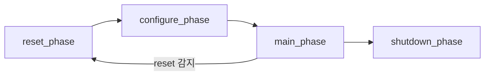

# Advanced Phasing

:::tldr
- run_phase는 12개 **runtime sub-phase**(reset→configure→main→shutdown)로 세분 → reset/main 시퀀스를 깔끔히 분리.
- **domain**으로 서로 다른 클럭/전원 영역이 독립적으로 phase를 진행하게 한다.
- **phase jump**으로 reset 같은 비정상 흐름을 모델링(main 도중 reset_phase로 점프).
:::

## runtime sub-phases

```
reset_phase → configure_phase → main_phase → shutdown_phase
(각각 pre_/post_ 포함, 총 12개)
```

```sv
class my_test extends base_test;
  task reset_phase(uvm_phase phase);
    phase.raise_objection(this);
    reset_seq::type_id::create("rs").start(env.v_sqr);
    phase.drop_objection(this);
  endtask
  task main_phase(uvm_phase phase);
    phase.raise_objection(this);
    traffic_seq::type_id::create("ts").start(env.v_sqr);
    phase.drop_objection(this);
  endtask
endclass
```

각 sub-phase는 모든 컴포넌트에서 **동기화**됩니다 — 모두가 reset을 끝내야 configure로 넘어감.

## domain — 독립 진행

멀티 클럭/전원 도메인에서 한 영역이 다른 영역과 다른 속도로 phase를 진행해야 할 때:

```sv
uvm_domain my_domain = new("cpu_domain");
agt.set_domain(my_domain);
```

기본은 모두 `uvm_domain::get_uvm_domain()` 한 도메인에서 동기화.

## phase jump

```sv
// main 도중 reset이 들어오면 reset_phase로 되돌림
task main_phase(uvm_phase phase);
  fork
    begin watch_reset(); phase.jump(uvm_reset_phase::get()); end
    do_traffic();
  join_any
endtask
```



:::gotcha
sub-phase를 쓰면 **objection도 그 sub-phase 단위**로 raise/drop 해야 합니다. main_phase의 objection을 run_phase에 걸면 동기화가 어긋납니다. 한 시나리오에서 run_phase와 sub-phase를 섞지 마세요.
:::

:::tip
대부분의 환경은 `run_phase` 하나로 충분합니다. sub-phase/domain/jump는 "reset이 main 도중 들어오는 시나리오", "전원 도메인이 따로 노는 SoC" 같은 복잡한 경우에만 도입하세요(과설계 주의).
:::

```check
Q: reset 시퀀스와 main 트래픽을 phase 차원에서 명확히 분리하려면 run_phase 대신 무엇을 쓰나?
A: runtime sub-phase인 `reset_phase`와 `main_phase`(필요시 configure_phase/shutdown_phase)를 각각 오버라이드한다. 모든 컴포넌트가 reset_phase를 끝내야 다음으로 넘어가므로 단계가 깔끔히 동기화·분리된다.
H: run_phase의 세분화된 12 sub-phase
```

```check
Q: main_phase 진행 중 DUT reset이 들어온 상황을 phase로 모델링하는 메커니즘은?
A: `phase.jump(uvm_reset_phase::get())`로 reset_phase로 되돌아가는 **phase jump**. 비정상 흐름(중간 reset)을 정상 phase 그래프 위에서 표현할 수 있다.
```
