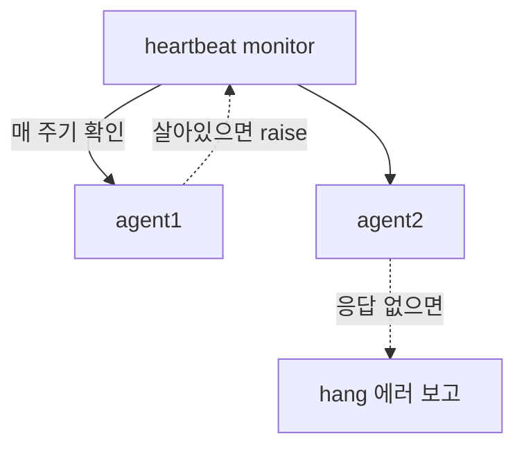

# Heartbeat · Barrier · Event Pool

:::tldr
- 병렬 컴포넌트 사이의 **동기화/생존 확인** 도구들.
- **uvm_event / event_pool**: 이름으로 공유하는 event(SV event의 UVM 버전, 데이터 전달 가능).
- **uvm_barrier**: N개 프로세스가 모두 도달할 때까지 대기. **heartbeat**: "살아 있음"을 주기적으로 확인해 hang 감지.
:::

## uvm_event & pool

```sv
uvm_event e = uvm_event_pool::get_global("dma_done");

// waiter
e.wait_trigger();              // 또는 wait_ptrigger (이미 trigger됐어도)
uvm_object data = e.get_trigger_data();

// trigger (데이터 동봉 가능)
e.trigger(some_obj);
```

SV `event`와 달리 **이름으로 전역 공유**되고 **데이터를 실어 보낼 수 있으며** `wait_ptrigger`로 race를 피합니다.

## uvm_barrier

```sv
uvm_barrier b = new("sync", 3);   // 3명 모이면 통과
// 각 프로세스
b.wait_for();                     // 3번째가 도달하는 순간 전원 진행
```

## heartbeat — hang 감지

```sv
uvm_heartbeat hb;
uvm_callbacks_objection obj = new("hb_obj");
hb = new("hb", env, obj);
hb.set_mode(UVM_ALL_ACTIVE);       // 등록된 모든 컴포넌트가 주기적으로 raise해야
hb.add(env.apb_agt.mon);
hb.start(hb_event);                // hb_event 주기마다 생존 확인
```

각 컴포넌트가 정해진 window 내에 objection을 raise하지 않으면 "죽었다"고 판단해 에러 → 무한 대기를 빨리 잡습니다.



:::gotcha
`wait_trigger`(=SV `@event`)는 trigger가 **먼저** 발생하면 놓칩니다. 이미 일어났을 수 있으면 `wait_ptrigger`(persistent)를 쓰세요. 분산 동기화 버그의 단골 원인.
:::

:::tip
긴 회귀에서 "왜 timeout까지 멈춰 있었나"를 빨리 찾으려면 heartbeat가 유용합니다. 특정 monitor가 일정 시간 트래픽을 못 보면 즉시 에러를 내 디버깅 시간을 줄여줍니다.
:::

```check
Q: SV `event`와 비교해 `uvm_event`가 주는 이점 두 가지는?
A: ① 이름(pool)으로 컴포넌트 간 **전역 공유**가 쉽고 trigger에 **데이터를 실어** 전달할 수 있다. ② `wait_ptrigger`로 trigger가 먼저 발생한 경우의 race(놓침)를 피할 수 있다.
H: 공유/데이터, 그리고 race 회피
```

```check
Q: 회귀에서 시뮬이 timeout까지 멈춰 있는 hang을 조기에 감지하려면 어떤 UVM 메커니즘을 쓰나?
A: `uvm_heartbeat`. 등록된 컴포넌트들이 정해진 window마다 objection을 raise하는지 감시하고, 일정 시간 활동(생존 신호)이 없으면 에러를 내 hang을 timeout 전에 잡아낸다.
```
