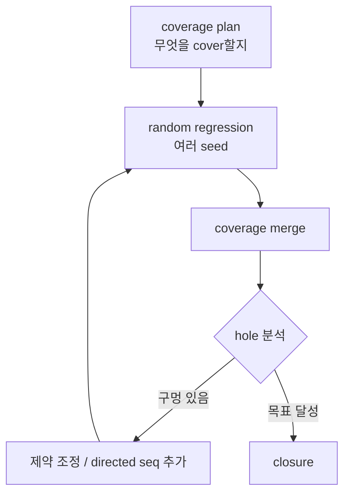

# Coverage Closure

:::tldr
- coverage closure = "검증 끝"의 정량 기준에 도달하는 과정 = **functional + code coverage 목표 달성**.
- 흐름: 계획(coverage plan) → 회귀(random seeds) → hole 분석 → 시퀀스/제약 보강 → 반복.
- 마지막 구멍은 **directed/targeted sequence**로 메운다. random은 80%까지, 나머지는 조준 사격.
:::

## closure 루프



## seed와 merge

- 같은 TB를 **다른 seed**로 수백~수천 회 → constrained random이 공간을 넓게 훑음.
- 각 run의 coverage DB를 **merge**해 누적 달성도 산출.

```
simv +UVM_TESTNAME=rand_test +ntb_random_seed=12345
# ... 여러 seed ...
urg -dir cov_dirs/* -report merged   # (예: VCS) coverage merge/report
```

## hole 분석 → 보강

| hole 유형 | 대응 |
|---|---|
| 특정 주소 영역 미발생 | sequence 제약으로 그 영역 유도 |
| cross bin 빈칸(wr+high+len64) | directed/targeted sequence |
| 도달 불가(illegal) | `ignore_bins`/`illegal_bins`로 모델 정정 |
| reset 중 트래픽 미검증 | reset_phase 시나리오 추가 |

## 도달 불가 bin 처리

모든 100%가 의미 있는 건 아닙니다. 물리적으로 불가능한 조합은 coverage plan에서 **제외(ignore)**하고 그 근거를 문서화 — 가짜 0% 추적에 시간 낭비를 막습니다.

:::gotcha
"code coverage 100%"로 closure를 선언하면 안 됩니다. 의도한 시나리오(functional coverage cross)가 채워졌는지가 진짜 기준. 반대로 functional 100%인데 code coverage에 큰 구멍이 있으면 plan 자체가 시나리오를 놓친 것.
:::

:::tip
random으로 80~90%를 빠르게 채운 뒤, **남은 hole만 directed sequence로 조준**하는 것이 가장 효율적입니다. 처음부터 directed로 다 짜는 것도, 끝까지 random만 돌리는 것도 비효율.
:::

```check
Q: coverage closure에서 constrained random과 directed test의 역할 분담은?
A: random은 여러 seed로 공간을 넓게 빠르게 훑어 대부분(80~90%)을 채운다. 남은 도달 어려운 hole(특정 cross bin 등)은 directed/targeted sequence로 조준해 메운다. 둘을 합쳐 효율적으로 closure에 도달한다.
H: 넓게 훑기 vs 조준 사격
```

```check
Q: functional coverage가 어떤 bin에서 0%인데 분석해보니 물리적으로 불가능한 조합이었다. 올바른 처리는?
A: 그 조합을 `ignore_bins`(또는 plan에서 제외)로 빼고 근거를 문서화한다. 도달 불가한 bin을 채우려 시도하는 것은 시간 낭비이며, 모델(coverage plan)을 현실에 맞게 정정하는 것이 맞다.
```
