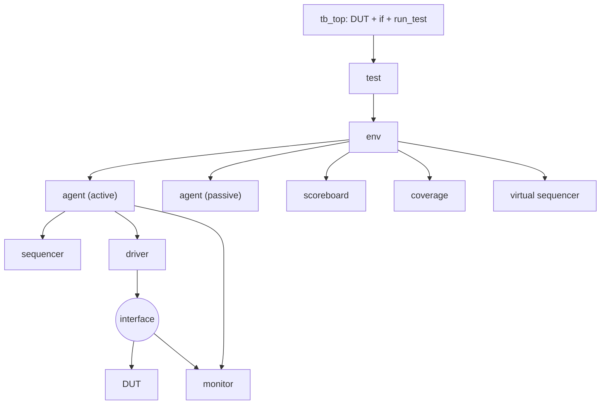

# TB 아키텍처 패턴

:::tldr
- 좋은 UVM TB = **계층화 + 단일 책임 + config 주도 + 재사용 단위(agent/env)**.
- 표준 계층: top → test → env → agent(sqr/drv/mon) → interface → DUT.
- "어떻게(구조)"는 env/agent에, "무엇을(시나리오)"은 sequence/test에 둔다 — 이 분리가 재사용의 전부.
:::

## 표준 hierarchy



## 각 컴포넌트의 단일 책임

| component | 한 줄 책임 |
|---|---|
| driver | sequence_item → 핀 구동 |
| monitor | 핀 → transaction 복원/publish |
| sequencer | sequence ↔ driver 중재 |
| agent | 한 프로토콜 캡슐화 |
| scoreboard | expected vs actual 판정 |
| coverage | 시나리오 달성도 측정 |
| env | 컴포넌트 통합/배선 |
| virtual seq | 다중 인터페이스 시나리오 조율 |
| test | env 구성 + 시나리오 선택 |

## 설계 원칙 체크리스트

- **config object**로 구성을 외부 주입(active/passive, coverage, 주소맵).
- 모든 생성은 `type_id::create` (override 가능).
- monitor는 driver에 의존하지 않음(독립 재구성).
- stimulus는 env가 아닌 test/vseq에.
- agent/env는 자기 완결적 → 칩 레벨 재사용.

:::gotcha
가장 흔한 안티패턴: **test에서 직접 핀을 흔들거나, driver 안에 시나리오를 박는 것.** 그 순간 재사용이 죽습니다. 핀=driver, 시나리오=sequence, 구성=config로 항상 분리하세요.
:::

:::tip
"이 코드를 다른 프로젝트에 그대로 가져갈 수 있나?"를 매 컴포넌트마다 물어보세요. 답이 'no'면 환경 의존(하드코딩된 경로/시나리오)이 새어든 것 — 리팩터 신호.
:::

```check
Q: UVM TB 설계의 핵심 분리 원칙을 한 문장으로?
A: "어떻게(구조/프로토콜 구동)"는 env·agent·driver에, "무엇을(시나리오)"은 sequence·test에, "구성(active/coverage/주소맵)"은 config object에 둔다. 이 분리가 컴포넌트 재사용을 가능하게 한다.
H: 구조 / 시나리오 / 구성
```

```check
Q: monitor를 driver에 의존시키면 안 되는 아키텍처상 이유는?
A: monitor가 driver에 의존하면 (1) passive agent에서 driver 없이 재사용할 수 없고, (2) driver가 실제로 핀에 낸 것이 아니라 의도한 것을 보게 되어 driver 버그를 못 잡는다. monitor는 핀에서 독립적으로 transaction을 재구성해야 한다.
```
