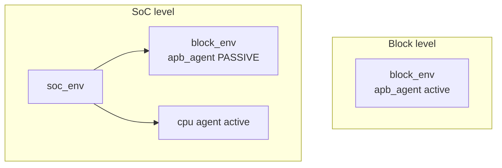

# Vertical Reuse

:::tldr
- vertical reuse = 블록 레벨 검증 자산(agent/env/sequence/RAL)을 **subsystem→SoC** 레벨에서 그대로 재사용.
- 핵심 장치: 블록 agent를 칩에선 **passive**로, 블록 env를 칩 env 안에 **인스턴스화**, RAL을 상위 block에 **통합**.
- horizontal reuse(프로젝트 간) ↔ vertical reuse(레벨 간) 둘 다 UVM 가치의 핵심.
:::

## 레벨 간 재사용



블록에서 자극을 주던 agent가, 칩에선 진짜 CPU가 그 버스를 구동하므로 **passive(관측 전용)**로 바뀝니다. 코드 변경 없이 config의 `is_active`만 토글.

## env 중첩

```sv
class soc_env extends uvm_env;
  block_env blk_env;        // 블록 env를 그대로 인스턴스화
  cpu_agent cpu_agt;
  function void build_phase(uvm_phase phase);
    super.build_phase(phase);
    // 블록 agent를 passive로
    uvm_config_db#(uvm_active_passive_enum)
      ::set(this, "blk_env.apb_agt", "is_active", UVM_PASSIVE);
    blk_env = block_env::type_id::create("blk_env", this);
    cpu_agt = cpu_agent::type_id::create("cpu_agt", this);
  endfunction
endclass
```

## sequence / RAL 재사용

- 블록 sequence는 그대로 virtual sequence에서 호출.
- 블록 RAL block을 칩 RAL의 sub-block으로 `add_submap` 통합 → 주소 오프셋만 조정.

## 재사용을 가능케 하는 전제

| 전제 | 이유 |
|---|---|
| config 주도 빌드 | 레벨마다 active/passive 등 다르게 |
| 상대 경로/핸들 | 절대 경로 하드코딩 금지 |
| monitor 독립성 | passive 전환 가능 |
| 자기 완결 env | 통째로 옮겨도 동작 |

:::gotcha
블록 TB에서 `uvm_config_db`의 set 경로를 `"uvm_test_top.env..."`처럼 **절대 경로로 하드코딩**하면 칩 레벨에서 경로가 달라져 깨집니다. 항상 `this` 기준 상대 경로로 set하세요.
:::

:::tip
vertical reuse를 염두에 두면 블록 검증 노력이 칩 레벨에서 공짜로 재활용됩니다. 처음부터 "이 env가 더 큰 env 안에 들어간다"고 가정하고 설계하는 것이 ROI가 가장 큽니다.
:::

```check
Q: 블록 레벨에서 active로 버스를 구동하던 agent가, SoC 레벨에선 보통 어떤 모드가 되며 그 이유는?
A: **passive**(관측 전용)가 된다. 칩 레벨에선 실제 CPU/마스터가 그 버스를 구동하므로 TB agent는 자극을 주면 충돌한다. 따라서 monitor만 살려 관측하고, 전환은 config의 `is_active`만 바꿔 코드 변경 없이 한다.
H: 진짜 마스터가 생기면 TB는?
```

```check
Q: vertical reuse가 깨지는 흔한 코딩 실수 하나는?
A: config_db set이나 핸들 참조에 `uvm_test_top.env...` 같은 **절대 경로를 하드코딩**하는 것. 상위 레벨에서 계층 경로가 달라지면 매칭이 실패한다. `this` 기준 상대 경로로 작성해야 env가 더 큰 env 안에 중첩돼도 동작한다.
```
