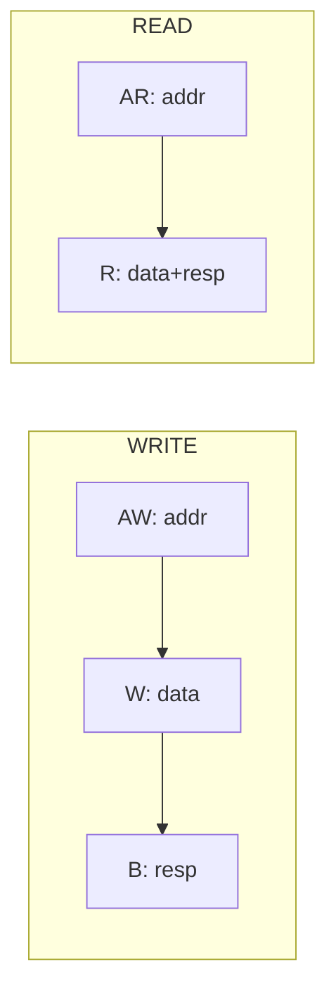

# 4. AXI Agent

:::tldr
- AXI는 **5개 독립 채널**(AW/W/B/AR/R)이라 driver/monitor가 APB보다 복잡 — 채널별 병렬 처리 + handshake(VALID/READY).
- **outstanding/out-of-order**: 여러 transaction이 동시에 진행되고 ID로 구분 → scoreboard는 ID 기반 매칭(Part 4 참고).
- 처음엔 **AXI-Lite**(burst/ID 없음)로 시작해 full AXI로 확장하는 것이 현실적.
:::

## 5 채널



| 채널 | 방향 | 내용 |
|---|---|---|
| AW | M→S | write 주소/burst 정보 |
| W | M→S | write 데이터(+WLAST) |
| B | S→M | write 응답 |
| AR | M→S | read 주소/burst |
| R | S→M | read 데이터(+RLAST) |

## handshake (모든 채널 공통)

```sv
// VALID/READY: 둘 다 1인 cycle에 전송 성립
task axi_handshake_aw(axi_item t);
  vif.cb.awvalid <= 1; vif.cb.awaddr <= t.addr;
  vif.cb.awlen <= t.len; vif.cb.awid <= t.id;
  do @(vif.cb); while (!vif.cb.awready);   // READY 대기
  vif.cb.awvalid <= 0;
endtask
```

## driver — 채널 병렬

```sv
task run_phase(uvm_phase phase);
  forever begin
    seq_item_port.get_next_item(req);
    if (req.is_write) fork
      drive_aw(req); drive_w(req); collect_b(req);
    join
    else fork
      drive_ar(req); collect_r(req);
    join
    seq_item_port.item_done(req);
  end
endtask
```

실제 고성능 driver는 각 채널을 **독립 forever 루프**로 돌려 여러 outstanding을 지원합니다(아래 gotcha).

## item

```sv
class axi_item extends uvm_sequence_item;
  rand bit [31:0]      addr;
  rand bit [3:0]       id;
  rand bit [7:0]       len;        // burst length-1
  rand bit [2:0]       size;
  rand bit [1:0]       burst;      // FIXED/INCR/WRAP
  rand bit [31:0]      data[];     // beat별 데이터
  rand bit             is_write;
  bit [1:0]            resp;
  constraint c_len { data.size() == len+1; }
  `uvm_object_utils(axi_item)
  function new(string n="axi_item"); super.new(n); endfunction
endclass
```

## monitor — 채널별 관측 후 조립

monitor는 AW/W/B(또는 AR/R)를 각각 관측해 ID로 묶어 하나의 `axi_item`으로 재구성합니다.

:::gotcha
초보 AXI driver의 함정: write에서 AW와 W를 **순차**로(`drive_aw` 후 `drive_w`) 처리하면 outstanding/interleaving을 못 만들고, 일부 DUT는 W를 먼저 기다리기도 해 **데드락**이 납니다. 채널은 독립이므로 fork로 병렬 구동하고, 여러 transaction을 동시에 받으려면 채널별 큐를 둔 파이프라인 driver가 필요합니다.
:::

:::tip
한 번에 full AXI를 구현하지 말고, **AXI-Lite(단일 beat, ID 없음, in-order)**로 먼저 끝까지(item→driver→monitor→scoreboard) 동작시킨 뒤 burst/ID/out-of-order를 단계적으로 추가하세요. 디버깅 표면이 훨씬 작아집니다.
:::

```check
Q: AXI driver가 APB driver보다 본질적으로 복잡한 이유 두 가지는?
A: ① **5개 독립 채널**(AW/W/B/AR/R)을 각자 VALID/READY handshake로 병렬 처리해야 한다. ② **outstanding/out-of-order** — 여러 transaction이 ID로 구분되어 동시에 진행되므로, driver는 채널별 파이프라인을, scoreboard는 ID 기반 매칭을 해야 한다.
H: 채널 수 + 동시성/순서
```

```check
Q: write transaction에서 AW와 W 채널을 순차로 처리하면 안 되는 이유는?
A: AW/W는 독립 채널이라 일부 DUT는 W 데이터를 AW와 무관하게(혹은 먼저) 기대한다. 순차 처리는 outstanding/interleaving을 막고 경우에 따라 데드락을 유발한다. fork로 병렬 구동하고 채널별 큐로 파이프라인화해야 한다.
```
