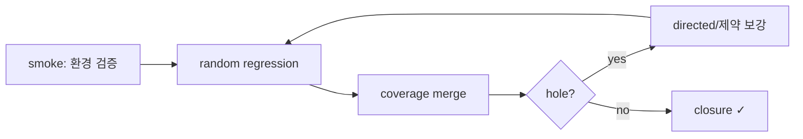

# 11. Bring-up → Coverage Closure

:::tldr
- 완성된 UVM 환경을 **smoke(bring-up) → random regression → coverage closure** 순으로 가동.
- coverage subscriber로 시나리오 달성도를 측정하고, hole을 directed/제약 보강으로 메운다.
- 마지막으로 레거시 TB 대비 무엇이 좋아졌는지 정리 — 마이그레이션의 결산.
:::

## 1) bring-up (smoke)

가장 단순한 single DMA 전송으로 환경 자체를 검증:

```
simv +UVM_TESTNAME=dma_smoke_test +UVM_VERBOSITY=UVM_HIGH
```

여기서 잡는 것: vif 연결, config_db, port connect, RAL map, scoreboard 배선 — **환경 버그**. (DUT 버그가 아님)

## 2) random regression

```sv
class dma_rand_test extends base_test;
  task main_phase(uvm_phase phase);
    phase.raise_objection(this);
    repeat (50) dma_rand_vseq::type_id::create("v").start(env.vseqr);
    phase.drop_objection(this);
  endtask
endclass
```

```
foreach seed in {1..500}: simv +UVM_TESTNAME=dma_rand_test +ntb_random_seed=$seed
merge coverage → report
```

## 3) coverage

```sv
class dma_cov extends uvm_subscriber #(axi_item);
  covergroup cg;
    cp_len  : coverpoint tr.len { bins one={0}; bins small={[1:15]}; bins big={[16:255]}; }
    cp_burst: coverpoint tr.burst { bins incr={1}; bins wrap={2}; }
    cp_align: coverpoint tr.addr[1:0];
    x: cross cp_len, cp_burst;
  endgroup
  // ... write()에서 sample ...
endclass
```

hole 분석 → 보강:

| hole | 보강 |
|---|---|
| len=0 미발생 | `dma_rand_vseq`에 `soft len==0` dist 추가 |
| reset 중 전송 미검증 | `dma_stress_vseq` 비중 ↑ |
| src==dst 겹침 | directed `overlap_vseq` 추가 |
| AXI wrap burst 빈칸 | constraint로 wrap 유도 |

## 결산: Before vs After

| 항목 | Legacy TB | UVM 환경 |
|---|---|---|
| 시나리오 생성 | 손으로 나열 | constrained random + directed |
| corner case | 누락 다수 | random이 발굴 + coverage로 추적 |
| 검증 완료 기준 | 없음 | coverage closure(정량) |
| 데이터 검증 | 수동 mem 비교 | scoreboard + ref model 자동 |
| 레지스터 | 주소 상수 | RAL + 자동 정합 |
| 동시성 | initial 순차 | virtual sequence fork |
| reset/IRQ corner | 거의 불가 | agent/event로 주입 |
| 재사용 | 불가 | agent/env 칩 레벨 재사용 |



:::gotcha
bring-up에서 fail이 나면 **DUT 버그로 단정하지 마세요**. 환경 버그(vif null, 잘못된 connect, ref model 오류)일 확률이 처음엔 더 높습니다. smoke 단계의 fail은 거의 환경 문제 — 챕터 7의 디버그 도구로 환경부터 의심.
:::

:::tip
마이그레이션 완료 후에도 레거시 directed test 몇 개를 UVM sequence로 옮겨 **회귀에 남겨두면** 좋습니다. 알려진 시나리오에 대한 빠른 sanity check 역할을 하고, random이 우연히 빠뜨리는 영역을 보장합니다.
:::

```check
Q: 새 UVM 환경의 smoke 테스트에서 fail이 났을 때, DUT 버그보다 먼저 의심해야 하는 것은?
A: **환경 버그** — vif null/연결 오류(config_db), port connect 누락, RAL map/주소 오류, reference model 실수 등. bring-up 단계의 실패는 대부분 환경 문제이므로, +UVM_CONFIG_DB_TRACE/print_topology 등으로 환경을 먼저 점검한다.
H: bring-up 실패의 통계적 1순위
```

```check
Q: coverage closure 루프에서 "len=0가 한 번도 발생하지 않음" hole을 어떻게 메우나?
A: random sequence의 제약을 조정한다 — 예: `len` 분포에 `soft len==0`이나 dist로 0 비중을 부여해 random이 그 값을 만들게 한다. 그래도 안 차는 도달 어려운 조합은 directed sequence로 조준한다.
```
