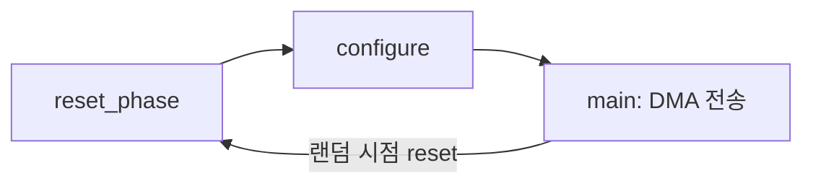

# 6. Clock/Reset 시나리오

:::tldr
- 고정 `initial reset`을 **reset agent/sequence**로 바꿔, 시뮬 중 임의 시점 reset·다중 클럭·clock gating을 검증.
- 핵심 corner case: **전송 도중 reset**, reset 중 버스 접근, 비동기 reset deassert 타이밍, 클럭 도메인 간 reset 순서.
- driver/monitor는 reset 시 진행 중 transaction을 **안전하게 폐기**하고 재동기화해야 한다.
:::

## reset agent

```sv
class reset_driver extends uvm_driver #(reset_item);
  `uvm_component_utils(reset_driver)
  virtual rst_if vif;
  task run_phase(uvm_phase phase);
    forever begin
      seq_item_port.get_next_item(req);
      vif.presetn <= 0; vif.aresetn <= 0;
      repeat (req.cycles) @(posedge vif.clk);
      vif.presetn <= 1; vif.aresetn <= 1;     // 동기 deassert
      seq_item_port.item_done();
    end
  endtask
endclass
```

## reset broadcast — 다른 agent에 알리기

reset이 들어오면 APB/AXI driver가 진행 중인 일을 멈춰야 합니다. `uvm_event`로 broadcast:

```sv
// reset monitor
@(negedge vif.presetn);
uvm_event_pool::get_global("reset_active").trigger();
```

```sv
// apb_driver: reset 인지하고 폐기
task run_phase(uvm_phase phase);
  fork
    forever begin seq_item_port.get_next_item(req); drive(req); seq_item_port.item_done(); end
    forever begin
      uvm_event_pool::get_global("reset_active").wait_ptrigger();
      // 진행 중 구동 중단, 핀 idle로
      disable drive_block;
      vif.cb.psel <= 0; vif.cb.penable <= 0;
    end
  join
endtask
```

## 전송 도중 reset (phase jump)

```sv
task main_phase(uvm_phase phase);
  fork
    begin
      #($urandom_range(100,500)*1ns);
      reset_seq::type_id::create("rs").start(env.reset_agt.sqr);
      phase.jump(uvm_reset_phase::get());   // reset_phase로 되돌림
    end
    do_dma_traffic();
  join_any
endtask
```



:::gotcha
reset 중에는 clocking block 신호가 X/0으로 튑니다. monitor가 이때 transaction을 조립하면 **가짜 transaction**이 scoreboard로 흘러갑니다. monitor도 reset_active 동안 collect를 중단하고, reset deassert 후 재동기화하세요.
:::

:::tip
"전송 도중 reset 후 재시작이 정상인가"는 실제 칩에서 자주 깨지는 corner case입니다. 레거시 TB로는 만들기 번거롭지만, reset agent + phase jump로 random하게 주입하면 자동으로 발굴됩니다 — UVM화의 대표적 이득.
:::

```check
Q: 고정 `initial reset`을 reset agent로 바꿔서 새로 검증할 수 있게 되는 대표 corner case는?
A: **전송(DMA/burst) 도중에 reset이 들어오는 경우**. 임의 시점에 reset을 주입해 진행 중 transaction이 안전히 폐기되고 reset 해제 후 정상 재시작하는지를 검증한다(phase jump로 reset_phase 복귀). 고정 initial reset으로는 만들기 어렵다.
H: 동적/임의 시점 reset
```

```check
Q: reset이 active인 동안 monitor가 계속 transaction을 조립하면 무슨 문제가 생기나? 대책은?
A: reset 중에는 신호가 X/0으로 튀므로 monitor가 **가짜 transaction**을 만들어 scoreboard에 흘려보내 거짓 mismatch를 낸다. 대책은 reset broadcast(uvm_event)를 받아 reset 동안 collect를 중단하고, deassert 후 재동기화하는 것.
```
