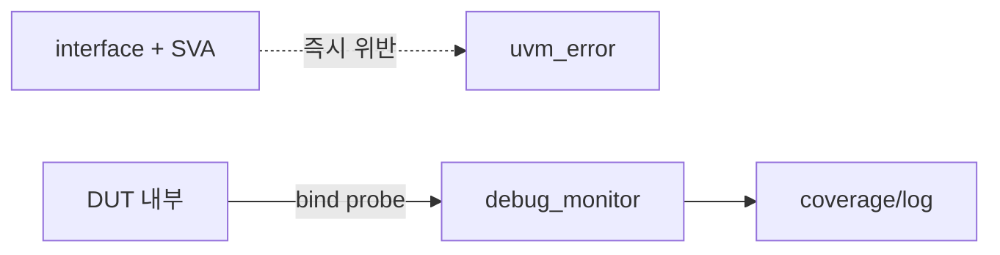

# 7. Debug Signal & Assertion

:::tldr
- DUT 내부 상태/trace 신호는 **passive debug agent**로 관측하고, **SVA assertion**으로 프로토콜 불변식을 상시 검사.
- 자극을 주지 않으므로 항상 passive. 디버깅 가시성과 자동 프로토콜 체크를 동시에 얻는다.
- assertion은 interface 안에 두어 monitor와 무관하게 시뮬레이터가 매 cycle 검사하게 한다.
:::

## debug agent (관측 전용)

```sv
class debug_monitor extends uvm_monitor;
  `uvm_component_utils(debug_monitor)
  virtual dbg_if vif;
  uvm_analysis_port #(dbg_item) ap;
  task run_phase(uvm_phase phase);
    forever begin
      @(vif.cb);
      if (vif.cb.state_changed) begin
        dbg_item t = dbg_item::type_id::create("t");
        t.state = vif.cb.fsm_state;
        t.active_channels = vif.cb.ch_active;
        ap.write(t);     // coverage/디버그 로그로
      end
    end
  endtask
endclass
```

내부 신호는 hierarchical reference나 `bind`로 끌어옵니다:

```sv
bind dma_core dbg_probe u_probe(.clk(clk), .fsm_state(state), .ch_active(ch_act));
```

## assertion — interface 안에

```sv
interface apb_if(input bit pclk, presetn);
  // ...signals...

  // PENABLE은 PSEL 다음 cycle에만
  property p_setup_access;
    @(posedge pclk) disable iff(!presetn)
      (psel && !penable) |=> (psel && penable);
  endproperty
  a_setup: assert property(p_setup_access)
    else `uvm_error("APB_SVA","SETUP→ACCESS 위반")

  // 전송 중 주소 안정
  property p_addr_stable;
    @(posedge pclk) disable iff(!presetn)
      (psel && !pready) |=> $stable(paddr);
  endproperty
  a_addr: assert property(p_addr_stable);
endinterface
```

## 역할 분담

| 도구 | 검사 대상 |
|---|---|
| assertion (SVA) | 매 cycle 프로토콜 불변식(즉시, 국소) |
| monitor + scoreboard | transaction 단위 정합성(end-to-end) |
| debug agent | 내부 FSM/상태 가시성, coverage |



:::gotcha
assertion에 `disable iff(!presetn)`를 빠뜨리면 reset 중 X 신호로 **거짓 assertion 실패**가 쏟아집니다. 모든 프로토콜 property에 reset disable 조건을 거세요.
:::

:::tip
assertion은 "국소적·즉각적" 버그(한 cycle 프로토콜 위반)를, scoreboard는 "전역적" 버그(데이터 정합성)를 잡습니다. 둘은 경쟁이 아니라 보완 — 좋은 환경은 둘 다 둡니다. SVA가 실패 지점을 정확히 짚어줘 디버깅이 빨라집니다.
:::

```check
Q: debug agent가 항상 passive인 이유와, SVA assertion을 interface 안에 두는 이유는?
A: debug agent는 내부 trace 신호를 **관측만** 하고 구동하지 않으므로 passive다. assertion을 interface에 두면 monitor 동작과 무관하게 시뮬레이터가 매 cycle 프로토콜 불변식을 검사하므로, 위반을 즉시·국소적으로 잡는다.
H: 관측 전용 + 매 cycle 검사 위치
```

```check
Q: 프로토콜 assertion에 `disable iff(!presetn)`를 반드시 넣어야 하는 이유는?
A: reset 동안 신호가 X/불안정 상태이므로, 이 조건이 없으면 정상적인 reset 구간에서 assertion이 거짓으로 다량 실패한다. disable iff로 reset 중에는 property 평가를 멈춰 거짓 실패를 막는다.
```
