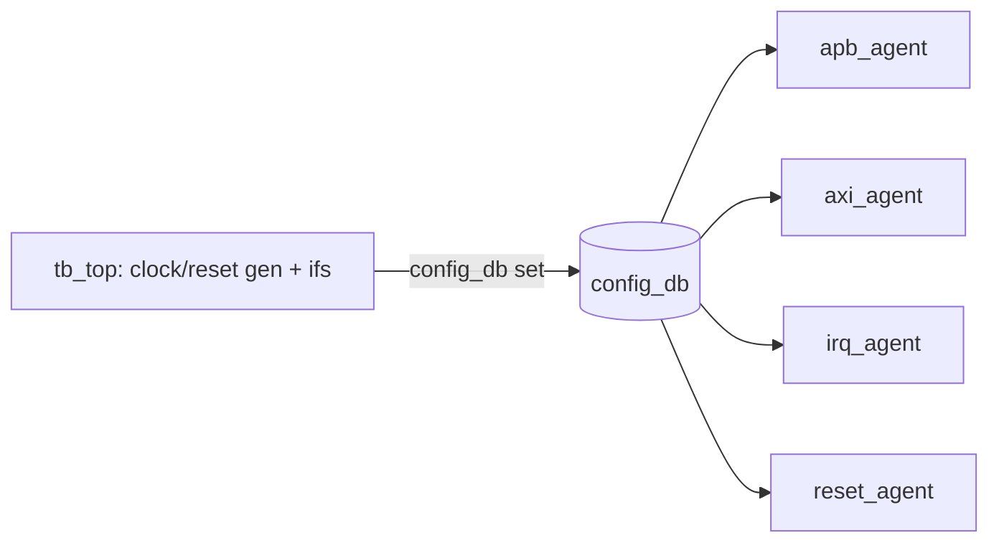

# 2. Interface · Clock · Reset 분리

:::tldr
- 흩어진 wire를 **interface + clocking block**으로 묶고, clock/reset 생성을 top에 정리.
- DUT는 interface를 통해 연결, TB는 virtual interface를 config_db로 받는다.
- reset은 별도 신호 interface로 빼서 나중에 reset agent/sequence가 제어하게 준비.
:::

## Before / After

<div class="diff2">
<div class="before">
<div class="diff-label">Before (legacy)</div>

```sv
module tb;
  logic [31:0] paddr,pwdata,prdata;
  logic psel,penable,pwrite,pready;
  dma_periph dut(.paddr(paddr), .psel(psel),
    .penable(penable), .pwrite(pwrite),
    .pwdata(pwdata), .prdata(prdata),
    .pready(pready), /* ...수십개... */);
  always #5 pclk=~pclk;
endmodule
```
</div>
<div class="after">
<div class="diff-label">After (UVM)</div>

```sv
interface apb_if(input bit pclk, presetn);
  logic [31:0] paddr,pwdata,prdata;
  logic psel,penable,pwrite,pready,pslverr;
  clocking cb @(posedge pclk);
    default input #1step output #1ns;
    output paddr,psel,penable,pwrite,pwdata;
    input  prdata,pready,pslverr;
  endclocking
  modport tb(clocking cb,input pclk,presetn);
endinterface
```
</div>
</div>

## top module 정리

```sv
module tb_top;
  bit pclk, aclk, presetn, aresetn;

  // clock gen
  initial begin pclk=0; forever #5  pclk=~pclk; end
  initial begin aclk=0; forever #2  aclk=~aclk; end

  // interfaces
  apb_if   apb (pclk,  presetn);
  axi_if   axi (aclk,  aresetn);
  irq_if   irq (pclk,  presetn);
  rst_if   rst (pclk);            // reset 제어용 (reset agent가 구동)

  // DUT
  dma_periph dut(
    .apb(apb.dut), .axi(axi.dut),
    .irq(irq.irq), .presetn(presetn), .aresetn(aresetn));

  // hand interfaces to UVM
  initial begin
    uvm_config_db#(virtual apb_if)::set(null,"*","apb_vif",apb);
    uvm_config_db#(virtual axi_if)::set(null,"*","axi_vif",axi);
    uvm_config_db#(virtual irq_if)::set(null,"*","irq_vif",irq);
    uvm_config_db#(virtual rst_if)::set(null,"*","rst_vif",rst);
    run_test();
  end
endmodule
```

## reset 신호 분리

reset을 별도 `rst_if`로 빼두면, 나중에 reset agent가 시뮬 중 임의 시점에 reset을 토글하는 시나리오를 만들 수 있습니다(챕터 6).



:::gotcha
clock 주파수가 다른 도메인(pclk vs aclk)은 **각자의 clocking block**으로 샘플해야 합니다. APB driver가 aclk 기반 신호를 pclk clocking으로 보면 CDC race가 생깁니다. interface를 클럭 도메인별로 나누세요.
:::

:::tip
이 단계만 끝나도 레거시 task를 그대로 두고 interface 너머로 호출하도록 바꿔 **점진 이주**가 가능합니다. 전부 한 번에 갈아엎을 필요 없습니다.
:::

```check
Q: APB(pclk)와 AXI(aclk)가 서로 다른 클럭일 때 interface/clocking block을 어떻게 구성해야 하나?
A: 클럭 도메인별로 **별도 interface와 별도 clocking block**을 둔다(apb_if는 pclk, axi_if는 aclk). 한 도메인의 driver/monitor가 다른 도메인 클럭으로 샘플하면 CDC race가 생기므로, 각 agent는 자기 도메인 clocking block만 사용한다.
H: 도메인마다 따로
```

```check
Q: reset 신호를 별도 interface(rst_if)로 분리해 두면 나중에 무엇이 가능해지나?
A: reset agent/sequence가 시뮬레이션 중 **임의 시점에 reset을 토글**하는 시나리오(전송 도중 reset 등)를 만들 수 있다. reset이 top의 고정 initial에만 묶여 있으면 이런 동적 reset 검증이 불가능하다.
```
