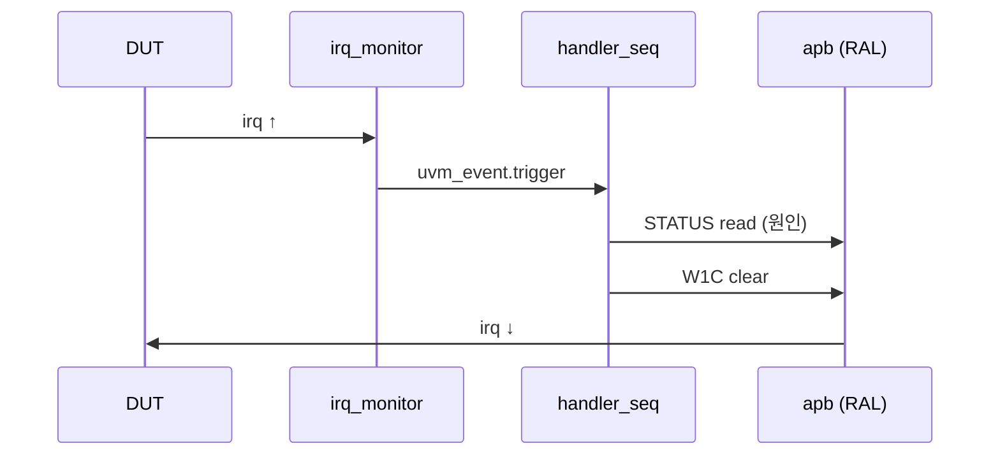

# 5. Interrupt 처리

:::tldr
- 레거시 `wait(irq)`를 **irq_monitor(passive agent) + interrupt handler sequence**로 옮긴다.
- IRQ는 자극이 아니라 **이벤트** → monitor가 edge를 잡아 `uvm_event`/analysis_port로 알리고, handler sequence가 반응(ISR 흉내).
- level/edge, 공유 IRQ 라인, 우선순위 등 corner case를 시나리오로 다룬다.
:::

## irq agent (passive)

```sv
class irq_monitor extends uvm_monitor;
  `uvm_component_utils(irq_monitor)
  virtual irq_if vif;
  uvm_analysis_port #(irq_item) ap;
  uvm_event irq_ev;
  function new(string n, uvm_component p); super.new(n,p); endfunction
  function void build_phase(uvm_phase phase);
    ap = new("ap", this);
    irq_ev = uvm_event_pool::get_global("irq_asserted");
    void'(uvm_config_db#(virtual irq_if)::get(this,"","irq_vif",vif));
  endfunction
  task run_phase(uvm_phase phase);
    forever begin
      @(posedge vif.cb.irq);           // edge 감지
      irq_item t = irq_item::type_id::create("t");
      t.time_asserted = $time;
      ap.write(t);
      irq_ev.trigger(t);               // 대기 중인 핸들러 깨움
    end
  endtask
endclass
```

## interrupt handler sequence (ISR 흉내)

<div class="diff2">
<div class="before">
<div class="diff-label">Before</div>

```sv
// initial 블록 안에서
apb_write(CTRL, START);
wait(irq);                 // 그냥 기다림
apb_read(STATUS, s);
if (s[0]) /* done */;
```
</div>
<div class="after">
<div class="diff-label">After: handler seq</div>

```sv
task body();   // irq_handler_seq
  uvm_event ev =
    uvm_event_pool::get_global("irq_asserted");
  forever begin
    ev.wait_ptrigger();          // IRQ 대기
    // STATUS 읽어 원인 파악 (RAL)
    reg_model.STATUS.read(st, val);
    if (val & DONE)  clear_done();
    if (val & ERROR) handle_error();
  end
endtask
```
</div>
</div>

handler sequence는 test의 background로 `fork`해 둡니다:

```sv
task main_phase(uvm_phase phase);
  phase.raise_objection(this);
  fork
    irq_handler_seq::type_id::create("h").start(env.v_sqr.apb_sqr);
  join_none
  // ... 메인 트래픽 ...
  phase.drop_objection(this);
endtask
```



:::gotcha
`@(posedge irq)`만 쓰면 핸들러가 늦게 시작했을 때 이미 뜬 IRQ를 놓칩니다. monitor의 `uvm_event` + `wait_ptrigger`(persistent) 조합으로 race를 막으세요. 또 **level-sensitive IRQ**는 원인을 clear(W1C)하기 전엔 계속 1이므로, clear 로직이 없으면 무한 루프가 됩니다.
:::

:::tip
IRQ를 scoreboard와도 연결하면 "전송 완료 시점에 IRQ가 정확히 떴는가"(예상 대비 누락/지연)를 검증할 수 있습니다. 단순 wait를 넘어 **IRQ 타이밍/정합성**까지 보는 것이 UVM화의 이득.
:::

```check
Q: 레거시 `wait(irq)`를 UVM에서 어떤 두 요소로 옮기며, 각각의 역할은?
A: ① **irq_monitor**(passive)가 irq edge를 감지해 analysis_port/uvm_event로 알린다. ② **interrupt handler sequence**가 그 이벤트를 `wait_ptrigger`로 받아 STATUS를 읽고 원인을 처리(W1C clear 등)한다. 즉 관측과 반응을 분리한다.
H: 관측(monitor) + 반응(handler seq)
```

```check
Q: level-sensitive 인터럽트를 처리할 때 무한 루프를 피하려면 핸들러가 반드시 무엇을 해야 하나?
A: 인터럽트 **원인을 clear**해야 한다(보통 STATUS 레지스터의 W1C write). level IRQ는 원인이 살아 있는 동안 라인이 계속 1이므로, clear하지 않으면 핸들러가 같은 IRQ를 끝없이 다시 받는다.
```
