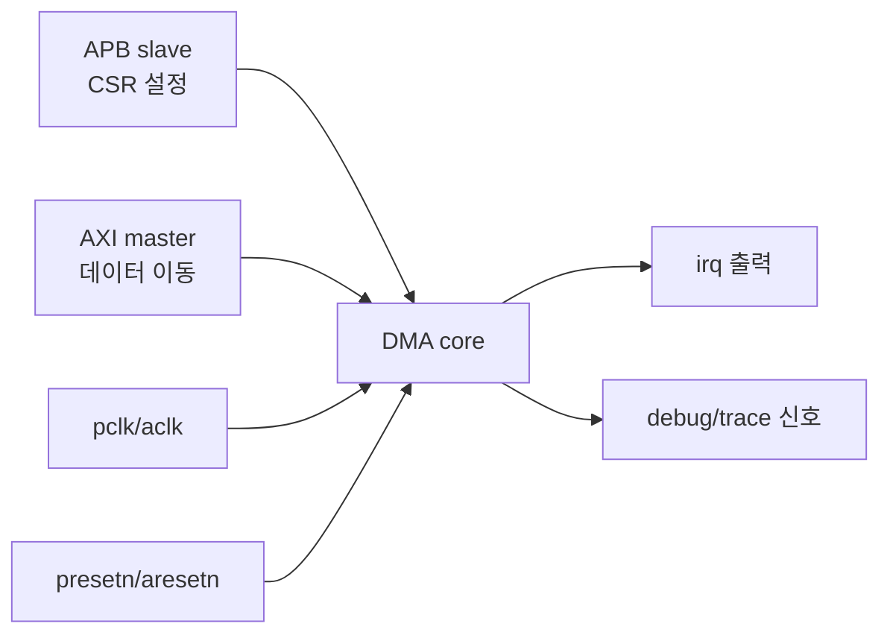

# 0. 출발점: Legacy SV TB

:::tldr
- 이 트랙은 **APB(CSR) + AXI(데이터) + IRQ + clock/reset + debug 신호**가 있는 가상 DMA 주변장치 DUT를 잡고, 모듈 기반 directed TB를 UVM으로 단계 이주한다.
- 먼저 "전형적인 레거시 TB"가 어떻게 생겼고 **무엇이 문제인지**를 본다 — 이것이 마이그레이션의 동기.
:::

## 대상 DUT (가상 `dma_periph`)



- **APB**: 제어 레지스터(CTRL/SRC/DST/LEN/STATUS) 접근.
- **AXI**: 메모리에서 메모리로 데이터 burst.
- **IRQ**: 전송 완료/에러 시 인터럽트.
- **debug**: 내부 상태 trace 신호(관측 전용).

## 전형적인 레거시 TB

```sv
module tb;
  bit pclk, presetn, aclk, aresetn;
  // ... DUT 핀들을 일일이 wire로 선언 ...
  logic [31:0] paddr, pwdata, prdata; logic psel, penable, pwrite, pready;
  logic irq;

  dma_periph dut(.*);

  always #5  pclk = ~pclk;
  always #2  aclk = ~aclk;

  // directed APB write task
  task apb_write(input [31:0] a, input [31:0] d);
    @(posedge pclk); psel=1; pwrite=1; paddr=a; pwdata=d; penable=0;
    @(posedge pclk); penable=1;
    wait(pready); @(posedge pclk); psel=0; penable=0;
  endtask

  task apb_read(input [31:0] a, output [31:0] d);
    @(posedge pclk); psel=1; pwrite=0; paddr=a; penable=0;
    @(posedge pclk); penable=1;
    wait(pready); d=prdata; @(posedge pclk); psel=0; penable=0;
  endtask

  initial begin
    presetn=0; aresetn=0; #20; presetn=1; aresetn=1;
    apb_write(32'h00, 32'h1);          // CTRL.enable
    apb_write(32'h04, 32'h1000);       // SRC
    apb_write(32'h08, 32'h2000);       // DST
    apb_write(32'h0C, 64);             // LEN
    apb_write(32'h00, 32'h3);          // start
    wait(irq);                          // 완료 대기
    // 결과를 직접 메모리 들여다보며 수동 확인...
    if (mem[32'h2000] !== mem[32'h1000]) $error("mismatch");
    $finish;
  end
endmodule
```

## 이 TB의 문제점

| 문제 | 설명 |
|---|---|
| corner case 누락 | 시나리오를 손으로 다 나열 — len=0, 겹치는 src/dst, reset 중 전송 등 빠짐 |
| 재사용 불가 | 다음 프로젝트로 통째 못 가져감 |
| 측정 불가 | "얼마나 검증됐나" 지표 없음 |
| AXI 미검증 | irq만 보고 데이터 정합성은 수동 |
| 확장 어려움 | 신호 추가 시 task/wire 전부 수정 |
| 동시성 빈약 | APB/AXI/IRQ를 한 initial에서 순차로만 |

:::note
이 레거시 TB도 "동작은 한다." 마이그레이션의 목적은 **동작**이 아니라 **재사용성·확장성·측정 가능성**을 얻는 것. 다음 챕터부터 이 구조를 UVM 컴포넌트로 하나씩 옮긴다.
:::

```check
Q: 위 레거시 TB가 "동작은 하는데" UVM으로 옮기는 이유 3가지는?
A: ① 시나리오를 손으로 나열해 corner case 누락(재현성 있는 random 부재), ② 재사용 불가(프로젝트/레벨 간 이식 안 됨), ③ 검증 완료를 측정할 functional coverage가 없음. 추가로 AXI 데이터 정합성·동시성 검증이 빈약하다.
H: 재사용 · 측정 · corner case
```

```check
Q: 레거시 TB의 `apb_write` task는 UVM에서 어느 컴포넌트의 책임으로 옮겨지나?
A: **driver**(핀 토글)와 **sequence**(무엇을 쓸지)로 분리된다. apb_write의 핀 프로토콜 부분은 apb_driver의 drive()로, 어떤 주소/값을 쓸지는 sequence_item + sequence로 간다.
```
