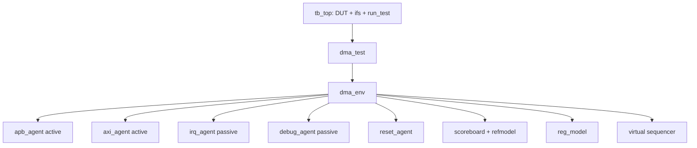

# 1. 매핑: SV → UVM 컴포넌트

:::tldr
- 마이그레이션의 첫 단계는 코딩이 아니라 **매핑 표**를 그리는 것 — 레거시 TB의 각 조각이 어느 UVM 컴포넌트가 되는가.
- 신호 다발→interface, task→driver+sequence, 수동 확인→monitor+scoreboard, 시나리오→test+vseq.
- 이 표가 곧 작업 계획서이자 챕터 순서.
:::

## 매핑 표

| 레거시 TB 요소 | UVM 대응 | 이 트랙 챕터 |
|---|---|---|
| wire 다발(paddr…) | `apb_if`, `axi_if`, `irq_if` interface | 2 |
| clock/reset 생성 always | clock/reset generator + reset agent | 2,6 |
| `apb_write/read` task | `apb_driver` + `apb_seq`/RAL | 3 |
| AXI 핀 토글 | `axi_driver`(5 채널) | 4 |
| `wait(irq)` | `irq_monitor` + interrupt handler seq | 5 |
| 수동 mem 비교 | `monitor` + `scoreboard` + ref model | 8 |
| CTRL/SRC/DST 주소 상수 | `uvm_reg_block`(RAL) | 9 |
| `initial` 시나리오 | `test` + `virtual sequence` | 10 |
| 결과 판정 `$error` | `uvm_error` + check_phase | 8,11 |
| (없음) coverage | `coverage subscriber` | 11 |

## 목표 아키텍처



## 작업 순서(왜 이 순서인가)

1. **interface/clock/reset** — 모든 agent가 닿을 토대 먼저.
2. **APB agent** — 가장 단순한 프로토콜로 패턴 확립.
3. **AXI agent** — 복잡한 프로토콜로 확장.
4. **IRQ/clock/debug** — 이벤트·비정상 흐름·관측.
5. **scoreboard/RAL/vseq** — 통합 검증.
6. **bring-up→coverage** — closure.

:::tip
실무에서도 "한 번에 다 UVM화"하지 않습니다. 레거시 task를 driver로 감싸 **공존**시키며 점진 이주하는 경우가 많습니다(예: 레거시 apb_write를 호출하는 임시 driver로 시작 → 나중에 순수 UVM driver로 교체).
:::

:::gotcha
매핑 단계를 건너뛰고 바로 코딩하면 "agent 경계"가 엉킵니다. APB와 AXI를 한 agent에 욱여넣거나, IRQ를 APB monitor에 섞는 실수가 대표적. **프로토콜 1개 = agent 1개** 원칙으로 경계를 먼저 확정하세요.
:::

```check
Q: 마이그레이션에서 interface/clock/reset을 가장 먼저 옮기는 이유는?
A: 모든 agent(driver/monitor)가 결국 interface를 통해 DUT에 닿고, clock/reset이 있어야 어떤 트래픽도 돌릴 수 있다. 토대를 먼저 세워야 그 위에 APB→AXI→IRQ agent를 순차로 올릴 수 있다.
H: 다른 모든 것이 의존하는 토대
```

```check
Q: 레거시 TB의 `initial` 블록 안 시나리오와 결과 판정은 각각 어느 UVM 요소로 가나?
A: 시나리오(무엇을 어떤 순서로)는 **test + virtual sequence**로, 결과 판정(수동 비교/$error)은 **monitor + scoreboard(+reference model)**의 자동 비교와 uvm_error/check_phase로 간다.
```
