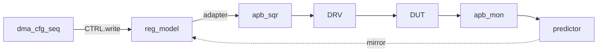

# 9. RAL 통합

:::tldr
- 흩어진 주소 상수(`CTRL_ADDR=0x00`…)를 **uvm_reg_block 모델**로 교체 → `reg_model.CTRL.write(...)`.
- APB sequencer에 adapter를 연결하고, APB monitor를 predictor에 연결.
- 이제 sequence는 주소를 몰라도 되고, 레지스터 정합성은 mirror가 자동 검증.
:::

## reg model (DMA CSR)

```sv
class dma_reg_block extends uvm_reg_block;
  `uvm_object_utils(dma_reg_block)
  rand ctrl_reg   CTRL;     // [0]=enable [1]=start
  rand addr_reg   SRC, DST;
  rand len_reg    LEN;
  status_reg      STATUS;   // RO/W1C
  uvm_reg_map     map;

  function new(string n="dma_reg_block"); super.new(n,UVM_NO_COVERAGE); endfunction
  virtual function void build();
    CTRL=ctrl_reg::type_id::create("CTRL"); CTRL.configure(this); CTRL.build();
    SRC =addr_reg::type_id::create("SRC");  SRC.configure(this);  SRC.build();
    DST =addr_reg::type_id::create("DST");  DST.configure(this);  DST.build();
    LEN =len_reg ::type_id::create("LEN");  LEN.configure(this);  LEN.build();
    STATUS=status_reg::type_id::create("STATUS"); STATUS.configure(this); STATUS.build();
    map = create_map("map", 0, 4, UVM_LITTLE_ENDIAN);
    map.add_reg(CTRL,'h00,"RW"); map.add_reg(SRC,'h04,"RW");
    map.add_reg(DST,'h08,"RW");  map.add_reg(LEN,'h0C,"RW");
    map.add_reg(STATUS,'h10,"RO");
    lock_model();
  endfunction
endclass
```

## env 연결

```sv
function void connect_phase(uvm_phase phase);
  reg_model.map.set_sequencer(apb_agt.sqr, apb_adapter);
  apb_predictor.map     = reg_model.map;
  apb_predictor.adapter = apb_adapter;
  apb_agt.mon.ap.connect(apb_predictor.bus_in);   // 관측→mirror
endfunction
```

## sequence가 깔끔해진다

<div class="diff2">
<div class="before">
<div class="diff-label">Before: 주소 하드코딩</div>

```sv
apb_write(32'h04, src);
apb_write(32'h08, dst);
apb_write(32'h0C, len);
apb_write(32'h00, 32'h3);  // start
```
</div>
<div class="after">
<div class="diff-label">After: RAL</div>

```sv
reg_model.SRC.write(st, src);
reg_model.DST.write(st, dst);
reg_model.LEN.write(st, len);
reg_model.CTRL.write(st, 'h3);
// 주소·정렬·정책은 모델이 안다
```
</div>
</div>



:::gotcha
RAL 도입 후에도 scoreboard가 `case(addr)`로 레지스터를 추적한다면 **이중 관리**입니다. predictor가 mirror를 갱신하므로, scoreboard는 reg_model의 mirror를 직접 읽거나(`reg_model.LEN.get()`) RAL 콜백으로 설정을 받는 편이 일관됩니다.
:::

:::tip
RAL의 즉효: 챕터 8 scoreboard의 `write_apb` 안 `case(addr)` 디코딩이 사라집니다. reference model이 `reg_model.SRC.get()` 등 mirror에서 설정을 읽으면 주소 상수 의존이 제거됩니다.
:::

```check
Q: RAL을 도입하면 dma 설정 sequence와 scoreboard의 주소 관련 코드가 어떻게 바뀌나?
A: sequence는 `reg_model.SRC.write(...)`처럼 이름 기반 접근이 되어 주소/정렬/정책 상수가 사라진다. scoreboard도 `case(addr)` 디코딩 대신 reg_model의 mirror(`reg_model.LEN.get()`)에서 설정을 읽어, 주소 하드코딩 이중 관리가 제거된다.
H: 주소 상수가 모델로 흡수됨
```

```check
Q: env.connect_phase에서 RAL을 APB agent에 통합하기 위해 연결해야 하는 두 가지는?
A: ① `reg_model.map.set_sequencer(apb_sqr, adapter)` — 모델의 추상 연산을 APB sequencer+adapter로 보냄. ② APB monitor의 analysis_port를 explicit predictor의 bus_in에 연결 — 관측된 버스 접근으로 mirror를 갱신. 이 둘이 있어야 frontdoor 접근과 mirror 정합이 동작한다.
```
