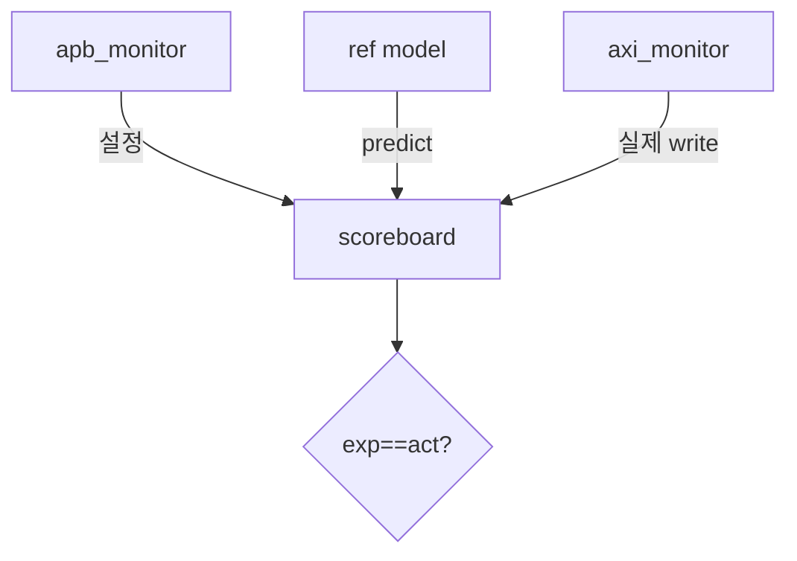

# 8. Scoreboard + Reference Model

:::tldr
- 레거시의 수동 `mem` 비교를 **scoreboard + reference model**로 자동화.
- reference model = DMA 동작을 SW로 모사("SRC에서 LEN만큼 DST로 복사") → expected 생성.
- APB monitor(설정) + AXI monitor(데이터)를 모두 받아, AXI write가 reference와 일치하는지 판정.
:::

## reference model

```sv
class dma_ref_model extends uvm_component;
  `uvm_component_utils(dma_ref_model)
  bit [31:0] mem [bit [31:0]];        // 모델 메모리
  bit [31:0] src, dst, len;

  function void configure(bit[31:0] s, bit[31:0] d, bit[31:0] l);
    src=s; dst=d; len=l;
  endfunction

  // 예상 AXI write 트랜잭션 목록 생성
  function void predict(ref axi_item exp_q[$]);
    for (int i=0; i<len; i++) begin
      axi_item e = axi_item::type_id::create("e");
      e.addr = dst + i*4;
      e.data = new[1]; e.data[0] = mem[src + i*4];
      e.is_write = 1;
      exp_q.push_back(e);
    end
  endfunction
endclass
```

## scoreboard — 두 스트림 결합

```sv
`uvm_analysis_imp_decl(_apb)
`uvm_analysis_imp_decl(_axi)

class dma_scoreboard extends uvm_scoreboard;
  `uvm_component_utils(dma_scoreboard)
  uvm_analysis_imp_apb #(apb_item, dma_scoreboard) apb_imp;
  uvm_analysis_imp_axi #(axi_item, dma_scoreboard) axi_imp;
  dma_ref_model ref_m;
  axi_item exp_q[$];

  // APB write → 레지스터 설정 추적 → start 시 예측 생성
  function void write_apb(apb_item t);
    if (t.is_write) case (t.addr)
      SRC_ADDR: ref_m.src = t.data;
      DST_ADDR: ref_m.dst = t.data;
      LEN_ADDR: ref_m.len = t.data;
      CTRL_ADDR: if (t.data[1]) ref_m.predict(exp_q);   // start bit
    endcase
  endfunction

  // AXI write 관측 → 예상과 비교
  function void write_axi(axi_item t);
    if (!t.is_write) return;
    foreach (t.data[i]) begin
      axi_item e = exp_q.pop_front();
      if (e == null) `uvm_error("SCB","unexpected AXI write")
      else if (t.data[i] !== e.data[0])
        `uvm_error("SCB",$sformatf("addr=%0h exp=%0h act=%0h",
                                   t.addr+i*4, e.data[0], t.data[i]))
    end
  endfunction

  function void check_phase(uvm_phase phase);
    if (exp_q.size()) `uvm_error("SCB",
      $sformatf("%0d expected writes missing", exp_q.size()))
  endfunction
endclass
```



<div class="diff2">
<div class="before">
<div class="diff-label">Before: 수동</div>

```sv
wait(irq);
if (mem[DST] !== mem[SRC])
  $error("mismatch");
// LEN개를 일일이...?
```
</div>
<div class="after">
<div class="diff-label">After: 자동</div>

```sv
// monitor가 자동 publish,
// scoreboard가 ref model과
// 매 beat 비교 + 누락 검사.
// 사람 개입 0.
```
</div>
</div>

:::gotcha
reference model이 DMA의 **side effect 순서**(예: src==dst 겹침, descriptor chaining)를 정확히 모사하지 않으면 정상 DUT가 fail로 나옵니다. 모델은 DUT 사양과 1:1이어야 하며, 모델 자체도 리뷰 대상입니다.
:::

:::tip
reference model을 scoreboard와 분리된 component로 두면, golden model을 C/DPI로 교체하거나 단독 테스트하기 쉽습니다. 복잡한 DUT일수록 모델 분리가 유지보수에 유리.
:::

```check
Q: DMA 전송 검증에서 scoreboard가 expected를 만들려면 어느 정보를 어디서 받아야 하나?
A: APB monitor로부터 레지스터 설정(SRC/DST/LEN/start)을 받아 reference model에 반영하고, start 시점에 ref model이 "SRC→DST로 LEN만큼 복사"라는 expected AXI write 목록을 생성한다. 그 후 AXI monitor가 준 실제 write와 beat 단위로 비교한다.
H: 설정은 APB, 실제 데이터는 AXI, 예상은 ref model
```

```check
Q: reference model이 DUT 사양과 미세하게 다르면 어떤 증상이 나타나나?
A: 정상 DUT인데도 scoreboard가 mismatch(fail)를 낸다(거짓 음성). 따라서 모델은 DUT 사양과 1:1로 정확해야 하고, 모델 코드 자체도 리뷰·검증 대상이다.
```
