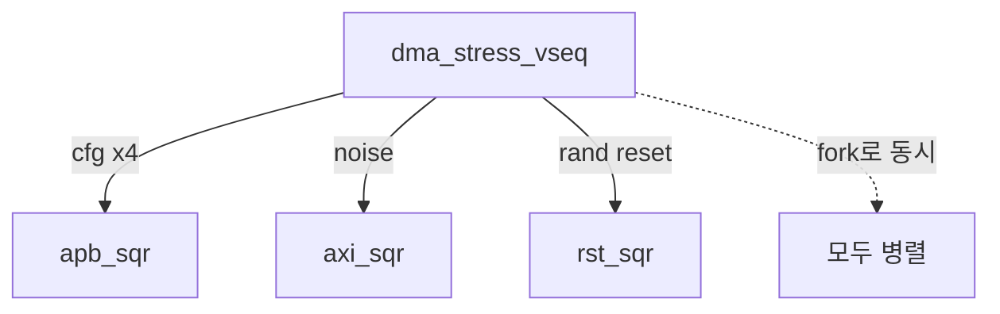

# 10. Virtual Sequencer 조율

:::tldr
- 레거시 `initial` 한 블록의 순차 시나리오를, **virtual sequence**가 APB(설정)·AXI(데이터)·IRQ(핸들러)를 조율하는 형태로 재구성.
- virtual sequencer가 apb_sqr/axi_sqr/reset_sqr 핸들을 모으고, virtual sequence가 fork로 동시성을 만든다.
- test는 "어떤 virtual sequence를 돌릴지"만 고르는 얇은 층이 된다.
:::

## virtual sequencer

```sv
class dma_vseqr extends uvm_sequencer;
  `uvm_component_utils(dma_vseqr)
  apb_sequencer   apb_sqr;
  axi_sequencer   axi_sqr;
  reset_sequencer rst_sqr;
  function new(string n, uvm_component p); super.new(n,p); endfunction
endclass
```

env.connect_phase에서 배선(챕터 5 env 참조).

## virtual sequence — 전체 시나리오

<div class="diff2">
<div class="before">
<div class="diff-label">Before: 순차 initial</div>

```sv
initial begin
  reset();
  apb_write(SRC,...);
  apb_write(DST,...);
  apb_write(LEN,...);
  apb_write(CTRL,START);
  wait(irq);
  check();
end
```
</div>
<div class="after">
<div class="diff-label">After: virtual seq</div>

```sv
task body();  // dma_smoke_vseq
  `uvm_declare_p_sequencer(dma_vseqr)
  dma_cfg_seq cfg;
  irq_handler_seq irqh;
  fork
    irqh.start(p_sequencer.apb_sqr); // 배경
  join_none
  // 설정 (RAL)
  `uvm_do_on(cfg, p_sequencer.apb_sqr)
  // 완료 대기 (IRQ event)
  uvm_event_pool::get_global("irq_asserted").wait_ptrigger();
endtask
```
</div>
</div>

## 동시성 시나리오들

```sv
class dma_stress_vseq extends uvm_sequence;
  `uvm_declare_p_sequencer(dma_vseqr)
  task body();
    fork
      // 여러 DMA 채널 동시 설정/전송
      repeat(4) `uvm_do_on(dma_cfg_seq::type_id::create("c"), p_sequencer.apb_sqr)
      // 동시에 background AXI 트래픽
      `uvm_do_on(axi_noise_seq::type_id::create("n"), p_sequencer.axi_sqr)
      // 랜덤 reset 주입
      `uvm_do_on(rand_reset_seq::type_id::create("r"), p_sequencer.rst_sqr)
    join
  endtask
endclass
```



:::gotcha
virtual sequence에서 여러 sub-sequence를 `fork`로 돌릴 때, 같은 sequencer에 동시에 올리면 arbitration이 끼어듭니다(Part 3 lock/grab). 원자적으로 보내야 하는 설정 시퀀스는 `lock`으로 보호하세요.
:::

:::tip
이 단계에서 비로소 레거시 TB가 "할 수 없던" 시나리오가 가능해집니다: **여러 DMA 전송 동시 진행 + reset 난입 + 백그라운드 노이즈**. 이런 동시성이 실제 칩 버그의 온상이며, virtual sequence가 이를 조합적으로 생성합니다.
:::

```check
Q: 레거시의 순차 `initial` 시나리오를 virtual sequence로 옮기면 새로 가능해지는 것은?
A: `fork`를 통한 **동시성 시나리오** — 여러 DMA 전송 동시 진행, 배경 AXI 노이즈, 랜덤 reset 난입 등을 한 시나리오에서 조합한다. 순차 initial로는 만들 수 없던 동시 상호작용 버그를 발굴할 수 있다.
H: 순차 → 병렬 조합
```

```check
Q: virtual sequence가 여러 sub-sequence를 같은 sequencer에 fork로 올릴 때, 설정 시퀀스의 원자성을 보장하려면?
A: 그 설정 sub-sequence를 `lock(sequencer)`/`unlock`으로 감싼다. 그러면 arbitration으로 중간에 다른 item이 끼어들지 못해 SRC/DST/LEN/start 설정이 원자적으로 나간다.
```
