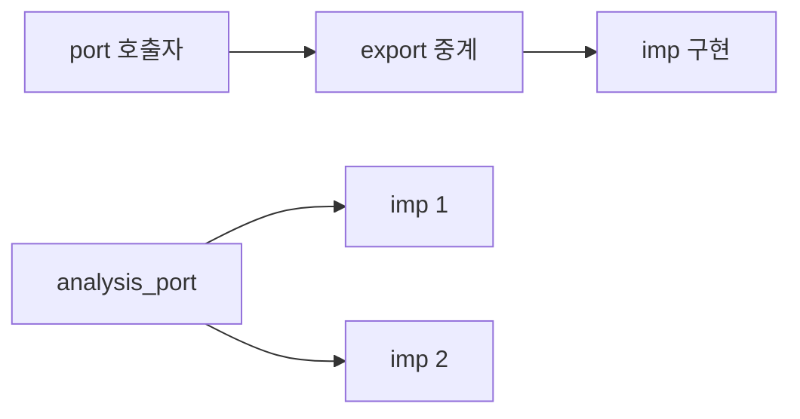

# TLM Port 종류

:::tldr
port(호출)–export(중계)–imp(구현). analysis는 1:多 broadcast. blocking은 시간 소비, non-blocking은 0 time.
:::

## 점대점 (1:1)

| 방향 | port | 메서드 |
|---|---|---|
| put | `uvm_blocking_put_port #(T)` | `put(t)` (block) |
| put | `uvm_nonblocking_put_port #(T)` | `try_put(t)`, `can_put()` |
| get | `uvm_blocking_get_port #(T)` | `get(t)` |
| peek | `uvm_blocking_peek_port #(T)` | `peek(t)` (안 꺼냄) |
| get_peek | `uvm_blocking_get_peek_port #(T)` | get+peek |
| transport | `uvm_blocking_transport_port #(REQ,RSP)` | `transport(req,rsp)` |

각 port는 대응 `_imp`(구현)와 `_export`(중계)가 있음.

## analysis (1:多)

| 요소 | 용도 |
|---|---|
| `uvm_analysis_port #(T)` | `write(t)` broadcast (monitor) |
| `uvm_analysis_imp #(T, C)` | `write(t)` 구현 (scoreboard) |
| `uvm_subscriber #(T)` | analysis_imp 내장, write만 구현 |
| `uvm_tlm_analysis_fifo #(T)` | write→큐잉→get |
| `uvm_analysis_imp_decl(_sfx)` | 한 컴포넌트가 여러 analysis 입력 |

## 연결 규칙

```sv
port.connect(export_or_imp);     // port → imp
analysis_port.connect(imp1);     // 1:多 가능
analysis_port.connect(imp2);
```



:::gotcha
일반 put/get port는 정확히 1개 imp에만 연결(1:1). 여러 구독자엔 analysis_port. analysis는 non-blocking이라 backpressure/응답이 없습니다.
:::

```check
Q: 한 scoreboard가 입력측·출력측 두 analysis 스트림을 따로 받으려면 무엇을 쓰나?
A: `uvm_analysis_imp_decl(_inp)`와 `_out` 매크로로 이름 있는 analysis imp 두 개(`uvm_analysis_imp_inp`, `uvm_analysis_imp_out`)를 만들어 각각 `write_inp`/`write_out`을 구현한다. 한 클래스에 같은 `write`가 둘일 수 없으므로 접미사로 구분한다.
H: imp_decl 접미사
```
